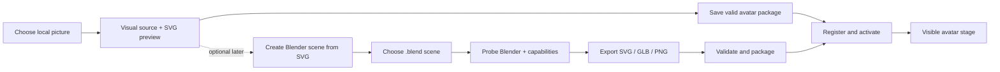

# Codex Avatar Studio — Final Implementation Plan

> This is the only authoritative implementation plan for the repository. It supersedes the three former root plans and the legacy checklist. Their history remains available in Git.

**Updated:** 2026-09-24

**Current state:** Phases 0–11 are complete. Phase 12 has one unchecked Blender MCP acceptance task and is blocked until the project-scoped server is available after restart. Phase 13's clean-profile offline and installed-host evidence is now recorded; the historical key still needs revoking by its account owner. The current Studio track is a standalone local infinite-canvas app served by a loopback host, with VS Code as an optional connector. It follows the Target UI linked from `docs/STUDIO_DESIGN_BRIEF.md`, uses Paper and pen.dev interaction patterns with our own brand, adds an OpenRouter agent panel where the user picks a model, adapts audited ZCode harness pieces, and exposes IDE connectors over MCP. Phases 14 and 15 are complete; Phase 16.1–16.12 are implemented and verified. Phase 18.1e is the next Studio acceptance task. Later work includes projects and exports (18), OpenRouter chat (19), agents (20), creation engines (21), IDE connectors (22), and acceptance (23–24). The former Phases 14–18 remain under “Studio v1 shell (superseded)”.

**Next work for the requested Studio track:** Complete Phase 18.1e: verify an edited canvas through autosave, standalone host restart, and reopen in the live editor; repeat in a live VS Code Webview. Continue with thumbnails, assets, media insertion, export, and canvas actions (18.2–18.7), OpenRouter chat (19), agents (20), creation engines (21), IDE connectors (22), and acceptance (23–24). The exposed historical key still requires revocation by its account owner. Keep Phase 12's final acceptance box open until its separate MCP evidence is recorded, and do not declare the overall release complete while it remains open.

## 1. Product outcome

Codex Avatar Studio must let a user choose a local picture, convert it to a safe SVG, save it as a valid avatar package, and immediately see it as the active IDE avatar. Blender must be a connected but optional local production tool for SVG line art, GLB, and PNG previews.

The required user journeys are:

1. **Picture → SVG avatar:** choose a picture, preview it, vectorize it locally, save it as an avatar, activate it, and keep it active after reload.
2. **Blender → avatar assets:** detect or configure Blender, export a `.blend` scene, validate the results, package supported output, and optionally activate it.
3. **Manage avatars:** import, select, validate, reload, reveal, export, and remove local avatar packages from the Webview without relying on hidden commands.
4. **Design in Studio:** open a recent local project, edit a canvas with working tools, save and reopen it, converse with a user-selected OpenRouter model, and apply any agent-proposed canvas change only after review.

“Upload” in the existing avatar workflow means choosing a local file. Picture tracing, Blender work, and avatar assets stay local. The AI chat is a separate, explicitly enabled network feature: only the user's submitted text and any context they deliberately attach may be sent to OpenRouter. The optional QuiverAI SVG engine (Phase 21.3) is off by default and sends only the prompt and reference images the user chooses. Never silently send pictures, SVG/GLB content, source scenes, workspace files, or paths.

## 2. Decisions that are now locked

- Preserve the working extension, Webview, SVG/Pixi foundation, state machine, package registry, and tests. This is not a greenfield rebuild.
- SVG is the permanent fallback and the first custom-asset runtime to complete.
- PixiJS remains the existing rich 2D runtime. Rive, Live2D, Inochi2D, VRM, WebGPU, and voice work cannot block the picture-to-SVG or Blender journeys.
- The extension host owns file pickers, filesystem access, package installation, Blender processes, and local URI conversion. The Webview owns presentation and sends only typed requests.
- Use the current versioned bridge, `AvatarManifest`, state names, and trigger names as the source of truth. Change them only through an explicit schema migration.
- Generated and imported assets remain local under the configured `.codex-avatar` workspace directory.
- Preserve source pictures and `.blend` files. Write through a staging directory and never leave a partial package registered as valid.
- Auto-tracing creates a useful static SVG, not a rigged character. Named layers may add richer motion later, but missing layers must not prevent a basic avatar from working.
- Blender is optional. Missing or broken Blender tooling must never prevent the extension or SVG fallback from loading.
- A feature is complete only when its user-visible journey works in the Webview and installed VSIX. Internal helpers or command registration alone are not completion.
- Keep the compact avatar sidebar working. Build the spacious canvas/chat experience from the existing `apps/studio` baseline as a standalone local app served by a loopback, token-protected host (Phase 17). The VS Code editor tab is an optional entry point, not the required host. Visual references guide hierarchy and interaction quality; they are not assets or instructions to copy. The Target UI design canvas is the visual spec.

## 3. Verified baseline and real gaps

The table below records the historical audit that drove Phases 1–9. Their completion evidence is preserved below; its “disconnected” column does not describe the current avatar Webview.

| Area | What already works | What is still disconnected |
| --- | --- | --- |
| IDE assistant | Extension activation, React Webview, state changes, settings, built-in SVG/Pixi assets | The panel is settings-heavy, actions are duplicated, and unsupported choices are exposed |
| SVG rendering | A built-in animated orb is always available | `SvgAvatarRenderer` hardcodes the orb and ignores the active manifest SVG |
| Vectorization | PNG/JPG/JPEG/WebP contract, local Jimp/ImageTracer tracing, SVGO optimization, sanitization, limits, and tests | The “preview” is XML text; save creates export files and a conversion record, not an active `AvatarManifest` package |
| Avatar packages | Secure import, validation, registry, activation, and fallback code exist | The Webview lacks Import/Activate controls, generated SVGs never enter the registry, and the free-text Avatar field is not registry activation |
| Blender | Setting, runner, output channel, dry-run tests, and SVG/GLB/PNG Python scripts exist | Detection misses the installed Blender, exports are existence-checked only, and no result is packaged, activated, or rendered |
| Optional renderers | Rive, Live2D, and WebGL source prototypes exist | `AvatarStage` currently routes only Pixi or the hardcoded orb; the prototypes are not product capabilities |
| QA | Unit, smoke, package, and clean-profile scripts exist | There is no end-to-end picture → package → visible avatar test or real Blender host acceptance test |

Important audit findings:

- The vectorizer writes `.codex-avatar/exports/svg/<name>.raw-trace.svg`, `<name>.optimized.svg`, and `<name>.manifest.json`. That last file is an export record, not `avatar.manifest.json`.
- Saving a trace does not register it, activate it, update the selected character/runtime, reload the package, or display it.
- Even a correctly imported SVG package still shows the built-in orb because the SVG renderer never reads `manifest.entrypoints.svg`.
- Blender 4.5.3 is installed locally under `C:\Program Files\Blender Foundation\Blender 4.5\blender.exe`, while the current Windows probe stops at Blender 4.4.
- A Blender export record is not an avatar package. GLB also cannot be advertised as active until the WebGL renderer is genuinely routed, built, tested, and protected by SVG fallback.

### 3.1 Studio baseline at the start of the requested redesign (2026-09-23)

| Area | Existing baseline | Gap to close |
| --- | --- | --- |
| Canvas | `apps/studio` runs React and tldraw with a frame, custom avatar/vector/Blender shapes, toolbar, side panels, and prompt dock | Several visible actions are placeholders; SVG insertion draws a rectangle, export shows an alert, and Blender handoff only opens the inspector |
| Projects | A Recents dashboard and project title UI exist | Recents are hardcoded; create/open/rename/save/reopen and recovery are not a verified document workflow |
| AI | A sidebar and model selector exist; a Vite development route can request an SVG | “Chat” fabricates an agent response from SVG generation; the model list mixes stale fixed IDs with live data, and the route is development-only |
| Security | The avatar extension already has a typed bridge, strict CSP, workspace trust, and local package rules | The Studio Vite route contains a literal provider credential fallback, listens beyond loopback, and accepts unbounded requests; the browser stores an OpenRouter key in `localStorage` and injects SVG markup into the DOM |
| Surfaces | The extension has a compact avatar activity-bar Webview | There is no supported large editor-tab Studio host yet; the browser preview and packaged extension must have explicit, tested responsibilities |

The supplied Paper and pen.dev screenshots are visual references for a sparse Recents launcher, generous central canvas, compact tool rail, contextual inspector, agent conversation, and persistent composer in light and dark themes. The QuiverAI screenshot is a sign-in reference, not a requirement to add authentication. Avoid copying their branding, icons, layouts pixel for pixel, or unavailable features. The target screens derived from these references live in the Target UI design canvas linked from `docs/STUDIO_DESIGN_BRIEF.md`.

## 4. Target experience and architecture



Blender is not required to turn a picture into SVG. The primary path is picture → SVG → active avatar. Blender is a separate optional path for authored scenes, line art, 3D assets, and previews.

### 4.1 Picture and Avatar Webview layout

Use one compact Studio surface:

1. Avatar stage, current state, current avatar, and health status.
2. Primary actions: **Create from Picture**, **Import Avatar**, and **Blender Tools**.
3. Studio workspace for source preview, conversion controls, output preview, warnings, progress, Cancel, and **Save & Use**.
4. Avatar library with active-package selection and package actions.
5. Behavior preferences grouped separately from Advanced/Debug settings.

Remove duplicate top/asset-manager actions. Do not show raw `vscode-resource` URLs in the normal view; show readable filenames, status badges, and Reveal/Open actions.

### 4.2 File layout

```text
.codex-avatar/
├── avatar-registry.json
├── avatars/
│   └── <avatar-id>/
│       ├── avatar.manifest.json
│       ├── svg/avatar.svg
│       ├── preview.png              # optional
│       └── webgl/avatar.glb         # optional
├── cache/
│   └── jobs/<job-id>/               # disposable previews/staging
└── exports/
    ├── svg/                          # retained raw/optimized exports
    └── blender/                      # retained Blender exports/reports
```

Only `avatars/<avatar-id>/avatar.manifest.json` is an installable avatar manifest. Conversion and Blender reports must be named `conversion-report.json` or `export-report.json` so they cannot be mistaken for packages.

### 4.3 Picture and Blender job bridge

Add a typed, versioned job protocol. The exact names may follow repository conventions, but it must cover:

- choose image or `.blend` source;
- start, progress, cancellation, completion, and structured failure;
- source metadata and safe Webview preview URIs;
- vectorization options and preview result;
- Blender status, selected modes, and per-mode result;
- save/package/activate result;
- reveal output and open logs.

Every message must pass runtime schema validation. The Webview must never receive an unrestricted filesystem operation or construct arbitrary local paths.

### 4.4 Standalone Studio architecture (Phases 14–24)

- `apps/studio` is the React + tldraw canvas UI: Home, editor, agent panel, Settings and Connectors. Its target look is the Target UI design canvas. The existing `apps/webview` remains the compact avatar sidebar.
- `apps/studio-server` (Phase 17) is a Node host bound to `127.0.0.1`. It serves the UI and owns projects, assets and conversations on disk. It holds provider keys in the OS keychain and calls OpenRouter (and QuiverAI only when the user turns it on). It runs local vectorization and optional Blender work, and exposes the MCP endpoint for IDE connectors (Phase 22). Every route checks the Host header, the Origin, and a per-launch session token.
- `packages/studio-host-core` holds the host-agnostic logic shared by the server and the VS Code extension: the OpenRouter connection and chat, the project store, and the Blender probe and runner. `packages/studio-agent` (Phase 20) holds the agent turn machine and the canvas tool registry adapted from audited ZCode pieces.
- The UI talks to a host only through the versioned `studioProtocol` messages, over one of three transports: WebSocket (standalone), VS Code Webview messaging (optional), or an in-memory fixture (tests and offline preview). Keys never cross the bridge.
- Remote processing is limited to AI the user turns on: OpenRouter chat, and optional QuiverAI SVG generation. Each uses the user's own key held by the host and shows what will be sent. Picture tracing, SVG validation and rendering, avatar packaging and Blender work stay local.

## 5. Ordered implementation phases

### Phase 0 — Consolidate truth and preserve the live baseline · complete

- [x] Compare the three former plans against the current repository.
- [x] Treat the existing live extension as the starting point.
- [x] Identify the actual image, package, renderer, and Blender disconnects.
- [x] Replace the conflicting plans with this single checklist.
- [x] Keep historical detail in Git instead of a second active plan.

**Acceptance:** there is one canonical plan, its next task is unambiguous, and it does not ask Codex to recreate completed foundation work.

**Evidence — 2026-07-12:** `pnpm validate:docs` passed for 25 Markdown files; `git diff --check` passed; and all three former root plans plus `docs/PLAN_CHECKLIST_LEGACY.md` are absent from the working tree.

### Phase 1 — Render the active package SVG · complete

**Goal:** make an imported or generated SVG capable of replacing the built-in orb.

- [x] Pass the resolved manifest SVG URI into the SVG renderer.
- [x] Render `entrypoints.svg` (or the compatibility `assets.svg`) without executing SVG scripts or remote content.
- [x] Keep the built-in orb as the load-error and missing-asset fallback.
- [x] Apply whole-avatar state effects—idle, thinking, speaking, success, warning, error, and sleeping—to any static SVG.
- [x] Treat named eye/mouth/body layers as optional enhancement data, not a basic-rendering requirement.
- [x] Add cache busting or a version key so Reload and re-export visibly refresh the asset.
- [x] Hide runtime options that are not actually routed through `AvatarStage`.
- [x] Add renderer tests for custom SVG, missing SVG, corrupt SVG, reload, and fallback.

**Done when:** activating a minimal valid SVG package changes the visible avatar immediately, remains selected after reload, responds with whole-avatar state effects, and returns safely to the orb on failure.

**Evidence — 2026-07-12:**

- `SvgAvatarRenderer` uses a local `` resolved from `entrypoints.svg` with `assets.svg` compatibility, keeps the inline orb while loading/after error, and never injects SVG markup. `AvatarStage` routes the manifest URI and falls directly to SVG when Pixi has no asset.
- `AvatarWebviewProvider` appends an incrementing `codexAvatarAssetRevision` to mapped asset URIs. Provider tests verify an active custom package maps to a Webview URI, reload changes the revision, registry failure restores the built-in manifest, and registry tests verify the active package survives recreation.
- Webview renderer tests pass 11/11 for entrypoint priority, compatibility paths, flat SVGs without named layers, missing assets, failure/retry state, fallback markup, and required whole-avatar states. Extension Vitest passes 8/8 and extension Node tests pass 15/15.
- `pnpm smoke:webview` exercised a real Edge render: a custom SVG replaced the orb, thinking motion applied, missing/corrupt SVGs returned to the orb, and a revised valid URI retried successfully.
- `pnpm run ci` passed formatting, lint, typecheck, all 98 workspace tests, and builds. `pnpm package:vsix`, `pnpm validate:vsix`, `pnpm smoke:vsix`, and `pnpm smoke:clean-profile` passed with a 27-file VSIX.

### Phase 2 — Build the Create from Picture Studio flow · complete

**Goal:** replace the vague Vectorize button with an obvious local picture workflow.

- [x] Add one primary **Create from Picture** action in the Webview and retain the Command Palette entry.
- [x] Open the native file picker from the extension host.
- [x] Support only formats that the packaged decoder proves it can read; PNG/JPG/JPEG are required, and WebP is advertised only after a real decode test passes.
- [x] Copy an explicitly selected external picture to a disposable job cache only when needed for Webview preview; never modify the source.
- [x] Show source thumbnail, filename, dimensions, file size, and alpha/background status.
- [x] Add clear Continue, Back, Cancel, and retry states.
- [x] Add typed progress and structured errors instead of relying on transient VS Code notifications.
- [x] Require a trusted workspace and explain how to open one when none is available.
- [x] Ensure cancellation or closing the panel removes disposable job data.

**Done when:** a user can choose and visually preview a local picture from the panel, cancel without writing a package/export, and understand every failure without opening developer tools.

**Evidence — 2026-07-12:**

- The extension contributes **Codex Avatar: Create Avatar from Picture**, opens a native PNG/JPG/JPEG picker, requires a trusted workspace, validates image metadata and a 32 MiB limit, and copies only the selected source into a UUID-scoped `.codex-avatar/cache/jobs/` preview directory.
- The versioned bridge now carries selecting/validating/copying progress, source metadata, cancellation reasons, and structured recoverable errors. The Webview shows a visual preview, safe filename, dimensions, size, format, transparency/background status, Continue, Back, choose-again, retry, and Cancel states without exposing the source path.
- Extension tests verify external-source preservation, replacement behavior, unsupported-format rejection, picker cancellation, safe Webview URI mapping, workspace guidance, and cleanup when a job or panel is closed. Webview tests verify progress, preview metadata, and accessible errors.
- `pnpm smoke:webview` passed in real headless Edge for picture progress, preview loading, metadata, Continue/Back, structured error, and cancellation. The smoke now waits for the initial assistant render instead of racing React effects.
- `pnpm run ci` passed formatting, lint, typecheck, all 106 workspace tests, and production builds. `pnpm package:vsix`, `pnpm validate:vsix`, `pnpm smoke:vsix`, and `pnpm smoke:clean-profile` passed with the 27-file VSIX; documentation and third-party notice validation also passed.

### Phase 3 — Produce and preview a useful SVG · complete

**Goal:** connect the existing local tracer to a visual, adjustable preview.

- [x] Reuse the existing validate → preprocess → trace → optimize → sanitize → complexity-check pipeline.
- [x] Show source and optimized SVG side by side in the Webview instead of opening raw XML as the primary preview.
- [x] Add simple presets: Color Illustration, Clean Icon, and High-Contrast Silhouette.
- [x] Expose bounded controls for color count, grayscale, threshold, near-white background removal, noise cleanup, and detail/path count.
- [x] Preserve color by default for character art; do not silently reduce every image to a two-color grayscale trace.
- [x] Show SVG byte size, path count, missing named-layer guidance, and any safety warnings before save.
- [x] Wire a real `AbortController` to the visible Cancel action.
- [x] Keep raw trace and optimized export naming deterministic without overwriting an unrelated prior result.
- [x] Add fixtures for transparent PNG, color PNG, JPEG, explicit WebP decoder rejection, oversized input, path explosion, cancellation, and malicious content. WebP remains unavailable until a packaged decoder passes a real decode-and-trace test.

**Done when:** a selected picture becomes a visual, safe SVG preview locally; Cancel writes no committed result; the source is unchanged; limits and sanitization remain enforced; and no network request occurs.

**Evidence — 2026-07-12:**

- Picture Studio now sends bounded preset/options through the versioned bridge and displays source plus optimized SVG through local `` URIs. It shows raw/optimized byte size, path/group counts, optional named-layer guidance, warnings, progress, retry, Back, conversion Cancel, and overall Cancel without injecting SVG markup.
- The existing local pipeline now defaults to a bounded 16-color trace, separates cleanup from low/balanced/high path detail, reports validation metrics, enforces regular-file/32-MiB/raster/SVG/path limits, and sanitizes executable elements, CSS, event handlers, doctypes/entities, external protocols, and non-fragment references.
- CPU-bound tracing runs in a separately packaged worker. A visible Cancel aborts the active controller, terminates the worker during its tracing stage, removes the job’s vector cache, and prevents a late preview or committed export. The legacy Vectorize command now opens this same Studio flow instead of an XML editor.
- Pipeline and provider tests cover saturated color, transparency, baseline JPEG, honest WebP rejection, oversized headers/files, forced path explosion, appended malicious content, source hashes, worker termination, stale/late result prevention, cache cleanup, and collision-safe exclusive export names.
- `pnpm run ci` passed formatting, lint, typecheck, all 114 workspace tests, and production builds. Real Edge smoke passed the source → controls → SVG preview → metrics → cancellation/error journey. The 28-file VSIX packaged the worker; validation, a real installed-worker decode/trace, activation smoke, and clean-profile installation all passed with documentation/notices validation.

### Phase 4 — Save, package, activate, and persist · complete

**Goal:** make **Save & Use** finish the journey instead of leaving an orphan export.

- [x] Collect/confirm avatar name, safe id, author, version, and license. Never invent a redistribution license for user artwork.
- [x] Generate the repository’s full schema-v1 `avatar.manifest.json`, not an `AssetManifestEntry` conversion record.
- [x] Create a staged package containing `svg/avatar.svg`, preview metadata, state mappings, capabilities, and SHA-256 checksums.
- [x] Validate the staged package through the same package validator used for imports.
- [x] Atomically install/register it at `.codex-avatar/avatars/<id>/`.
- [x] Handle id collisions with explicit Replace, Create Copy, or Cancel choices.
- [x] Activate the package, update the selected character and runtime to SVG, call `reloadAssets()`, and return a typed completion message.
- [x] Roll back files and registry changes together when validation, installation, activation, or reload fails.
- [x] Provide **Save & Use**, **Open Folder**, and **Copy Path** on the completed generated package; the former orphan-export workflow is no longer the primary Studio path.
- [x] Add an integration test for choose → preview → save → validate → register → activate → manifest message.

**Done when:** picture → SVG → **Save & Use** visibly replaces the orb without manual commands, updates `avatar-registry.json`, survives an IDE reload, and never registers a partial or invalid package.

**Evidence — 2026-07-12:**

- The Studio requires name, safe lowercase id, author, semantic version, and an explicit license/rights statement; author and license start blank. Save & Use produces `svg/avatar.svg`, checksummed `metadata/source.json`, and a full schema-v1 `avatar.manifest.json` with SVG runtime/state mappings and no source-raster copy.
- Generated staging runs through the same package/tree/path/SVG/checksum validator as imports. The registry installs from workspace-local staging with exclusive transaction directories and recoverable registry writes, selects the new package, sets character/runtime to the generated id/SVG, and posts the cache-revised active manifest immediately.
- Existing ids return typed Replace, Create Copy, and Cancel choices. Successful completion exposes Open Folder and Copy Path without sending raw paths to the Webview. A generated package remains active when a new registry instance simulates IDE reload.
- Transaction tests cover new install, deterministic copy id, replacement commit, replacement rollback, source preservation, and cleanup. A simulated active-manifest reload failure restores the former package files, registry, character, and runtime and never sends a false success.
- `pnpm run ci` passed formatting, lint, typecheck, all 120 workspace tests, and builds. Real Edge smoke passed package progress, collision, failure, and success UI. The 28-file VSIX passed validation, clean-profile install, and a real installed choose → worker trace → Save & Use → active manifest journey.

### Phase 5 — Make the Studio panel calm and useful · complete

**Goal:** fix the long, technical layout shown in the current screenshots.

- [x] Keep the stage and primary creation actions above the fold.
- [x] Replace the free-text Avatar field with the real avatar-library selector.
- [x] Consolidate Import, Activate, Validate, Reload, Reveal, and Remove in the avatar library.
- [x] Make Validate run actual package/SVG checks and display structured results; remove the timestamp-only behavior.
- [x] Group everyday behavior controls separately from Advanced/Debug settings and collapse the latter by default.
- [x] Hide raw asset URIs and duplicate action rows.
- [x] Disable unavailable actions with a short reason and setup action.
- [x] Use VS Code theme tokens, clear hierarchy, consistent button labels, aligned controls, and responsive narrow-panel spacing.
- [x] Preserve keyboard navigation, visible focus, screen-reader labels, high contrast, reduced motion, and no-animation behavior.
- [x] Add useful empty, loading, success, partial-success, and failure states.
- [x] Capture manual screenshots at narrow and wide widths in dark, light, and high-contrast themes.

**Done when:** a new user can identify how to create, select, and manage an avatar without scrolling through technical settings or reading raw paths.

**Evidence — 2026-07-12:**

- The visible panel now keeps the stage and exactly three primary actions—Create from Picture, Import Avatar, and Blender Tools—before the real avatar library. Behavior stays compact; runtime, timing, effects, and diagnostics are inside a collapsed, keyboard-accessible Advanced behavior section. The free-text avatar id, raw asset URIs, timestamp-only validation, and duplicate Toggle/Vectorize/action rows are gone.
- The versioned bridge now carries bounded library refresh/status/validation data and typed import, activate, validate, reload, reveal, remove, and workspace-setup requests. The extension host performs real package/manifest/SVG/checksum validation, redacts known local paths, refuses registered-root/symlink escapes, falls back to the built-in SVG in untrusted workspaces, and rolls settings, registry state, files, and active rendering back on failed activation/removal. Windows package moves use bounded retry without weakening transactional rollback.
- The library exposes readable metadata and Active, Ready, Needs repair, built-in, and partial-success note badges; structured error/warning lists; loading, empty, working, success, and failure feedback; two-step destructive confirmation; and disabled-action reasons with Open Folder or Manage Trust setup actions.
- `pnpm run ci` passed formatting, lint, strict typecheck, builds, and all 128 tests: avatar core 19, asset pipeline 21, Pixi runtime 24, extension Node 18, extension Vitest 20, Webview Vitest 21, and Webview Node 5. Three concurrent provider stress runs also passed after exercising Windows removal transactions.
- Real Edge smoke passed the renderer, picture Studio, package states, avatar selector, structured validation, and raw-URI privacy checks. Six inspected screenshots were captured under `.codex-avatar/previews/phase5/` at 340×900 and 760×900 in dark, light, and high-contrast themes; the stage, main actions, and library remained identifiable above technical settings in every variant.
- The 28-file, 1.48 MB VSIX passed package validation, third-party notice validation, installed-package activation/Webview smoke, and a clean-profile VS Code installation.

### Phase 6 — Establish a real Blender connection · complete

**Goal:** make Blender detection and setup trustworthy while keeping it optional.

- [x] Introduce a typed Blender probe result containing path, discovery source, parsed Blender version, support state, and available export capabilities.
- [x] Reject a non-Blender executable even when it exits successfully with `--version`.
- [x] Probe the configured setting, `BLENDER_PATH`, `PATH`, and dynamic platform install locations without a fixed version ceiling.
- [x] Continue probing after an invalid configured path and report the invalid preference separately.
- [x] Add **Browse**, **Auto-detect**, and **Test Connection** controls in Blender Tools.
- [x] Display detected version, executable path, supported modes, and actionable setup help.
- [x] Keep `shell: false`; add `--disable-autoexec`, input/script validation, single-flight locking, bounded logging, configurable timeout, cancellation, and process-tree cleanup.
- [x] Stage output per job and move only validated artifacts into `.codex-avatar/exports/blender/`.
- [x] Prefix stdout/stderr logs and provide Open Log/Open Output Folder actions.
- [x] Add unit tests for valid Blender identity, fake executable rejection, invalid-setting fallback, cancellation, timeout, collision, and missing Blender.

**Done when:** this Windows machine auto-detects its installed Blender 4.5.3, a bad path produces a repairable status, cancellation stops the process, and a machine without Blender still runs the avatar normally.

**Evidence — 2026-07-12:**

- The typed probe checks the restricted `codexAvatar.blenderPath` setting, `BLENDER_PATH`, system `PATH`, and dynamically enumerated Windows/macOS/Linux install locations. It requires anchored Blender identity output, supports Blender 3.6+ without a maximum-version ceiling, retains a separate invalid-preference result while continuing fallback discovery, and reports version, source, support, attempts, and SVG/GLB/PNG production capabilities.
- A real host probe found `C:\Program Files\Blender Foundation\Blender 4.5\blender.exe` as a platform installation and parsed Blender 4.5.3 as supported. A second real probe used Node as the configured executable, rejected its successful `v22` output as non-Blender, preserved that repairable preference error, and still found Blender 4.5.3.
- The collapsible Blender Tools panel now exposes Browse, Auto-detect, Test Connection, Cancel, Open Log, and Open Output Folder through the versioned bridge. It shows friendly missing/invalid/unsupported/working/success/failure states, version, executable, discovery source, support, and capability badges while explaining that picture-to-SVG does not require Blender. Narrow dark, wide light, and narrow high-contrast browser captures under `.codex-avatar/previews/phase6/` were inspected successfully.
- Blender processes use `shell: false`, `--disable-autoexec`, trusted regular-file/real-path checks, one active job, bounded prefixed stdout/stderr, a configurable 10–600 second timeout, abort propagation, and Windows/POSIX process-tree termination. Jobs stage under `.codex-avatar/cache/jobs/blender-<uuid>/`; only nonempty artifacts with valid JSON reports publish collision-safely, and failure/cancel/timeout/collision removes staging without changing the source scene or existing output.
- `pnpm run ci` passed formatting, lint, strict typecheck, all builds, and all 156 tests: avatar core 19, asset pipeline 21, Pixi runtime 24, extension Node 38, extension Vitest 22, Webview Vitest 27, and Webview Node 5. Tests cover identity/fake tools, invalid fallback, cross-platform discovery, missing/unsupported Blender, probe cancellation, command timeout/cancellation and process-tree cleanup, logging bounds, path escapes, staging, validation, late collision, and single-flight release.
- Real Edge smoke passed the connected Blender Tools states and cancellation UI. The 28-file, 1.49 MB VSIX included the Blender safety strings and UI controls, passed installed activation/Webview smoke and third-party validation, and installed successfully in a clean VS Code profile.

### Phase 7 — Export Blender assets and connect supported output · P1

**Goal:** turn a Blender job into validated assets and a usable avatar package.

- [x] Allow an explicitly selected `.blend` source while always writing output inside the trusted workspace.
- [x] Preserve the source scene; scripts must never save over it.
- [x] Define and enforce `Export` collection preference, `Avatar` fallback, and `Guides`/`Ignore` exclusion.
- [x] Export selected SVG line art, GLB, and PNG preview modes independently and report partial success per mode.
- [x] Treat SVG as capability-dependent line art. Do not claim that Blender automatically vectorizes arbitrary pictures or meshes.
- [x] Optimize and sanitize Blender SVG through the same SVG safety pipeline used by picture tracing.
- [x] Validate nonempty SVG, GLB structure/size, PNG signature/dimensions, and portable relative report paths—not file existence alone.
- [x] Rename per-mode metadata to `export-report.json` and keep it separate from `avatar.manifest.json`.
- [x] Build a valid avatar package with a package-local SVG fallback, optional GLB, and optional PNG preview.
- [x] Validate, register, optionally activate, and reload the package through the same atomic path as Phase 4.
- [x] Allow **Use as Avatar** immediately for a valid SVG result.
- [x] Label GLB as export-only until the lazy WebGL renderer is included in dependencies, typecheck/build, routed by `AvatarStage`, and verified with SVG fallback.
- [x] If GLB activation is implemented, require a package SVG fallback and test GPU/asset failure recovery. GLB activation is intentionally not implemented in this phase, so the guard remains satisfied by keeping SVG as the only entrypoint/runtime priority.
- [x] Run a real Blender host fixture covering at least one supported SVG or GLB/PNG scene.

**Done when:** a real `.blend` fixture produces validated local output, Blender-created SVG can become the visible avatar, re-export refreshes it, and unsupported GLB/runtime combinations are never presented as active.

**Phase 7 evidence (2026-07-12):**

- `blenderPlan.ts`, `blenderRunner.ts`, and `blenderArtifacts.ts` now accept only explicitly selected external regular `.blend` files, keep staging/output inside the trusted asset workspace, publish modes independently, sanitize/optimize SVG, validate glTF 2 GLB and PNG structure/limits, enforce portable reports, and use `<scene>.<mode>.export-report.json`.
- Blender scripts prefer `Export`, fall back to `Avatar`, recursively exclude `Guides`/`Ignore`, never save the source scene, and describe SVG accurately as authored Grease Pencil line art rather than automatic vectorization.
- `blenderAvatarPackage.ts` creates a validated SVG-first package with optional GLB/PNG, an SVG-only entrypoint/runtime priority, checksums, and source metadata. The provider installs, activates, reloads, commits, or rolls back through the existing transaction path. Re-export plus same-id replace refreshes the visible avatar.
- Typed protocol/Webview states expose per-mode success/failure, package metadata, collision choices, and **Use SVG as Avatar**. GLB is visibly labelled export-only and cannot be selected as the active runtime.
- `pnpm smoke:blender` passed against Blender 4.5.3 LTS using a disposable external `.blend`: one `Export` object produced validated GLB and 1024×1024 PNG output while the `Ignore` object was excluded and portable reports recorded `collection: "Export"`, `objectCount: 1`. The source and temporary workspaces were removed afterward.
- `pnpm run ci` passed formatting, lint, strict typecheck, all builds, and all 162 tests: avatar core 19, asset pipeline 21, Pixi runtime 24, extension Node 40, extension Vitest 25, Webview Vitest 28, and Webview Node 5. Focused coverage includes external-source safety, partial success, structural artifact rejection, path privacy, SVG-first package validation, and typed UI results.
- Real Edge Webview smoke passed Blender connection, partial results, export-only GLB guidance, and avatar-save success; the inspected Phase 7 screenshot is under `.codex-avatar/previews/phase7/`. Documentation/notices validation passed. The 28-file, 1.50 MB VSIX passed content validation, installed activation/Webview smoke, and a clean-profile install.

### Phase 8 — Optional SVG-to-Blender handoff · P2

**Goal:** provide a clear bridge for users who want to refine a vectorized result in Blender.

- [x] Add **Create Blender Scene from SVG** after a successful vector preview/package.
- [x] Import the sanitized SVG as curves into a new scene under the `Avatar` collection.
- [x] Add an orthographic camera, neutral lighting, simple materials, and `Export`, `Guides`, and `Ignore` collections.
- [x] Save a new `.blend` working copy under `.codex-avatar/exports/blender/`; never modify the SVG or an existing scene.
- [x] Explain that imported curves are not an automatic rig or 3D character.
- [x] Return the scene to the Phase 7 flow for user editing and export.

**Done when:** a user can turn the generated SVG into a safe editable Blender starting scene and then use the normal Blender export workflow. This phase does not block the core SVG or Blender-export releases.

**Phase 8 evidence (2026-07-12):**

- `import_svg_scene.py` imports only a sanitized SVG into editable curves inside `Avatar/Export`, creates `Guides` and `Ignore`, adds an orthographic camera, neutral area light, transparent background, and small curve depth, and saves a brand-new working copy plus portable report.
- `blenderHandoff.ts` confines input to the avatar workspace, rejects unsafe/symlink/oversized SVG, verifies the extension-owned script, uses disposable staging and exclusive publication, validates the `.blend` header/size and report, and never modifies the SVG or an existing scene.
- Typed provider/Webview messages show working/success/error states without exposing raw paths. **Create Blender Scene from SVG** appears after preview and after package success; the result offers **Open Scene Folder** and **Export Blender Scene** and explicitly says curves are not an automatic rig or 3D character.
- The real Blender 4.5.3 host smoke imported a sanitized SVG as curve geometry, produced a valid working `.blend` with `Export` conventions, and successfully sent that scene back through the normal validated GLB export flow.
- `pnpm run ci` passed formatting, lint, strict typecheck, all builds, and all 165 tests. Real Edge Webview smoke passed the handoff working/success states and return actions; the Phase 8 screenshot is under `.codex-avatar/previews/phase8/`.

### Phase 9 — End-to-end quality, documentation, and release · required

**Goal:** prove the actual user journeys in the packaged extension.

- [x] Add Webview tests proving a manifest SVG URI—not the hardcoded orb—is rendered.
- [x] Add mocked VS Code integration tests for picture selection, job progress/cancel, package installation, activation, reload, and rollback.
- [x] Add package tests for id collisions, checksums, malicious SVG, source outside the workspace, atomic failure, and cache cleanup.
- [x] Replace the Node-as-Blender version test with a controlled fake that emits Blender-shaped output.
- [x] Add Blender runner tests for identity, cancellation, timeout, process cleanup, partial success, validation, registration, and reload.
- [x] Add an opt-in real-Blender test for the supported host matrix.
- [x] Manually verify dark, light, high contrast, reduced motion, no animation, narrow panel, and keyboard-only use.
- [x] Update the user guide, asset pipeline, package specification, Blender guide, troubleshooting, architecture, privacy, and release checklist.
- [x] Verify the built VSIX contains required Webview assets, Blender scripts, and no prohibited remote runtime.
- [x] Run `pnpm run ci`, `pnpm smoke:webview`, `pnpm package:vsix`, `pnpm validate:vsix`, `pnpm smoke:vsix`, `pnpm smoke:clean-profile`, `pnpm validate:docs`, and `pnpm validate:notices`.

**Done when:** both required journeys pass from a clean installed VSIX, no external network service is needed, generated sources remain local, and all fallbacks are verified rather than assumed.

**Phase 9 evidence (2026-07-12):**

- Manifest-driven SVG renderer tests prove custom cache-versioned URIs are attempted, flat SVG works without named layers, failed/corrupt URIs return to the built-in orb, and a revised URI retries instead of staying on a hardcoded asset.
- Mocked provider/registry tests cover external picture copying, typed progress, worker cancellation, local vector preview, package collisions/copies, validation, checksums, malicious SVG and path rejection, atomic install/activation/reload, persisted selection, rollback, removal rollback, and cache cleanup.
- Blender tests use a controlled runner that emits anchored Blender-shaped identity output and cover fake-tool rejection, discovery, timeout, cancellation/process-tree cleanup, staging, source preservation, external selection, structural validation, late collisions, partial success, SVG-first package registration/reload, and SVG handoff safety.
- `pnpm smoke:blender` is opt-in on hosts without Blender and passed here with Blender 4.5.3 LTS for real GLB, PNG, SVG curve handoff, and handoff-scene re-export.
- Real Edge smoke passed dark, light, high-contrast, 360 px narrow layout, system reduced motion, no-animation mode, keyboard Tab/Enter traversal, manifest asset load/failure/reload, picture/vector/package flows, Blender partial results, and SVG handoff. Phase 5–8 screenshots remain under `.codex-avatar/previews/`.
- User, pipeline, package, Blender, troubleshooting, architecture, privacy, QA, performance, README, and changelog documentation describe the implemented local-only behavior and its non-rigging/non-vectorization boundaries.
- Final release matrix passed: `pnpm run ci` (165 tests and all builds), `pnpm smoke:webview`, `pnpm smoke:blender`, `pnpm package:vsix`, `pnpm validate:vsix`, `pnpm smoke:vsix`, `pnpm smoke:clean-profile`, `pnpm validate:docs`, and `pnpm validate:notices`.
- The 29-file, 1.50 MB VSIX contains the Webview, SVG/Pixi fallback assets, four production Blender scripts including `import_svg_scene.py`, typed Blender safety/UI strings, and no prohibited remote runtime. Installed activation/Webview smoke and clean-profile installation passed.

### Phase 10 — Layered animated mascot prototype · complete

**Goal:** use the supplied Skjermbilde illustration as the visual reference for a responsive local website-ready mascot, rather than stopping at the static picture trace.

- [x] Recreate the character as code-native named SVG layers for the body, head, hat, hair, eyes, irises, eyelids, eyebrows, cheeks, mouth, scarf, cape, hands, skirt, feet, and reactions.
- [x] Add idle breathing, natural randomized blinking, restrained head motion, pointer-following gaze, thinking, speaking, success, warning, error, and sleeping behavior.
- [x] Connect existing pose and trigger inputs for local text/audio-level mouth movement, blink, gaze, nod, shake, celebrate, point, and particles.
- [x] Route the `skjermbilde-character` package through the layered renderer without changing the schema contract for unrelated packages.
- [x] Keep the traced package SVG as the runtime-boundary fallback and the built-in orb as the final missing/corrupt-asset fallback.
- [x] Preserve strict CSP, no SVG markup injection, local-only operation, page-visibility pause, focus mode, and reduced-motion expressions.
- [x] Document React website integration and a plain static-image fallback.
- [x] Add focused renderer tests, real Edge state/input smoke, VSIX activation/install checks, and installed VS Code visual verification.

**Done when:** the supplied character is visibly active in the installed extension, has independent moving facial/body/reaction layers, supports the required states and gaze/mouth inputs, remains usable without GPU or network services, and can be reused as a documented website component with static SVG fallback.

**Phase 10 evidence (2026-07-13):**

- `LayeredMascotRenderer.tsx` and its isolated stylesheet reconstruct the recognizable bowler hat, black hair and dress, large glossy eyes, woven collar, medallion, red cape, cheeks, hands, and shoes as named code-native SVG layers. `AvatarStage` selects it only for `skjermbilde-character` and wraps it in the existing `RuntimeBoundary` with the package trace as fallback.
- State CSS and local React behavior implement breathing, randomized blink, gaze/head tracking, text/audio-level mouth movement, idle, thinking, speaking, success, warning, error, sleeping, and supported one-shot reactions. Reduced motion removes continuous animation without removing state meaning.
- `pnpm run ci` passed formatting, lint, strict typecheck, all builds, and all 174 tests: avatar core 19, asset pipeline 21, Pixi runtime 24, extension Node 42, extension Vitest 25, Webview Vitest 38, and Webview Node 5.
- `pnpm smoke:webview` passed in real headless Edge for named layers, non-image rendering, speaking mouth animation, success body animation, error reaction, nod trigger, pointer gaze, generic SVG fallback, and corrupt/missing fallback. The inspected success capture is under `.codex-avatar/previews/phase10/`.
- The 30-file, 1.61 MB VSIX passed content validation, installed activation/Webview smoke, third-party notice validation, documentation validation, and clean-profile installation. Computer Use reloaded the installed VSIX in the live Blender workspace and visibly confirmed the repaired local package as **Active**, **Ready**, and rendered by the layered mascot.
- [LAYERED_MASCOT_PROTOTYPE.md](LAYERED_MASCOT_PROTOTYPE.md) documents the authored-2D boundary, component props, normalized pointer and mouth inputs, React/Vite reuse, and plain SVG fallback. No remote service, microphone permission, WebGL, or WebGPU is required.

### Phase 11 — Portable avatar package export · complete

**Goal:** let a user create a shareable local artifact from a ready avatar without manually locating and copying its installed package files.

- [x] Add **Export Avatar** to non-built-in, valid packages in the Webview avatar library.
- [x] Send export through the typed, versioned bridge and require an open, trusted workspace.
- [x] Revalidate the registered package immediately before export and preserve package file-count and byte limits.
- [x] Write an atomic local `.codex-avatar.zip` containing one portable top-level `<id>/` package folder with UTF-8 relative paths.
- [x] Reject symbolic links, unsafe paths, non-regular files, destinations inside the installed package, and invalid packages.
- [x] Show author/license confirmation before writing and strengthen the warning for unclear or restricted redistribution statements.
- [x] Reveal the completed ZIP, explain that it must be unzipped before import, and document static SVG versus authored layered-renderer reuse.
- [x] Add protocol, ZIP structure, provider, Webview, browser smoke, packaged-VSIX, and clean-install coverage.

**Done when:** a ready custom avatar exports from the visible library as a validated local ZIP, unclear rights cannot be overlooked, the archive can be extracted into an importable package folder, and invalid/built-in packages cannot be accidentally exported through the UI.

**Phase 11 evidence (2026-07-13):**

- `avatarPackageExport.ts` builds dependency-free stored ZIP records with CRC-32, UTF-8 entry names, one `<id>/` root, package limits, symbolic-link/path checks, package-internal destination rejection, and temporary-file publication. `AvatarWebviewProvider` revalidates, confirms rights, opens the native save dialog, writes locally, and reveals the result.
- `AssetManagerPanel` exposes **Export Avatar** only for non-built-in packages and disables it when validation has failed. The shared protocol accepts `library:export` and reports export progress/success/failure through the existing bounded library status channel.
- Focused ZIP tests passed for archive structure/content, invalid-package rejection, internal-destination rejection, safe naming, and restrictive-rights detection. Provider coverage exported a real generated package through the typed bridge and verified the stronger all-rights-reserved warning; Webview coverage verified the visible action and typed wiring.
- `pnpm run ci` passed formatting, lint, strict typecheck, all builds, and all 177 tests. `pnpm smoke:webview` passed in real headless Edge and verified the export action in the rendered library. `pnpm validate:docs` and `pnpm validate:notices` passed.
- `pnpm package:vsix` produced a validated 30-file, 1.61 MB VSIX. `pnpm smoke:vsix` passed activation, command, Webview, and worker checks from an isolated temporary workspace, and `pnpm smoke:clean-profile` installed the VSIX successfully without reading or changing the user's active avatar workspace.

### Phase 12 — Blender MCP and professional 3D avatar · required

**Goal:** connect Codex to local Blender through a restricted project MCP, author a professional local-only 3D Cholita, and make validated GLB packages usable through the optional WebGL runtime while preserving SVG/orb fallback.

- [x] Add pinned project Blender MCP configuration, an idempotent checksum-verifying add-on setup command, localhost-only operation, telemetry disablement, a four-tool allowlist, and approval for arbitrary Blender Python.
- [x] Install the seven audited Blender modeling/material/animation/export/rigging/inspection skills at fixed commits and record their licenses and source pins.
- [x] Add `webgl` to settings, typed bridge validation, library reporting, workspace-scoped avatar activation, and Blender package generation without changing manifest schema version 1.
- [x] Lazy-load Three.js and GLTFLoader, play mapped glTF actions through AnimationMixer, drive morph-based blink/mouth plus gaze, and dispose all GPU resources.
- [x] Preserve reduced motion, page-visibility pause, strict CSP, local paths, WebGL context-loss recovery, and the GLB → package SVG → built-in orb fallback chain.
- [x] Create `.codex-avatar/avatars/cholita-3d/source/cholita.blend` as a stylized authored model with ≤60k triangles, ≤50 deform bones, four influences per vertex, required facial shape keys, and the complete state/trigger clip set.
- [x] Export and validate the local-only GLB, SVG fallback, preview, contact sheet/turntable, manifest, and rig/export report; activate `cholita-3d` only in this workspace and retain the Phase 10 package.
- [ ] Run focused MCP, package, renderer, Blender, performance, privacy, installed-extension, fallback, CI, VSIX, and visual acceptance checks; prove Cholita assets are absent from Git and the VSIX.

**Done when:** the current workspace visibly uses the animated 3D Cholita through WebGL, every supported state and trigger has verified behavior, Blender/MCP/GPU failures remain harmless, and redistributable builds still contain only the approved coder-orb assets.

**Phase 12 evidence (2026-07-14):**

- `.codex/config.toml` pins `uvx --python 3.11 blender-mcp==1.6.4`, `localhost:9876`, telemetry-off environment values, the four approved tools, automatic read-tool approval, and prompt approval for `execute_blender_code`. `pnpm setup:blender-mcp` followed by `pnpm verify:blender-mcp` passed idempotently with add-on commit `6641189231caf3752302ae20591bc87fda85fc4e`, SHA-256 `bba60831f5f89a74deda0294b131668a086cf46eb35a6a01abbd0d21d9e92630`, enabled status, Blender 4.5.3, and `uvx 0.11.28`; `codex mcp list` reports the project server enabled.
- The seven reviewed project skills are installed under `.agents/skills` at the requested commits. `skills.md` catalogs them and `THIRD_PARTY_NOTICES.md` records their complete source pins plus MIT/Apache-2.0 notices. No remote-generation, unlicensed, or duplicate search result was installed.
- The local `cholita-3d` package contains the authored `.blend`, GLB, SVG fallback, PNG preview, turntable/contact sheets, manifest, and machine-readable audits. The Blender audit passed at 17,004 triangles, 31 deform bones, one normalized influence per vertex, applied mesh transforms, a root at the origin, seven required facial shape keys, ten seamless loops, and all 22 required actions. The independent GLB audit passed at 1,031,388 bytes with one skin, seven morphs, all 22 clips, and no root-translation channels.
- On 2026-09-24, `pnpm smoke:blender` completed the local Blender/GLB/PNG/SVG handoff smoke; `pnpm package:vsix`, `pnpm smoke:vsix`, `pnpm smoke:clean-profile`, and `pnpm smoke:offline-studio` passed for the current implementation. The VSIX validator excludes `.codex-avatar` and Cholita source assets. These local checks do not replace the live project-scoped Blender MCP acceptance below.
- The workspace registry retains `skjermbilde-character`, adds and activates `cholita-3d`, and `.vscode/settings.json` selects `cholita-3d` with `webgl`. A real local browser run rendered one Three.js canvas, visually checked all thirteen semantic states and all eleven supported triggers at narrow and wide widths, verified stable focus/no-animation frames, survived three reloads without duplicate canvases or console errors, and recovered to the package SVG after both context loss and an invalid GLB.
- `pnpm run ci` passed formatting, lint, strict typecheck, all builds, and all 182 tests. `pnpm smoke:blender`, `pnpm smoke:webview`, `pnpm validate:docs`, and `pnpm validate:notices` passed. `pnpm package:vsix` produced a validated 33-file, 1.77 MB VSIX; `pnpm smoke:vsix` and `pnpm smoke:clean-profile` passed. `scripts/validate-vsix.mjs` now requires the lazy WebGL/GLTF chunks and rejects `.codex-avatar`, Cholita, `.blend`, and `.glb` entries. `git status -- .codex-avatar` is empty and `git check-ignore` confirms the local `.blend`, GLB, SVG, and preview are ignored.
- **BLOCKED (2026-09-24):** `pnpm verify:blender-mcp` confirms the local setup, but this task exposes no project-scoped `blender` MCP tools; the separate `blender_svg` tools do not meet the repository's project-server allowlist. Restart Blender and open a Codex task where the project-scoped server is available, then verify `get_scene_info`, `get_object_info`, `get_viewport_screenshot`, and one explicitly approved harmless `execute_blender_code` call. Keep the final acceptance checkbox unchecked until that evidence is recorded.

### Phase 13 — Secure the Studio baseline and define the product boundary · requested, required

**Goal:** make the existing `apps/studio` safe to develop further, identify every simulated interaction, and give the large canvas a supported host for secrets, network requests, and local project work. The compact avatar Webview remains available.

- [x] Inventory the visible Studio controls, current behavior, and data flows in [`docs/STUDIO_BASELINE.md`](STUDIO_BASELINE.md). Record which controls work, are disabled, or still contain simulated behavior.
- [x] Save the Recents, canvas, sidebar, inspector, and composer at desktop and narrow widths as local screenshots and record their paths in the baseline inventory.
- [x] Remove the literal ZenMux credential fallback from `apps/studio/vite.config.ts` and scan the current source tree for token-shaped values. A matching historical value remains in Git history and must be revoked in the provider account; keep its value out of this plan and command output.
- [x] Bind Studio's development and preview servers to loopback and remove the privileged Vite API routes. There is no browser endpoint that accepts a provider key; any future chat gateway must implement bounds, timeout, cancellation, and request authorization in Phase 16.
- [x] Keep the OpenRouter key out of browser `localStorage`, request bodies, and Studio messages. In VS Code, Connect/Replace use a native password prompt and `SecretStorage`; the browser preview is setup-only and has no key form or provider call.
- [x] Replace raw SVG HTML injection with locally sanitized SVG image previews. Chat SVG responses and SVG creation/insertion are disabled until implemented through the host boundary.
- [x] Disable Studio's ZenMux/OpenRouter text-to-SVG and vision-to-SVG routes. Local bitmap tracing remains available in Avatar Studio; remote compatibility entry points reject instead of issuing requests.
- [x] Implement the versioned, runtime-validated Studio bridge for host state and OpenRouter connection actions. Model, chat, project, and canvas-proposal messages are owned by Phases 15–16 and must be added to this same versioned contract.
- [x] Add the VS Code editor-tab host for the built Studio. The browser preview uses the same protocol definitions and explicitly reports that it has no trusted host; VS Code owns secrets and provider requests.
- [x] Add a visible OpenRouter connection/privacy explanation. The full outbound-request preview, including history, app instructions, tool schemas, and selected local context, is a Phase 16 requirement before chat can send.
- [x] Add focused negative coverage for secret-free bridge messages, unsafe SVG, invalid protocol data, key storage, and untrusted workspace connection attempts. No local API route remains to exercise oversized-request or unauthorized-route cases.
- [x] Record a clean-profile offline startup and the current installed-extension/browser boundary behavior in the evidence below.

**Done when:** no credential is bundled or exposed to the browser, no raw SVG executes, the shipped Studio host has a validated local boundary, and the existing avatar workflow still works.

**Phase 13 evidence (2026-09-23–24):**

- `docs/STUDIO_BASELINE.md` inventories the visible Studio controls and data flows. The ignored local folder `.codex-avatar/previews/studio-phase13/current-2026-09-23/` contains 40 verified PNGs and `manifest.json`. At both `desktop-1280x800-` and `narrow-360x800-` prefixes, the dark captures include `dark-recents.png`, `dark-canvas-empty.png`, `dark-canvas-populated.png`, `dark-sidebar-populated.png`, `dark-inspector.png`, and `dark-composer-populated.png`; light and high-contrast Recents/canvas/chat/Inspector captures are present too. The full-view PNGs match their stated viewport dimensions. Isolated Edge 153 headless capture used the local Vite preview, with a 1.1-second panel-layout settle; no external content or user asset was submitted.
- `apps/studio/vite.config.ts` no longer contains the fallback key or privileged API middleware and binds Vite/preview to `127.0.0.1`. A current-tree scan found no token-shaped OpenRouter/ZenMux credential. A scan of Git history confirmed a credential-shaped value in historical Studio config; the value is intentionally omitted. The owning OpenRouter account must revoke it because this local tool session cannot complete an account credential change.
- `apps/extension/src/openRouterConnection.ts` keeps the key in VS Code `SecretStorage`, invokes a native password prompt, validates through OpenRouter's current-key endpoint, and times out after 10 seconds. `apps/extension/src/StudioWebviewPanel.ts` applies workspace trust and posts only the validated, versioned connection state.
- `packages/asset-pipeline/src/svgSafety.ts` validates and sanitizes SVG; `VectorStudioCanvasShape.tsx` renders its inert `data:` preview through ``. Remote vector engine entry points reject; the Vite sample route and MCP remote vector tools are removed.
- `packages/avatar-core/src/studioProtocol.ts` owns the strict v1 connection bridge. The extension host report for `pnpm package:vsix`, `pnpm smoke:vsix`, `pnpm smoke:clean-profile`, and focused protocol/secret/Webview checks was passing before this turn. In this turn `pnpm --filter @codex-avatar-studio/studio typecheck` passed after the Recents and responsive-shell changes. The local preview was reviewed at 360×800 and 1280×800; canvas frame fit, one-panel narrow layout, real session-page switching, and the truthful disabled chat state were observed.
- The packaged offline smoke passed on 2026-09-23: `pnpm package:vsix` produced 120 files (4.73 MB) with local Geist and tldraw assets; `pnpm smoke:offline-studio` opened the packaged loopback preview with zero external browser requests and blocked a bundled host fetch. `pnpm smoke:vsix`, `pnpm smoke:clean-profile`, `pnpm validate:notices`, and `pnpm validate:docs` passed.
- On 2026-09-24, `pnpm smoke:clean-profile` installed the current VSIX into an isolated profile, and `pnpm smoke:offline-studio` again verified setup-only startup, zero external browser requests, and a blocked bundled-host fetch. `scripts/smoke-live-vscode-studio.mjs` then launched that installed extension in an isolated VS Code profile with `--disable-background-networking`: the live Studio Webview showed Recents, opened Scratchpad, and rendered the editor with “Auto-saved”. No OpenRouter key was configured and no chat request was sent. This records the installed-Webview boundary; the separate browser preview remains setup-only and has no key form or provider endpoint. The script used `STUDIO_SKIP_EDIT=1`, so this is startup evidence only; live edit/reopen remains Phase 18.1e.
- The historical credential-shaped value remains only in Git history and still needs revocation by the owning account user. Full request preview is gated before any chat send.

### Studio v1 shell (former Phases 14–18) · superseded 2026-09-23

On 2026-09-23 the Studio direction changed: the Studio becomes a standalone local infinite-canvas app served by a loopback host, with VS Code as an optional connector. It follows the Target UI design canvas linked from [`docs/STUDIO_DESIGN_BRIEF.md`](STUDIO_DESIGN_BRIEF.md). The items below were completed under the former Phase 14–18 checklist, and their evidence is kept here. Every unchecked former item was folded into the new Phases 14–24 below. This section is history; do not implement from it.

#### Former Phase 14 — professional canvas workspace (completed items)

- [x] Write a one-page design brief, reference matrix, and acceptance matrix in [`docs/STUDIO_DESIGN_BRIEF.md`](STUDIO_DESIGN_BRIEF.md). Map Paper/pen.dev screenshots 1–6 to Studio; treat screenshot 7 only as sign-in context.
- [x] Implement and review the design acceptance matrix: no clipping at target widths, at least a 640×500 unobstructed canvas at 1280×800, one active side panel at 360px, 4.5:1 body-text and 3:1 control contrast, visible focus, and touch-sized controls.
- [x] Define information architecture for Recents, the working canvas, conversation, assets, and settings. Give the large canvas one primary focus and keep the avatar sidebar as a compact entry point.
- [x] Specify design tokens for type scale, spacing, surface elevation, dividers, icon size, focus, status, and one primary accent; provide light, dark, and high-contrast values in `docs/DESIGN_SYSTEM.md` and code.
- [x] Audit and remove remaining ornamental glow/glass treatment and competing panels; establish a restrained shell with project/title controls, a compact tool rail, a generous canvas, contextual inspector, and a clearly placed conversation/composer area.
- [x] Replace hardcoded demo Recents with the real current-session tldraw page list, title search, grid/list choice, non-destructive New Canvas action, and an honest unavailable-preview label.
- [x] Make the agent conversation distinct from the quick creation prompt; show model, connection state, message stream, tool status, and an accessible composer without duplicate send surfaces.
- [x] Make panels user-resizable and collapsible without covering the artboard or each other at 360px, 768px, 1280px, and 1920px widths; preserve usable canvas space and touch targets.

**Former Phase 14 evidence (2026-09-23):**

- Added `docs/DESIGN_SYSTEM.md` with shared dark/light/high-contrast palettes, spacing/type/radius tokens, focus and reduced-motion rules, and the editor interaction hierarchy. `StudioWindowBar`, the toolbar, chat, inspector, and Recents consume the tokens; tldraw retains a light artboard on the themed canvas.
- The canvas now opens as the primary view with both panels closed. Conversation and Inspector use one mutually exclusive side-panel slot at all widths. The desktop conversation was simplified into separated sections instead of stacked bordered cards. Vector icons replace the hand/pen emoji; zoom reset and theme controls have keyboard labels.
- The conversation exposes the live connection/model/chat controls and composer in one place. Its header states `Tools off` until the permissioned tool registry is implemented in Phase 17; the outbound review remains the only send confirmation surface.
- CUA visual review of the local Vite preview covered 360×800, 768×900, 1280×800, and 1920×1080. It showed a separate horizontal mobile tool row, visible artboard above an open narrow panel, a 961×642 frame with the Inspector at 1280×800, and a centered frame at 1920×1080 after the resize fit settles. Conversation/Inspector switching was observed at both 360px and desktop widths. Light, dark, and high-contrast themes were reviewed; theme preference survived a preview reload. The screenshot evidence has not been saved as local files.
- WCAG contrast calculations for the coded palette report 7.95:1 or better for primary/secondary/muted text and 4.22:1 or better for control boundaries on the tested surfaces; black/white high-contrast text and boundaries report 21:1. CUA showed the visible focus ring on keyboard-accessible theme controls. The narrow tool controls have 40px targets. The screenshot-artifact, full keyboard/screen-reader, and complete interaction-state boxes remain open.
- `apps/studio/src/App.tsx` refits the frame after canvas-container resizes while the user has not manually changed the view. Pointer, wheel, and explicit zoom actions preserve the user's chosen view. At 360px the frame fits at 30%; at 768px it fits at 52%; the canvas grows for desktop widths.
- `apps/studio/src/styles/studio.css` gives the narrow tool rail its own row and spacing above the canvas, and mutually exclusive docked panels prevent the conversation and inspector from covering one another.
- Both panels now have a focusable separator. Arrow keys and dragging resize width on desktop and height below 900px; Home/End move to limits, and the chosen size survives reload. `panelSizing.ts` clamps stored and requested sizes; compact panels stop at 48% of workspace height. CUA verified pointer and keyboard resizing, no panel overlap, and a visible composer at 360×800, 768×900, 1280×800, and 1920×1080. With the Inspector at its maximum on 360×640, 302px of canvas remained. `panelSizing.test.ts` passed 3/3.
- The latest `pnpm --filter @codex-avatar-studio/studio typecheck` passed. `pnpm package:vsix` rebuilt and packaged the Studio and extension successfully (40 files, 2.69 MB); rerun after later edits before release.

#### Former Phase 15 — projects, canvas tools, and exports (completed items)

- [x] Make the layer/selection inspector edit real properties with bounded inputs and coherent multi-selection behavior; prevent controls from changing an unrelated shape.
- [x] Remove simulated Blender connection/version/scene values and export actions from the legacy Studio canvas connector shape; leave a truthful unavailable state and keep Blender optional.

**Former Phase 15 evidence (2026-09-23):**

- Added a `formatVersion: 1` project envelope containing the tldraw editor snapshot, stable project ID, title, creation time, and update time. Tldraw's serialized schema travels with the snapshot so `editor.loadSnapshot` can migrate supported record versions. Unsupported or damaged project envelopes are reported and preserved; autosave refuses to overwrite an unreadable existing file.
- Added trusted extension-host project storage at `.codex-avatar/studio/projects`, with UUID-only filenames, local workspace containment and symlink checks, 20 MB snapshot limits, serialized writes per project, unique temporary files, and same-folder atomic rename.
- Added project listing, most-recent open, debounced autosave, rename, duplicate, confirmed delete, and visible save state. The browser preview remains session-only. Recents reads project metadata and labels the thumbnail unavailable until real previews are implemented.
- The Inspector now edits selected tldraw x/y and supported width/height values through bounded numeric fields. Multi-selection shows mixed values, omits a single-shape ID, and applies edits only to the current selection. Browser verification moved and resized a rectangle and confirmed undo/redo; `inspectorSelection.test.ts` covers empty, single, matching, mixed-type, and mixed-dimension selections.
- `scripts/smoke-installed-vsix.mjs` now exercises the extracted package with an isolated mock VS Code host/workspace: create and queue edited snapshots, reopen after host restart, preserve corrupt bytes and refuse overwrite, repair and reopen, and inject an atomic rename failure while retaining the last good file and cleaning its temporary file. `pnpm smoke:vsix` passed. The fixture uses a synthetic tldraw snapshot; an actual VS Code Webview edit/autosave/restart run remains open.
- `pnpm --filter codex-avatar-studio-extension typecheck`, `pnpm --filter @codex-avatar-studio/studio typecheck`, and `pnpm package:vsix` passed. A clean browser preview reload verified the session-only Recents fallback. The filesystem path has not yet been exercised inside a live VS Code host, so the create/edit/reopen, failed-write, and restart acceptance boxes remain open.

**Former Phase 15 acceptance evidence:** The installed-package mock-host round trip and failure recovery passed. Pending a live VS Code Webview run that creates a project, edits and autosaves it, then reopens the same tldraw content after restart. The browser preview is intentionally session-only.

#### Former Phase 16 — OpenRouter chat (completed items)

- [x] Implement a host-owned OpenRouter gateway for connection validation, model catalog, account-filtered model availability, and chat. Keep API keys, authorization headers, and provider errors containing sensitive details out of the browser, Webview messages, bundles, and logs.
- [x] Add Connect, Test, Replace, and Disconnect for a user's own key through the native VS Code host prompt and `SecretStorage`; validate through the provider's current-key endpoint and show masked identity/limits when available. In the local browser preview, show server-side key setup instructions/status without a browser key form. Never silently use a checked-in or shared key.
- [x] Build a searchable, keyboard-usable model picker with author/publisher, free/paid, modality, context, and price filters. Show loading, unavailable, and catalog-error states; remove stale hardcoded default IDs from the user-facing list.
- [x] Send real multi-turn text messages to the selected model with bounded history and an explicit outbound-context preview that includes app instructions and tool schemas when used. Only attach selected canvas text or other local context after the user chooses it.

**Former Phase 16 evidence (2026-09-23):**

- The trusted extension host now owns the OpenRouter catalog request and streaming chat request. The Webview receives only normalized model metadata, deltas, usage, and safe error messages; API credentials and authorization headers remain in VS Code `SecretStorage` and host memory.
- Connect/Replace/Test/Disconnect run in the extension host. Connect/Replace use a native password prompt and store a regular API key only after the current-key endpoint accepts it. Management keys are rejected; safe label/limit summaries are masked and bounded. Unit tests cover these responses; no user-owned credential was used.
- The catalog first uses OpenRouter's account-filtered `/models/user` endpoint with `output_modalities=all`. If a regular key is rejected by that endpoint with 403, it makes an explicitly labeled public `/models?output_modalities=all` request without sending Authorization. The public endpoint was verified to return 616 model records at the time of this pass. The picker now searches and filters by publisher, listed price, modality, minimum context, and maximum input/output price; it never auto-selects a model and keeps an unavailable saved choice visible until the user changes it. It disables entries that do not advertise text input and text output. Live account eligibility still needs testing with the user's own key; complete catalog caching/pagination and per-conversation model persistence remain open.
- Each send opens a review of the assistant instructions, bounded conversation history, and pending message. Canvas records, images, SVG, Blender scenes, paths, and project files are not attached. SSE handling includes event bounds, keepalive comments, `[DONE]`, cancellation, timeout, output limits, safe provider errors, and optional usage capture.
- Focused tests passed 15/15 across model filtering, inspector selection summaries, OpenRouter catalog fallback, and key metadata/error handling. Studio and extension typechecks, `pnpm validate:docs`, and `git diff --check` passed. After the formatting pass, `pnpm package:vsix`, `pnpm smoke:vsix`, and `pnpm smoke:clean-profile` passed; the VSIX contains 40 files (2.69 MB). Vite emitted existing large-chunk advisory warnings for the Studio and avatar Webview bundles. `pnpm format:check` still reports seven untouched baseline files: `FloatingPromptBar.tsx`, `StudioHeader.tsx`, `main.tsx`, `shapes/types.ts`, `blenderCapabilityAnalyzer.ts`, `svgSerializer.ts`, and `svg-ir.test.ts`. The root Biome config now excludes nested `.kilo` worktrees; touched implementation files were formatted. The browser preview remains setup-only. Live account catalog, streaming, and the full provider failure matrix have not been exercised; no model IDs or permanent availability claims are recorded.

The former Phases 17 (on-canvas agents) and 18 (acceptance) had no completed items. Their tasks now live in Phases 20 and 23.

### Phase 14 — Visual target and design system v2 · requested, required

**Goal:** a concrete visual spec and a component foundation that makes every later screen consistent.

- [x] 14.1 Save "before" screenshots of Recents, the editor, the chat panel and the inspector at 1440×900 and 390×844 under `.codex-avatar/previews/studio-v2/before/`, the same sizes as the Target UI artboards. The 1280×800 and 360×800 captures in `.codex-avatar/previews/studio-phase13/current-2026-09-23/` already cover the v1 shell at other widths.
- [x] 14.2 Publish the Design artifact "blenderSVG Studio — Target UI" with these artboards:
  - Home dashboard
  - Editor with an empty agent
  - Editor with the agent working: tool cards, a proposal preview and the properties panel
  - Composer menus sheet: "+" menu, model picker, mode menu, variants menu
  - Image → SVG dialog
  - Connectors page
  - Settings → Models & keys
  - Editor in the light theme, with the Layers tab
  - Editor at 390px
- [x] 14.3 Link that artifact from `docs/STUDIO_DESIGN_BRIEF.md` and rewrite the reference matrix:
  - 1: bottom creation dock with Design / Vector Asset / Image modes
  - 2: pen.dev editor
  - 3: pen.dev dashboard
  - 4: Paper editor
  - 5: Paper Recents
  - 6: composer "+" menu
- [x] 14.4 Tokens v2 in `apps/studio/src/styles/tokens.css`, with the same token names in the light and high-contrast sets. Take the values from the Target UI canvas and update `docs/DESIGN_SYSTEM.md`.
  - **Surfaces:** a neutral graphite scale (dotted canvas, panel, raised, and 8%-white hairline borders).
  - **Color:** three text levels, one accent, and status colors.
  - **Radius:** control 8, panel 12, pill 999.
  - **Elevation** for floating pills.
  - **Type:** 13px UI text, 12px meta, 11px caption.
- [x] 14.5 Bundle fonts locally: Geist Sans and Geist Mono via `@fontsource`, OFL-1.1. No remote font requests. Add the notices to `THIRD_PARTY_NOTICES.md`.
- [x] 14.6 Adopt `lucide-react` (ISC) as the only icon set. Replace the inline path icons, the Unicode glyphs (◐ ≡ × ⌕ ▦ ☷ −) and all emoji.
- [x] 14.7 Add Radix UI primitives (MIT), wrapped in `apps/studio/src/ui/`:
  - Button, and IconButton with a tooltip and shortcut hint
  - FloatingPill, Tabs, Menu, Popover, Chip, Combobox, Dialog, Toast
  - Kbd, Segmented, EmptyState, Skeleton, ResizeHandle
- [x] 14.8 Clean up the CSS:
  - Move layout out of inline `style={{…}}` in `App.tsx`, `StudioWindowBar.tsx` and `AgentHarnessSidebar.tsx` into class-based CSS.
  - Remove the `!important` overrides in `studio.css`.
  - Split the CSS by area: `shell`, `home`, `editor`, `agent`.
- [x] 14.9 Remove leftovers:
  - Delete the unused `StudioHeader.tsx` and `FloatingPromptBar.tsx`.
  - Remove the emoji from `AvatarCanvasShape.tsx`.
  - Make all custom shapes use theme tokens.
- [x] 14.10 Motion: 120–180ms ease-out on menus and panels, no ambient glow or glassmorphism, and `prefers-reduced-motion` honored.
- [x] 14.11 Add a dev-only `#/gallery` route that renders every primitive in dark, light and high contrast.
- [x] 14.12 Brand: the name "blenderSVG Studio", our own monochrome logo mark (as drawn on the Target UI canvas) and a favicon. No pen.dev or Paper logos, names or copy.

**Done when:** the gallery shows every primitive in all three themes with visible focus and text contrast of at least 4.5:1, and no emoji or Unicode icons remain.

**Phase 14 evidence — partial (2026-09-23):**

- 14.1: eight PNGs in `.codex-avatar/previews/studio-v2/before/` cover Recents, editor, Chat, and Inspector at both 1440×900 and 390×844. Headless Chrome against the Vite preview wrote them; Node read each PNG header (1440×900 and 390×844) and the capture logged 0 console errors. Visual check of all eight shows the current shell, including the tldraw production-license badge and the honest browser-preview states ("Browser session only", "Not connected", "Preview unavailable").
- Step 0: `scripts/validate-docs.mjs` skips `docs/plan/` the same way it skips `docs/PLAN_CHECKLIST.md`. `pnpm validate:docs` passed: 30 Markdown files, 17 pnpm commands. No `studio` script was added.
- 14.2: the private Design artifact [blenderSVG Studio — Target UI](https://claude.ai/artifact/KF4tzS5uc1apNpW8YDygGN) (version 2) holds nine artboards: Home, Editor empty, Editor working, Composer menus, Image → SVG, Connectors, Settings → Models & keys, Editor light with Layers, and Editor at 390×844. Each artboard's title names the phase it specifies. It uses our own graphite palette, Geist type, lucide-style stroke icons and logo mark, with no Paper or pen.dev branding. Only its owner can open it until it is shared from the page's Share menu.
- 14.3: `docs/STUDIO_DESIGN_BRIEF.md` links the artifact and maps reference screenshots 1–6 to Studio screens and phases. `pnpm validate:docs` passed after the change.
- 14.4: `tokens.css` takes graphite, white, text, grid and accent values from the local `docs/design/target-ui/` artboards; high contrast uses the same 21 theme-token names. A Node comparison found no missing or extra theme tokens. In the running browser, computed canvas, panel, accent and control values matched dark, light and high contrast after cycling the theme control. `docs/DESIGN_SYSTEM.md` records the palette, 8/12/999px radii, 13/12/11px type and calculated contrast pairs; `pnpm validate:docs` passed.
- 14.5: the Studio build bundles `@fontsource/geist-sans@5.3.0` and `@fontsource/geist-mono@5.3.0`; `THIRD_PARTY_NOTICES.md` includes both OFL-1.1 texts. The packaged loopback offline smoke observed zero external browser requests, and the rendered Studio computed `Geist Sans` as its UI font.
- 14.6: shell controls import `lucide-react` only. A search of `apps/studio/src` found none of the old Unicode icon glyphs (◐ ≡ × ⌕ ▦ ☷ −) and no emoji. The two remaining `<svg>` blocks in `AvatarCanvasShape.tsx` are the avatar drawing, not chrome icons. `lucide-react` 1.47.0 is listed in `THIRD_PARTY_NOTICES.md`, and `pnpm validate:notices` passed.
- 14.7: `apps/studio/src/ui/` wraps `radix-ui` 1.6.7 for Button, IconButton (tooltip plus shortcut), FloatingPill, Tabs, Menu, Popover, Chip, Combobox, Dialog, Toast, Kbd, Segmented, EmptyState, Skeleton and ResizeHandle. `apps/studio/test/ui-primitives.test.ts` passed 3/3. `pnpm --filter @codex-avatar-studio/studio typecheck` passed. `pnpm test:unit` passed 162/162. `pnpm exec biome check apps/studio/src/ui` passed. The dev gallery route is still 14.11.
- 14.8: `studio.css` only imports `tokens.css`, `ui.css`, `shell.css`, `home.css`, `editor.css`, and `agent.css`. A search found no `!important` in `apps/studio/src`. `App.tsx` and `StudioWindowBar.tsx` have no `style=` attributes. `AgentHarnessSidebar.tsx` and `StudioInspector.tsx` set only the live `--studio-panel-width` and `--studio-mobile-panel-size` custom properties.
- 14.9: `StudioHeader.tsx` and `FloatingPromptBar.tsx` are absent and unreferenced. Avatar, vector, and Blender shapes use `studio-shape` classes and theme tokens; a search of `apps/studio/src/shapes` found no hex colors or emoji. `pnpm --filter @codex-avatar-studio/studio typecheck` passed.
- 14.10: menus, panels, and controls use 160ms ease-out (`studio-panel-in` and control transitions). A search of `apps/studio/src` found no glassmorphism, backdrop filters, or glow. `prefers-reduced-motion` in `shell.css` and `ui.css` removes those transitions and animations.
- 14.11: `main.tsx` renders `ComponentGallery` only when `import.meta.env.DEV` and the hash is `#/gallery`. The live preview at `http://127.0.0.1:5175/#/gallery` showed every primitive group. Switching the theme controls set `data-theme` to light (`--studio-accent: #2d62d6`) and contrast (`--studio-accent: #ffff00`). Focus rings are `2px solid var(--studio-accent)` on `:focus-visible`, and `3px` in high contrast.
- 14.12: the document title is "blenderSVG Studio", the favicon is `apps/studio/src/assets/brand-mark.svg`, and the same mark is used in the window bar and Recents. The mark matches the Target UI path (rounded square, two nodes, one curve). A search of Studio UI source found no pen.dev or Paper names in rendered copy.

### Phase 15 — Home dashboard (pen.dev dashboard + Paper Recents) · requested, required

- [x] 15.1 Replace the `isRecentsOpen` overlay with a hash router: `#/`, `#/p/:projectId`, `#/connectors`, `#/settings`, `#/gallery`. Back/forward and deep links must work.
- [x] 15.2 Left sidebar (240px):
  - Logo and workspace menu, Search (Ctrl+K), Recents, Drafts, Templates, Design systems.
  - Connectors and Settings at the bottom.
  - Any item without a working feature behind it is hidden, not shown dead.
- [x] 15.3 Top row: the title, "Open file" (imports a project `.json`) and a primary "+ New file" button.
- [x] 15.4 Hero composer "Design anything…", sharing the Composer component with Phase 19:
  - **Category chips:** Landing page, Mobile app, Web app, Dashboard, Slides, Avatar, Icon / vector, Something else. Each sets a frame preset (such as 1440×1024 or 390×844) and a starter prompt.
  - **Submit:** creates a project, opens the editor and puts the prompt in the agent composer.
  - **Sending:** it sends only if the user is connected and confirms; otherwise it shows the connect step.
- [x] 15.5 Start cards: "Image → SVG" (local VTracer), "Recreate a screenshot" (places it locally and attaches it only to a reviewed vision-model message) and "Import SVG / image" (sanitized local asset). No Figma or web import until they are real.
- [x] 15.6 Recents grid:
  - Populated canvases show a real thumbnail; empty or unsupported canvases show an honest placeholder, alongside the title and edit time.
  - A "⋯" menu offers Open, Rename, Duplicate, Delete and Reveal in folder.
  - Grid/list and sort order (last edited, name, created) are remembered.
  - A search box filters by title.
- [x] 15.7 A pinned "Scratchpad" project that always exists, following Paper's permanent-draft pattern.
- [x] 15.8 Empty state, skeleton loading cards, and an error state that shows how many projects are corrupt, with details.
- [x] 15.9 Responsive layout:
  - Below 1024px the sidebar becomes an icon rail; below 700px it becomes a drawer.
  - The grid reflows from 1 to 5 columns.

**Done when:** Home matches its artboard at 1440 and 390, and every visible control works.

**Phase 15 evidence — complete (2026-09-23):**

- 15.1: `parseStudioHash` / `formatStudioHash` round-trip home, project, connectors, settings, and gallery. `apps/studio/test/studioRoute.test.ts` passed 3/3. `pnpm --filter @codex-avatar-studio/studio typecheck` passed. In the live preview, `#/` showed Home with the Home control pressed; opening the session canvas set `#/p/page%3Apage` and released Home. `#/connectors` and `#/settings` rendered honest unavailable pages, not fake connections or a key form. `history.back()` returned to `#/` and `history.forward()` returned to the project hash. `#/gallery` stays on the dev-only gallery in `main.tsx`.
- 15.2: at 1440×900 the Home rail measures 240px. The logo opens a keyboard-operable workspace menu identifying the trusted VS Code workspace or browser session, with working New file and Open file actions. Ctrl+K focuses the canvas search box. Drafts, Templates, Design systems, Connectors, and Settings stay hidden until they have working destinations.
- 15.3: the Home header shows the title "Home", "Open file", and a primary "New file" button with a plus icon. Clicking New file opened `#/p/page%3Aitx1rGiOHVIPYeUiqwyA2`. Open file uses the VS Code project import dialog in a trusted workspace, and a `.json` file input in the browser. `apps/studio/test/importProjectFile.test.ts` passed 2/2: a versioned project with a tldraw snapshot is accepted, and invalid JSON, the wrong shape, and a snapshot without a schema are rejected. A browser import is labeled "Imported into this browser session. It is not saved to a workspace." Studio typecheck passed. The native file dialog itself was not completed in the preview.
- 15.4: `HOME_CATEGORY_PRESETS` covers all eight chips. `apps/studio/test/homeCategories.test.ts` passed. In the live preview, Mobile app set the prompt to "Design a mobile app for " and the frame note to 390 × 844. Submitting "Design a mobile app for a neighborhood library" opened `#/p/page%3AUWVz6MplhdCG_TanNmBNs` with the chat panel open and that text in the message box. Review & send stayed disabled, and the panel said the browser preview cannot store keys or send chat. Attachment, build, and variant controls are not shown until they work. Studio typecheck passed after rebuilding `@codex-avatar-studio/avatar-core`.
- 15.5: all three Home cards are enabled, with no Figma or web import. Local PNG tracing uses VTracer and sanitizes its SVG result; importing SVG also sanitizes before placement. The screenshot card places its image on a new canvas, pre-fills the reconstruction request, and holds a removable attachment locally. In the OpenRouter flow, only an explicitly attached image appears in the review, and only the selected vision model can receive it. A live preview showed the local attachment chip and the notice that it will be sent only after review and confirmation. `apps/studio/test/localAssets.test.ts`, `packages/asset-pipeline/test/tracePixels.test.ts`, and extension OpenRouter image tests passed. The native file dialogs were not completed in the preview.
- 15.6: populated pages use locally captured tldraw JPEG thumbnails in a bounded cache; blank or unsupported pages show "Preview unavailable". Cards show their title and stored relative edit time. The ⋯ menu offers Open, Rename, Duplicate, and Delete with a confirmation dialog for browser-session canvases; trusted workspace projects also expose Reveal in folder, and the host confirms project deletion. Pinned Scratchpad cannot be renamed or deleted. Search, Name sort, list view, and localStorage preferences were exercised; `apps/studio/test/recentCanvas.test.ts` passed 2/2. At 1440×900 the recent-card layout rendered without clipping (`.codex-avatar/previews/studio-v2/home-recents-1440x900.png`). The browser delete dialog was opened and canceled, leaving the canvas intact.
- 15.7: trusted workspaces atomically provision the permanent Scratchpad file (`00000000-0000-4000-8000-000000000001`) once and protect it from deletion. Browser sessions mark a tldraw page as Scratchpad and keep it first and immutable for the session. Reloading the browser preview showed the pinned card; its menu exposed only Open and Duplicate. A live Phase 16 page-panel check found that a marked Scratchpad could sort after Untitled in an existing snapshot. `ensureSessionScratchpad` now promotes both existing and newly created Scratchpads to the first tldraw page index; `apps/studio/test/sessionScratchpad.test.ts` covers both cases. `apps/extension/test/studio-project-scratchpad.test.ts` also passed. A live VS Code workspace was not opened in this pass.
- 15.8: searching for `zzzz-no-match` showed "No matches found" and "0 canvases"; Clear search restored Scratchpad and Untitled. Screenshot: `.codex-avatar/previews/studio-v2/home-empty-search-1440x900.png` (1440×900). A damaged Scratchpad file stays on disk, and `list()` reports `corruptCount: 1` with the basename `00000000-0000-4000-8000-000000000001.json`. The host message names that file and stays within 500 characters. `apps/studio/test/recentStates.test.ts` renders four skeleton cards, the "2 project files need attention" alert with a Details disclosure, and the empty search. A load error or an all-damaged list does not also say "No projects yet". Studio typecheck passed. The skeleton and corrupt alert were not opened in a live VS Code workspace.
- 15.9: the grid is `repeat(auto-fill, minmax(max(180px, (100% - 48px) / 5), 1fr))`, so it stops at five columns. Measured in the live preview: 390×844 drawer off-canvas (x −252), Open navigation visible, 1 column; opening it placed a 240px rail at x 0 and Close navigation dismissed it. 560px was 2 columns. 768px was a 72px icon rail and 3 columns. 1000px was a 72px rail and 4 columns. 1440px was a 240px rail and 4 columns. 1920px was 5 columns inside the 1120px content width. Screenshot: `.codex-avatar/previews/studio-v2/home-390x844.png`.

**Implementation session (2026-09-23):**

- **Completed phase:** Phase 15 — Home dashboard.
- **Completed tasks:** 15.2–15.9, including the workspace menu, screenshot review attachment, confirmed session-canvas deletion, browser and trusted-workspace Scratchpads, recents states, and responsive Home layout.
- **Verification commands and observed results:** `pnpm test:unit` passed (196 tests in 46 files); focused Scratchpad/recents tests passed (8 tests); Studio typecheck and production build passed; extension TypeScript check passed; manual preview checks covered 1440×900 and 390×844. Biome passed for `RecentsDashboard.tsx` and `home.css`.
- **Files changed:** `apps/studio/src/App.tsx`, `apps/studio/src/components/AgentHarnessSidebar.tsx`, `apps/studio/src/components/RecentsDashboard.tsx`, `apps/studio/src/components/sessionScratchpad.ts`, `apps/studio/src/styles/home.css`, `apps/studio/test/sessionScratchpad.test.ts`, `packages/avatar-core/src/studioProtocol.ts`, and this checklist.
- **Open blockers:** The production bundle emits Vite's existing advisory that the main chunk exceeds 500 kB (about 2.2 MB before gzip). The native project-open dialog and a live trusted workspace were not exercised in this preview.
- **Next unchecked task:** 16.12 — properties panel for page, frame, shape, text, and mixed selection.

**Implementation session (2026-09-24):**

- **Completed phase:** Phase 16 — Editor workspace shell; Phase 18.1 implementation items 18.1a–18.1d.
- **Completed tasks:** 16.12 — Paper-style properties for page, frame, shapes, text, and mixed selections. Phase 18.1 now has authenticated host-backed project CRUD, debounced save status, last-good-file coverage, and standalone library persistence across a host restart. Home-route initialization no longer saves the hidden canvas as an unwanted project. The top-level Phase 18.1 task remains open until 18.1e passes.
- **Verification commands and observed results:** `pnpm --filter @codex-avatar-studio/studio build` passed previously and copied the build into the extension media folder; the focused Vite production build for the Home-route fix passed, with the existing large-chunk advisory. Studio typecheck passed. The latest focused project/host suite passed 25/25 across `apps/extension/test/studio-webview-panel.test.ts`, `apps/extension/test/studio-project-actions.test.ts`, `apps/studio/test/standaloneProjects.test.ts`, `apps/studio/test/hostProjectSave.test.ts`, and `apps/studio-server/test/server.test.ts`; it includes the atomic-rename failure, Webview-panel recreation, and route-bootstrap regression checks. Biome formatting and `git diff --check` passed. In the latest isolated live run, the Recents dashboard rendered and its project card opened to the UUID route, but browser automation timed out before the canvas became observable/editable. The host restarted successfully; reopening with its new launch token was blocked by the browser client (`ERR_BLOCKED_BY_CLIENT`). A live VS Code Webview was not exercised.
- **Files changed:** In addition to the Phase 16.12 files above: `apps/studio-server/src/server.ts`, `apps/studio-server/src/index.ts`, `apps/studio-server/test/server.test.ts`, `apps/extension/test/studio-webview-panel.test.ts`, `apps/extension/test/studio-project-actions.test.ts`, `apps/studio/src/projects/standaloneProjects.ts`, `apps/studio/src/projects/hostProjectSave.ts`, `apps/studio/test/hostProjectSave.test.ts`, `apps/studio/test/standaloneProjects.test.ts`, host project-save wiring in `apps/studio/src/App.tsx`, and this checklist.
- **Phase 18.1 progress:** Items 18.1a–18.1d are implemented and verified below; 18.1e remains open because a live editor edit/restart/reopen comparison has not been observed.
- **Open acceptance:** Phase 17's live standalone/VS Code acceptance remains unobserved; Phase 18.1e still needs its live editor comparison. Vite reports the existing large main chunk advisory.
- **Next unchecked task:** 18.1e — verify edit, autosave, restart, and reopen in the standalone editor and a live VS Code Webview.

**Implementation session (2026-09-24, verification continuation):**

- **Completed tasks:** Fixed the Webview test harness to await the async message handler and assert terminal library-operation status plus a refreshed library update; corrected the stale Kurva Studio request-title expectation; fixed the Studio server header-forwarding callback to return `void`. This makes the focused async fixture deterministic and clears the lint error.
- **Verification commands and observed results:** `pnpm test:unit` passed 99 files / 328 tests; `pnpm run typecheck` and `pnpm run lint` passed; targeted Biome checks and `git diff --check` passed before this checklist edit. `pnpm run format:check` currently fails with 14 formatting findings, so the full `pnpm run ci` gate is not green. Earlier in this session, local Blender, VSIX, clean-profile, and offline-host smokes passed; none provides project-scoped Blender MCP evidence or a live edited-canvas restart comparison.
- **Files changed in this continuation:** `apps/extension/src/AvatarWebviewProvider.ts`, `apps/extension/test/avatar-webview-provider.test.ts`, `packages/studio-host-core/test/chatRetry.test.ts`, `apps/studio-server/src/server.ts`, and this checklist.
- **Open blockers:** Phase 12 still needs the project-scoped Blender MCP tools after restart. Phase 18.1e still needs visible, trusted editor input and a live edited-canvas save/restart/reopen comparison. The historical credential in Git history still needs revocation by its account owner. Formatting findings still block full CI.
- **Next unchecked task:** 18.1e for the Studio track; Phase 12's independent final MCP acceptance remains open.

### Phase 16 — Editor workspace shell (pen.dev editor + Paper panels) · requested, required

- [x] 16.1 CSS grid shell:
  - A left panel, 320px by default, resizable from 260 to 480.
  - A floating tool rail.
  - A full-bleed canvas.
  - A right properties panel, 280px by default, resizable and collapsible.
  - The pills float over the canvas.
- [x] 16.2 Top-left pill:
  - Logo (goes Home), Home icon, folder icon.
  - Title with inline rename.
  - Save status: "Auto-saved", "Saving…", "Offline – kept locally", or "Save failed – Retry".
  - Overflow menu: Rename, Duplicate, Export…, Delete.
- [x] 16.3 Top-right pill:
  - Agents (a sessions popover), Export (instead of Share until sharing exists), Settings, and Present (the selected frame fullscreen).
  - No globe or web-import button until they work.
- [x] 16.4 Left panel icon tabs with tooltips: Agent, Layers, Pages, Assets, Styles. Add a collapse button and remember the last tab.
- [x] 16.5 Layers tab:
  - A frame → children tree.
  - Selection stays in sync with the canvas both ways.
  - Double-click to rename, plus hide and lock toggles.
  - Drag to reorder.
  - Virtualized so 1,000 shapes stay smooth.
- [x] 16.6 Pages tab: add, rename, reorder and delete tldraw pages.
- [x] 16.7 Assets tab: the project's images, SVGs and avatars, draggable onto the canvas.
- [x] 16.8 Styles tab: the project's color and type tokens. This feeds "Choose a style".
- [x] 16.9 Rebuild the tool rail:
  - **Tools:**
    - Select/Hand (V/H)
    - Frame (F) with a presets menu
    - Shapes: rectangle (R), ellipse (O), line (L), arrow (A)
    - Pen (P), Text (T), Sticky (N), Image/SVG (I) opens the local import picker because tldraw has no default image-placement tool.
    - A shortcuts button at the bottom
  - Canvas tools **arm** the matching tldraw tool (`editor.setCurrentTool`) instead of inserting at the center. Image/SVG invokes the existing local picker.
  - The active state follows `editor.getCurrentToolId()` through `useValue`, so keyboard changes show on the rail.
- [x] 16.10 Canvas styling:
  - A dotted background driven by tokens.
  - A white default frame with its name above it.
  - Accent-colored selection handles.
  - Our own right-click menu: Cut/Copy/Paste, Duplicate, Delete, Bring forward/back, Group, Export selection, "Ask agent about selection".
- [x] 16.11 Bottom-right zoom cluster: − / % / +, with a menu for fit (Shift+1), selection (Shift+2), 50%, 100% and 200%.
- [x] 16.12 Right panel (Paper-style properties):
  - **Nothing selected:** Page (background color as hex + opacity, grid on/off) and Export.
  - **Frame:** size presets, fill and clip.
  - **Shape:** position and size (reuses `StudioInspector.tsx` and `inspectorSelection.ts`), rotation, fill, stroke, opacity and radius.
  - **Text:** font, size, weight and alignment.
  - **Multiple selection:** mixed values.
  - Number inputs are bounded and support scrubbing.
- [x] 16.13 Resize handles reuse `panelSizing.ts`, use `role="separator"` and can be resized with the arrow keys. Widths are remembered, and Ctrl+\ toggles the panels.
- [x] 16.14 A "?" shortcut sheet and a Ctrl+K command palette covering tools, actions and projects.
- [x] 16.15 Responsive layout:
  - Below 1024px the right panel becomes a drawer.
  - Below 700px the left panel becomes a bottom sheet and the rail moves to a bottom bar.
  - The canvas is never fully covered.
- [x] 16.16 Configure the tldraw production license key through a build-time env variable (the preview already shows tldraw's license reminder) and document it in `docs/DEVELOPER_SETUP.md`.
- [x] 16.17 Intentional empty, loading, saving, generating, canceled, error and success states across the shell. Controls without a working feature behind them are hidden or disabled with a reason, and mock data is never shown as live status.

**Done when:** the editor matches its artboards at 1440, 1280, 768 and 390 in all three themes, with no overlap or clipping.

**Phase 16 evidence — partial (2026-09-23):**

- 16.1: the workspace is a CSS grid. At 1440×900 with both panels open, the grid columns measured `320px 808px 280px`. The left conversation panel was 320×884 at x 8, the canvas filled the center cell, and the inspector was 280×884. Closing the inspector left the left panel open. The tool rail is `position: absolute`, and the window-bar pills float over the canvas. Chat width clamps to 260–480 and defaults to 320; inspector width defaults to 280. `apps/studio/test/panelSizing.test.ts` passed 3/3. Studio typecheck passed. Screenshot: `.codex-avatar/previews/studio-v2/editor-shell-1440x900.png`.
- 16.2: the top-left pill has the logo and All files (both go Home), Open project file, an inline canvas title, and the overflow menu Rename, Duplicate, Export…, Delete…. A browser canvas showed "Offline – kept locally". Saved, Saving…, and Save failed – Retry are mapped in `formatEditorSaveStatus`. Export writes a JSON file that `parseImportedStudioProject` accepts. `apps/studio/test/exportProjectFile.test.ts` passed 2/2. Studio typecheck passed. Clicking the title opened the rename field. Delete stays disabled for Scratchpad and the last canvas.
- 16.3: the top-right pill is Agents, Export, Settings, and Present. Agents opens one real conversation and says other sessions are not stored; Open conversation showed the agent panel. Export uses the same local project download. Settings changes the theme and shows or hides properties, and says API keys stay in the host. Present was disabled with "Select a frame to present it". The handler fits only a selected frame and then requests fullscreen; that enabled path was not clicked in the preview. There is no globe or web-import button. Zoom controls sit in a bottom cluster so the pill matches the artboard. Studio typecheck passed.
- 16.4: the left panel has Agent, Layers, Pages, Assets, and Styles tabs with labels, plus Collapse left panel. Choosing Pages and reloading the preview restored Pages without clicking it again. `apps/studio/test/leftPanelTab.test.ts` passed. Pages lists the live tldraw pages, including pinned Scratchpad, and can add or delete a non-pinned page. Layers, Assets, and Styles read the current canvas instead of sample data. Studio typecheck passed.
- 16.5: the Layers tab builds a frame-then-children tree, top index first. In the live preview, selecting Frame marked it current and enabled Present; a temporary geo selected on the canvas became current in the layer list. Double-click rename changed the frame to “Frame QA” in both the list and canvas, then it was restored. Hide/Show and Lock/Unlock each toggled and were restored. The `reorderSiblingIndexes` helper swaps siblings and rejects different parents; `layerWindow(1000, …)` returns fewer than 20 rows. `apps/studio/test/layerTree.test.ts` passed. The browser automation drag gesture did not dispatch an HTML drag event, so drag reorder is covered by the implementation and helper test, not a live drag observation.
- 16.6: the Pages tab lists live tldraw pages. Add page creates one and opens it. Double-click rename changed Page 3 to “QA Temporary Page.” Move up/down reordered it while Scratchpad stayed pinned first and immovable. Delete asked for confirmation; after acceptance, Home showed exactly Scratchpad and Untitled, confirming the QA page was removed. `apps/studio/test/pageOrder.test.ts` passed. Studio typecheck passed.
- 16.7: Assets lists image records plus SVG and avatar shape instances across pages. The live preview added a temporary avatar, displayed it as an asset, and clicking its asset row placed a duplicate at the viewport center; the asset and Layers lists updated immediately. Both temporary avatars were removed, leaving the original Frame. Drag buttons encode typed local asset IDs, and the canvas drop handler maps screen coordinates to page coordinates and inserts image assets or duplicates custom shapes. `apps/studio/test/canvasAssets.test.ts` covers payload validation and centered image/avatar placement. Dragging the avatar row onto the zoom control inside the canvas raised the asset count from 4 to 5. `apps/studio/test/canvasAssets.test.ts` passed 4/4. Studio typecheck passed. Screenshot: `.codex-avatar/previews/studio-v2/assets-drag-1440.png`.
- 16.8: the Styles tab edits the canvas document's color and type tokens. Text and hex fields keep an editable draft, commit valid values on blur or Enter, cancel on Escape, and explain invalid values without changing the saved token. In the live preview, changing the style name and canvas color updated the style label and swatch; invalid hex showed validation feedback, and the preview was restored to Studio defaults afterward. `apps/studio/test/projectStyle.test.ts` passed 3/3. Studio typecheck passed. The tokens are stored in document metadata included in the project snapshot; reloading this in-memory preview starts a fresh canvas, so reload persistence was not live-verified.
- 16.9: tool buttons arm tldraw select, hand, frame, rectangle, ellipse, line, arrow, pen, text, and sticky tools. Image/SVG invokes the existing local import picker because tldraw has no default image-placement tool. Active state reads `getCurrentToolId()` and the next-shape geo style through `useValue`; V/H/F/R/O/L/A/P/T/N shortcuts are wired, and the shortcuts panel lists them. The Frame preset menu offers Freeform, Desktop (1440×900), Presentation (1600×900), Tablet (768×1024), and Phone (390×844). Live preview checks confirmed Frame arms without inserting, Rectangle and Pen shortcuts update the selected tool, Ellipse drawing follows the pointer, and a Phone preset created a frame named “Phone”; temporary shapes were removed, leaving only the original Frame. Typecheck, focused unit tests (17/17), Biome, build, and docs validation passed.
- 16.10: the canvas background is a token dot grid (`--studio-grid-dot`), the default frame fill measured white, and its name “Frame” sits above it. Selection stroke uses the accent `#7aa7ff`. Right-clicking the frame opened Cut, Copy, Paste, Duplicate, Delete, Bring forward, Send backward, Group, Export selection, and Ask agent about selection. With the frame selected, those actions were enabled except Paste (nothing copied yet) and Group (one shape). Ask agent about selection put `About this selection: frame “Frame” (1080×720).` in the composer and left Review & send disabled in the browser preview. `apps/studio/test/canvasContextMenu.test.ts` passed 3/3. Studio typecheck passed.
- 16.11: the bottom-right cluster is − / % / +. The percent button opens Zoom to fit (Shift+1), Zoom to selection (Shift+2), 50%, 100%, and 200%. With nothing selected, Zoom to selection was disabled. Choosing 200% changed the label to 200%. Zoom to fit then showed 117%. After the frame was selected, Zoom to selection was enabled and returned the label to 100%. The cluster sits above the tldraw license badge so both remain clickable. `apps/studio/test/zoomMenu.test.ts` passed 3/3. Studio typecheck passed.
- 16.12: with no selection, the inspector edits page background via a validated hex draft and exposes grid and export controls. Frame properties expose size presets, fill and the clipped-content status; setting Fill to blue changed the rendered frame body to `#f9fafe`. Shape properties expose position, dimensions, rotation, fill, stroke, opacity, and a corner radius; setting a rectangle's radius to 18 rendered rounded geometry. Text properties expose font, size, weight and alignment; selecting Bold applied the weight. Multiple selection computes mixed values and leaves those selectors enabled so a chosen value applies to all selected shapes. Bounded numeric fields use a dedicated pointer/keyboard scrub button. Live preview at 1440×900 verified the page, frame, radius, weight and scrubber states; `inspectorSelection.test.ts` and `textWeight.test.ts` passed 10/10; Studio typecheck, production build and Biome passed.
- 16.13: both panel resize handles use `role="separator"`. Ctrl+\ opened the conversation panel and the inspector together, and a second press closed both. With the conversation handle focused, ArrowRight changed its width from 320 to 344. Widths are written through `writePanelSize`.
- 16.14: Ctrl+K opened a command palette listing tools (Select through Sticky), actions (Export project, All files, Toggle panels), and projects (Scratchpad, Untitled). Choosing Rectangle armed the rectangle tool. "?" opened the shortcut sheet listing the tool keys from Select through Import image or SVG. The sheet also includes Ctrl+K, Ctrl+\, Shift+1, Shift+2, and ?. `apps/studio/test/commandPalette.test.ts` passed 2/2. Studio typecheck passed.
- 16.15: at 768px the inspector was an absolute drawer (300×756) while the canvas stayed 392×884 and the left panel stayed in the grid. At 390px the left panel was a fixed bottom sheet (380px tall), the tool rail was a fixed horizontal bar at the bottom, and the canvas remained 374×804, so the canvas was not fully covered.
- 16.16: `VITE_TLDRAW_LICENSE_KEY` is read at build time and passed to tldraw only when it is a non-empty string. No key is stored in the repo. `docs/DEVELOPER_SETUP.md` says a missing or blank value leaves the license unset, so the production-license reminder stays. `apps/studio/test/tldrawLicense.test.ts` passed 2/2. Studio typecheck passed.
- 16.17: the browser preview shows real empty and disabled states: the chat composer says to open the VS Code editor tab, Review & send stays disabled, and the page inspector shows the live background and grid. Save status maps Saving…, Auto-saved, Save failed – Retry, and Offline – kept locally. Chat runs map to Generating…, Canceling…, Reply finished., and The reply failed. A live OpenRouter generation was not run in this preview. `apps/studio/test/shellStatus.test.ts` passed. Studio typecheck passed.

### Phase 17 — Standalone local Studio host (VS Code optional) · requested, required

- [x] 17.1 Write ADR `docs/adr/0001-standalone-studio-host.md`:
  - **Architecture:** a local-first web app served by a Node host on loopback; VS Code becomes an optional connector.
  - **Threat model:**
    - websites calling localhost
    - DNS rebinding
    - other local processes
    - malicious SVG
    - prompt injection
  - Evidence: `docs/adr/0001-standalone-studio-host.md` records the loopback Node host, VS Code as an optional connector, and the five threats above. The host package is not built yet.
- [x] 17.2 Create `packages/studio-host-core` by moving host-agnostic code with no behavior change:
  - `openRouterConnection.ts` (it already uses the injectable `SecretStore` and `PasswordPrompt`).
  - `openRouterChat.ts` and `studioProjectStore.ts`.
  - The `blenderProbe/Plan/Artifacts/Runner/Handoff` files. Replace `import type * as vscode` in `blenderRunner.ts` with a small `Logger` interface.
  - The extension imports from this package, and its tests stay green.
  - Evidence: the eight modules now live in `packages/studio-host-core`. `blenderRunner.ts` takes a `Logger` instead of a VS Code output channel. Extension files re-export the package. Host-core build and extension typecheck passed. `openRouterConnection`, `studio-webview-panel`, `studio-project-scratchpad`, and `blender-avatar-package` tests passed 20/20.
- [x] 17.3 Create `apps/studio-server` (Node 22, Hono or Fastify plus `ws`):
  - It serves the built `apps/studio` and binds only to `127.0.0.1`.
  - A new root script `pnpm studio` starts it and opens the browser.
  - Evidence: the server listens on `127.0.0.1` and serves the Studio build. A request whose host is not loopback returns 421. `apps/studio-server/test/server.test.ts` passed 2/2. `pnpm studio` starts it. WebSocket handling is not in this step.
- [x] 17.4 Split `apps/studio/src/bridge/studioHost.ts` into three transports: `vscodeTransport`, `webSocketTransport`, and `fixtureTransport` for tests and offline mode. All three carry the existing versioned `studioProtocol` messages and zod parsers.
  - Evidence: `apps/studio/src/bridge/studioTransports.ts` has the VS Code, WebSocket, and fixture transports. Each send and receive path uses `createStudioToHostMessage` and `parseHostToStudioMessage`. The live editor still uses the VS Code transport when that API exists, and the fixture transport does not pretend a host is connected. `apps/studio/test/studioTransports.test.ts` passed 3/3. Studio typecheck passed. The server does not accept a WebSocket yet.
- [x] 17.5 Host security:
  - A `Host` header allowlist.
  - An `Origin` check on the WebSocket upgrade and on every POST.
  - A random per-launch token, exchanged for an HttpOnly, SameSite=Strict cookie.
  - No CORS.
  - The strict CSP sent as a header.
  - Body and message size limits, rate limiting, and path containment on every file route.
  - Evidence: a bad host returns 421, a bad origin or a WebSocket upgrade without a matching origin returns 403, a missing token returns 401, an oversized body returns 413, and the rate limit returns 429. A valid launch token is exchanged for an HttpOnly SameSite=Strict cookie. Responses send a strict Content-Security-Policy and do not send an access-control header. File paths must stay inside the Studio build. `apps/studio-server/test/hostSecurity.test.ts` and `server.test.ts` passed 4/4. Studio-server typecheck passed.
- [x] 17.6 Data location:
  - An OS app-data "Studio library" with `projects/`, `assets/`, `conversations/` and `thumbnails/`.
  - An optional workspace folder, trusted on first use. This replaces VS Code workspace trust.
  - Evidence: `studioLibrary.ts` creates `projects`, `assets`, `conversations`, and `thumbnails` under the OS app-data directory, or `STUDIO_LIBRARY` when set. A workspace path is stored only after `trustWorkspace`. A path that leaves the library is rejected. `packages/studio-host-core/test/studioLibrary.test.ts` passed 3/3. Host-core typecheck passed. The VS Code extension still uses its existing workspace store.
- [x] 17.7 Secrets:
  - The OS keychain via `@napi-rs/keyring`, with an `OPENROUTER_API_KEY` env fallback.
  - The Settings form posts the key once to the authenticated host.
  - The key is never kept in browser storage, never echoed back and never logged. The UI only ever sees a masked status.
  - Update `docs/SECURITY_PRIVACY.md` and the locked decision that forbade any browser key form.
  - Evidence: `@napi-rs/keyring` 2.1.0 is the host keychain binding. `OPENROUTER_API_KEY` is used only when the keychain is empty. `POST /api/openrouter-key` stores the key and returns `{ configured, source }` with no key material. Settings has a password field that posts once and then clears. `docs/SECURITY_PRIVACY.md` records that the page never stores or receives the key. `packages/studio-host-core/test/hostSecrets.test.ts` passed 2/2. Notices validation passed. The form was not submitted in the preview, so no key was sent.
- [x] 17.8 With no host running, the UI opens on the fixture transport and says "Offline preview – nothing is saved".
  - Evidence: the browser preview has no VS Code host, so it uses the fixture transport. Opening the conversation showed “Offline preview – nothing is saved”. `apps/studio/test/studioTransports.test.ts` passed 4/4. Studio typecheck passed.
- [x] 17.9 VS Code: `codexAvatar.openStudio` opens the standalone Studio. Retire the duplicated `StudioWebviewPanel.ts` logic once the standalone host reaches parity. The avatar sidebar stays unchanged.
  - Evidence: `codexAvatar.openStudio` starts `apps/studio-server` when that file is in the workspace, reads its `http://127.0.0.1` URL, and opens it. If the server file is missing or the process does not print a URL, the existing editor tab opens and a message says why. `StudioWebviewPanel.ts` is still in place because the standalone host does not yet have chat and project parity. The avatar sidebar registration is unchanged. `apps/extension/test/openStandaloneStudio.test.ts` passed 2/2. Extension typecheck passed. VS Code itself was not launched.
- [x] 17.10 Tests:
  - A missing or invalid token, a bad Host, and a bad Origin are all rejected.
  - Oversized messages and path traversal are rejected.
  - A keychain mock.
  - WebSocket reconnect with state resync.
  - Evidence: bad host, origin, token, oversized body, and rate limit are rejected in `hostSecurity.test.ts`. Encoded `..` paths are rejected by `studioFilePath`. The keychain mock in `hostSecrets.test.ts` stores a key and returns only status. A closed WebSocket reconnects and sends `studio:ready`, then accepts a host-state resync. Those four test files passed 12/12. The reconnect was exercised on the client transport, not a live server socket.

**Done when:**
- `pnpm studio` runs without VS Code, opens Home, and saves projects to disk.
- A foreign-origin or tokenless request is rejected.

### Phase 18 — Real canvas projects, assets and exports · requested, required

- [ ] 18.1 Project operations through the host, reusing the `formatVersion: 1` envelope and atomic writes:
  - Create, open, rename, duplicate, and delete with confirmation.
  - Autosave with a debounce, reflected in the pill status.
  - If a write fails, the last good file is kept.
  - Verify create → edit → autosave → restart → reopen in both the standalone host and a live VS Code Webview, which closes the former Phase 15 acceptance gap.
  - [x] 18.1a Implement host-backed create/open/rename/duplicate/delete paths for the standalone library and trusted VS Code workspace. Delete requires confirmation; Scratchpad remains permanent. `apps/studio/test/standaloneProjects.test.ts`, extension project-action tests, and `apps/extension/test/studio-webview-panel.test.ts` cover wrappers, validation, and bridge messages.
  - [x] 18.1b Wire editor autosave after a 650ms debounce and show Saving…, Saved, or Save failed. Host saves use the `formatVersion: 1` envelope. Home-route initialization leaves the library unchanged until the user creates a project; `shouldBootstrapStandaloneProject()` is covered by `apps/studio/test/hostProjectSave.test.ts` (3/3), and the focused Vite build and Studio typecheck passed. The earlier built editor loaded a host-backed project with the Auto-saved state visible.
  - [x] 18.1c Preserve the last good file on an invalid snapshot or failed write. The host integration test rejects a malformed snapshot and reopens the previous saved project unchanged; `apps/extension/test/studio-project-actions.test.ts` injects an atomic-rename failure and verifies the original bytes and snapshot remain readable.
  - [x] 18.1d Repair the standalone Node HTTP adapter so request headers, origin, cookie, and streamed body reach the Fetch router; store standalone projects under `<libraryRoot>/projects`. `apps/studio-server/test/server.test.ts` verifies cookie-authenticated save/open through the HTTP server, files on disk, and reopen after a server restart with a newly issued session cookie.
  - [ ] 18.1e Run a live editor create → edit → autosave → restart → reopen comparison in both standalone Studio and a live VS Code Webview, verifying edited canvas content. On 2026-09-24 the installed Webview opened Scratchpad and showed “Auto-saved”; isolated CDP inspection confirmed the saved frame, but input automation did not create a shape, so no edit/autosave/reopen result is claimed. The VS Code process was hidden with no native window handle; both synthetic canvas events and CDP mouse events left the snapshot unchanged. Previous standalone host restart evidence is in 18.1d, but it does not verify changed canvas content. Extension bridge tests simulate panel recreation and reopen the same `formatVersion: 1` snapshot, but are not a live VS Code restart. **BLOCKED:** repeat the edit with a visible isolated VS Code window or another trusted end-to-end input path, then verify the changed snapshot after restart in both hosts.
- [ ] 18.2 Thumbnails: when saving (throttled), render the first frame with `editor.toImage` to a PNG and serve it through the authenticated host.
  - Host route stores and serves a PNG under the library `thumbnails` folder, rejects non-PNG bytes, and leaves the previous PNG in place. After a successful host save, the editor calls `editor.toImage` on the first frame and posts that PNG. `packages/studio-host-core/test/thumbnailStore.test.ts` and the server thumbnail test passed. A live frame render was not captured in the preview, so this item stays open.
- [ ] 18.3 A host-backed tldraw asset store at `/assets/:id` instead of base64 inside snapshots. Enforce size limits and always sanitize SVG with `svgSafety.ts`.
  - Host route stores PNG, JPEG, and SVG under the library `assets` folder, rejects files over 1 MB, and runs SVG through `sanitizeSvg` before writing. A stored SVG no longer contains a script element. When the page has a `studioToken`, new tldraw uploads use that route instead of embedding the file. `packages/studio-host-core/test/assetStore.test.ts` and the server asset test passed. An upload from the live canvas was not performed, and older snapshots can still contain base64, so this item stays open.
- [ ] 18.4 Insert SVG, PNG and JPG by drag-drop, paste or the Image tool as a real image shape that keeps the viewBox and aspect ratio. This replaces the black-rectangle placeholder.
  - Dropping or pasting a PNG, JPEG, or SVG calls `placeFileOnCanvas`. SVG uses its viewBox, and bitmap images use their pixel size, both fitted with the aspect ratio kept. A 1600×800 image becomes 800×400. `apps/studio/test/fittedMediaSize.test.ts` passed 2/2. A live drop was not performed, so this item stays open.
- [ ] 18.5 Export a frame or selection as PNG (1× or 2×) or sanitized SVG, and export the project as `.json`, with safe filenames. Remove the ".svg & .blend bundle" claim.
  - The canvas menu exports SVG through `sanitizeSvg`, and PNG at `pixelRatio` 1 or 2, using `safeExportFileName`. Project JSON still downloads as `*.studio.json`. `../Secret blend` becomes `secret-blend.svg`. `apps/studio/test/exportProjectFile.test.ts` and `canvasContextMenu.test.ts` passed 5/5. Studio typecheck passed. No “.svg & .blend bundle” string remains in the app source. A live download was not clicked, so this item stays open.
- [ ] 18.6 Wire undo/redo, copy/paste, duplicate, group, align/distribute and snapping to tldraw, and show their shortcuts in the menus.
  - The canvas menu calls `undo`, `redo`, `duplicateShapes`, `groupShapes`, `alignShapes`, and `distributeShapes`. Snapping uses `editor.user.updateUserPreferences({ isSnapMode })`, and Ctrl+Shift+S toggles it outside text fields. Shortcuts are shown on the menu and in the canvas shortcut sheet. Align needs two shapes; distribute needs three. `apps/studio/test/canvasContextMenu.test.ts` passed 3/3. Studio typecheck passed. A live align was not clicked, so this item stays open.
- [x] 18.7 Tests:
  - a project round-trip
  - a thumbnail
  - SVG insert followed by export
  - a failed save
  - a corrupt file
  - Evidence: `apps/studio/test/exportProjectFile.test.ts` imports a saved project and rejects `{` plus a snapshot of `not-json` (4/4). An inserted SVG with a script is exported without `script` and keeps a 20×10 viewBox. `apps/studio-server/test/server.test.ts` saves a project, rejects a bad snapshot while the last good file stays readable, and serves a PNG thumbnail (6/6). A live close-and-reopen that compares PNG bytes was not run, so the phase “Done when” stays unmet.

**Done when:** New file → edit → close → reopen → export PNG/SVG produces identical content.

### Phase 19 — Agent panel and OpenRouter chat (pen.dev composer) · requested, required

- [x] 19.1 Agent tab header: a "New Agent ▾" conversation dropdown showing title, model and time, plus a "+ New" button.
  - Evidence: the conversation header shows “New agent ▾” and “+ New”. Opening the menu listed “New agent”, “No model”, and “Sep 24, 8:52 AM”. + New added a second session in the same menu. `apps/studio/test/agentConversations.test.ts` passed 2/2. Studio typecheck passed. These sessions stay in memory until reload; disk storage is Phase 19.5.
- [x] 19.2 Empty state: "Ask me to design anything", six design suggestion chips written in our own words, and two short tips (exporting and attaching context).
  - Evidence: the empty conversation shows that headline, six chips, an export tip, and an attach-screenshot tip. Clicking “Frame a landing page at 1440×900” put that text in the composer and left Review & send disabled. `apps/studio/test/agentEmptyState.test.ts` passed 1/1.
- [x] 19.3 Composer:
  - **Input:** an autosizing "Design anything…" box. Enter sends; Shift+Enter adds a newline.
  - **"+" menu:**
    - Add image or file
    - Add from canvas: the selection or frame, as a PNG or a structured summary
    - Choose a style
    - Pick a skill
  - **Chips:**
    - Attachment chips with a remove button.
    - A mode chip (Phase 20).
    - A "1x" variants chip, disabled with a reason until Phase 20.
    - A model chip.
  - **Send:** the ↑ button becomes Stop while a reply is streaming.
  - Evidence: the + menu offers Add image or file, Add from canvas (disabled until a selection exists), Choose a style, and Pick a skill (disabled because skills are not connected). Choose a style wrote “Use the Studio style.” into the composer. Mode and 1× chips are disabled with reasons. The send control is an arrow labeled Review & send and stays disabled without a connected model. Stop is the same control while a reply is streaming; no reply was generated in the preview. When a text model is ready the placeholder is “Design anything…”. Enter still opens review; Shift+Enter keeps the newline. `apps/studio/test/composerMenu.test.ts` passed 2/2. Studio typecheck passed.
- [ ] 19.4 Model picker popover:
  - Search, grouping by publisher, and badges: Free, Vision, Tools, Reasoning, context size and $/M.
  - Favorites and recent models at the top, the filters from `modelFilters.ts`, and full keyboard navigation.
  - **Catalog:**
    - The full `/models/user` catalog with `output_modalities=all`, falling back to the public catalog on a 403.
    - Pagination if the API has it.
  - Cached with a timestamp and a Refresh button.
  - No hardcoded model IDs.
  - A saved model that disappears stays visible with a warning.
  - [x] Replace the permanent Model section with a composer-anchored searchable popover. It has Free, Vision, Tools, Reasoning, and 128K+ quick filters; the existing publisher, price, modality, context, and price-cap controls; Favorites/Recent/publisher groups; context and per-million input/output rates; an unavailable-chat label; and missing-model, loading, error, and refresh states.
  - [x] Wire search focus, ArrowUp/ArrowDown and Home/End result navigation, native Enter/Space selection, Escape/outside dismissal, and trigger focus restoration. `apps/studio/test/modelPicker.test.ts` covers combined quick filters and passes 3/3; Studio typecheck and production build pass.
  - [ ] Exercise the rendered picker, real catalog refresh, keyboard focus/selection, and visual placement in the standalone host and live VS Code Webview. Catalog API behavior and model-grouping tests pass, but the browser preview has no account catalog and local browser navigation is currently blocked (`ERR_BLOCKED_BY_CLIENT`), so live UI behavior remains unverified.
  - Catalog fetch uses `/models/user?output_modalities=all`, falls back on 403, and follows a `next` URL only when it is another OpenRouter models page. `packages/studio-host-core/test/catalogPages.test.ts` passed. The production build still reports the existing large main-chunk advisory. Keep 19.4 open until live UI acceptance passes.
- [ ] 19.5 Conversations:
  - The model is saved per conversation.
  - Conversations are stored per project on the host at `conversations/<projectId>/<id>.json`.
  - They can be renamed, deleted and exported, under a documented retention policy.
  - The key is never stored with them.
  - Evidence: `conversationStore.ts` writes `conversations/<projectId>/<id>.json`, keeps the model id, rejects a `key` field, and can rename and delete. The host keeps 50 files per project. `docs/SECURITY_PRIVACY.md` states the key is not stored. `packages/studio-host-core/test/conversationStore.test.ts` passed, including rename and delete. The conversation menu can rename, export a JSON file with no key, and delete after a second confirmation. In the preview, saving the title “Landing notes” renamed the menu button. The preview has no host token, so a live library file was not written. This item stays open.
- [x] 19.6 Message rendering:
  - Markdown through `react-markdown` + `rehype-sanitize`, with no raw HTML.
  - Code blocks with Copy, and a streaming caret.
  - Collapsible reasoning, and a footer with token count and `usage.cost`.
  - Error cards with Retry, Switch model, Open settings, and Add credits.
  - Evidence: assistant replies render through `react-markdown` and `rehype-sanitize`. A message containing a script tag does not produce a script element, and a fenced block shows Copy. Reasoning renders in a collapsed `details` element only when the reply includes reasoning text. `apps/studio/test/chatMessageBody.test.tsx` passed 2/2. `reasoningDelta` reads OpenRouter `reasoning` text and ignores ordinary content; that test passed. Studio and host-core typecheck passed. The usage footer prints token counts and `usage.cost` when OpenRouter returns it, otherwise “cost was not returned.” Error cards offer Retry, Switch model, Open settings, and Add credits only when the error mentions credits. A live model stream was not run.
- [x] 19.7 Actions: Stop, Retry, Regenerate, edit and resend the last message, Copy, New, and Delete. No duplicate sends.
  - Evidence: the composer shows Edit last message, Regenerate, and Copy reply, all disabled until a message exists. Stop replaces send while a reply is streaming, and Retry appears after an error. + New and Delete… are on the conversation menu. A second send is refused while a reply is streaming or a review dialog is open. `apps/studio/test/chatActions.test.ts` passed 2/2. Studio typecheck passed. No live generation was running, so Stop and Regenerate were not clicked through a real request.
- [ ] 19.8 Privacy UX:
  - A "Context" row above the composer lists exactly what will be sent.
  - A consent dialog appears on the first send in each project.
  - A setting to always show the full request preview.
  - A cue before sending to a paid model.
  - Evidence: the composer shows a Context list: no model selected, draft length, earlier message count, no image, and “The OpenRouter key is not included.” The “Always show the full request preview” checkbox is checked. A paid model shows “This model is listed as paid.” `apps/studio/test/privacyContext.test.ts` passed 2/2. Studio typecheck passed. The first-send consent dialog was not opened because this preview cannot send. This item stays open.
- [x] 19.9 Gateway (`openRouterChat.ts`):
  - Add the `HTTP-Referer`/`X-Title` headers and `usage: {include: true}`, and pass reasoning deltas through.
  - Send images only to vision models.
  - Back off and retry on 429 and 5xx.
  - Let catalog refresh run even while the connection flag is `busy`.
  - Re-resolve the model after a host restart.
  - Evidence: chat requests send `HTTP-Referer: http://127.0.0.1`, `X-Title: blenderSVG Studio`, and `usage: { include: true }`. A mocked 429 was followed by a second request that completed the stream. An image sent to a text-only model produced no chat request and an image-input error. A missing model calls `refreshModels` once before the unavailable error. Catalog refresh uses a shared in-flight request instead of the old busy refusal. `packages/studio-host-core/test/chatRetry.test.ts` passed 2/2.
- [ ] 19.10 Settings → Models & keys:
  - Connect, Test, Replace and Disconnect.
  - A masked key label and credit usage.
  - These replace the connection and filter cards in the sidebar.
  - Evidence: Settings shows Connect, Test, Replace, and Disconnect. In this browser preview they are disabled because the host is not VS Code. The label says “not configured”, the key is not shown, and credit usage says it was not returned. The conversation no longer has those four buttons. Model filters stay on the model list. A key was not entered. This item stays open.
- [ ] 19.11 Remove the old single-column `AgentHarnessSidebar.tsx` layout once the new panel reaches parity.
  - The tabbed left panel still renders the conversation through `AgentHarnessSidebar.tsx`. Removing that file would remove the agent tab. It stays until the conversation body lives somewhere else. This item stays open.
- [x] 19.12 Tests:
  - The SSE parser with split lines, keepalive comments, `[DONE]` and a mid-stream error.
  - Catalog pagination and cache, and model switching.
  - Errors: 401, 402, 429, 5xx, offline, an unavailable model, an empty reply, a malformed stream, and cancel.
  - Conversation persistence.
  - Evidence: `packages/studio-host-core/test/chatStream.test.ts` passed 5/5. A split SSE line plus a keepalive comment became “Hello” and stopped at `[DONE]`. A mid-stream error, an empty reply, and a malformed event each failed the reply. HTTP 401, 402, and three 500 responses mapped to key, credit, and HTTP 500 errors. Offline, an unknown model, and cancel were reported. A catalog `next` page was loaded. Conversation rename and delete were already covered by `conversationStore.test.ts`. A 429 retry was covered by `chatRetry.test.ts`.

**Done when:** a user connects their own key, finds any eligible model, then streams, stops, retries, switches models, and reopens the chat after a restart.

### Phase 20 — Agent harness adapted from ZCode (design agent) · requested, required

- [x] 20.1 Write ADR `docs/adr/0002-agent-harness.md`, pinned to ZCode `328c1a0` (Apache-2.0).
  - Evidence: `docs/adr/0002-agent-harness.md` pins ZCode commit `328c1a0`, lists the only files that may be ported after an audit, and excludes the CLI, Electron app, bash/edit/git tools, `node:sqlite`, and Zhipu account code. No ZCode source was copied, so `THIRD_PARTY_NOTICES.md` has no ported-file entry yet.
  - **Port only these, after auditing them:**
    - `core/src/agent/turn-machine.ts`
    - `core/src/tool/registry.ts` and `scheduler.ts`
    - `core/src/permission/` (the modes)
    - `core/src/compact/policy.ts`
    - `core/src/subagent/profile*.ts`
    - `adapters/src/model/streaming-tool-call-assembler.ts`
  - **Do not import:**
    - the ZCode CLI or Electron app
    - its bash/edit/git tools
    - its `node:sqlite` store (it needs Node 24)
    - its Zhipu account code
  - Add per-file attribution and Apache-2.0 notices to `THIRD_PARTY_NOTICES.md`.
- [x] 20.2 `packages/studio-agent`, a turn machine that runs in the host:
  - Its states: input → model → streaming → schedule tools → await permission → execute → aggregate → done or error.
  - It uses OpenRouter's OpenAI-compatible `tools`/`tool_choice` and streamed `delta.tool_calls`.
  - It has a turn limit, per-tool timeouts, cancellation, and typed events for the UI.
  - [x] Send the mode-appropriate OpenRouter `tools` and `tool_choice: "auto"` for non-Ask requests when the selected model advertises tool support.
  - [x] Assemble streamed `delta.tool_calls` fragments and track the turn state; helper tests cover permission, cancellation, and the tool-round limit.
  - [x] Emit typed turn/proposal/result events, wait for the Webview permission and execution result, run validated tools with per-tool timeouts, and feed results back into the next model round.
  - Evidence (2026-09-24): `OpenRouterChatController` in `packages/studio-host-core/src/openRouterChat.ts` assembles streamed calls, emits typed turn/proposal/execute/result events, waits for Webview permission and execution results, validates arguments against `packages/studio-agent/src/canvasTools.ts`, enforces per-tool timeouts plus turn/tool-round bounds, and resumes the same OpenRouter model with bounded tool results. Cancellation and disposal settle outstanding waits. `apps/studio/src/App.tsx` runs the approved/Auto canvas calls and returns bounded results; screenshot results are returned as bounded PNGs only after permission. Focused validation passed: studio-agent and studio-host-core builds; Studio and extension typechecks; 32 tests across `chatStream.test.ts`, `agentGuards.test.ts`, `studioProtocol.test.ts`, `designFrameHtml.test.ts`, `executeCanvasTool.test.ts`, `toolCallCard.test.tsx`, and `studio-webview-panel.test.ts`.
- [x] 20.3 Studio protocol v2 in `studioProtocol.ts`:
  - Agent session start and stop.
  - Turn events.
  - Tool calls: proposed, approved, rejected and result.
  - Permission request and response.
  - zod bounds on every message, and a migration from v1.
  - Evidence (2026-09-24): v1 messages still parse, including legacy `studio:ready`; v2 covers agent start/stop, turn events, tool proposal/execute/result, and permission. Runtime schemas reject extra keys, invalid tool arguments, oversized results, and malformed screenshot data. The extension host and Studio bridge now exchange these events during the tool loop. Protocol round-trip tests passed within the focused 32-test suite; avatar-core build passed.
- [x] 20.4 Canvas tool registry, with JSON schemas and readOnly/destructive flags:
  - **Read:** `get_canvas_summary`, `get_selection`, `get_frame_tree`, `screenshot_frame`, `get_styles`.
  - **Write:** `create_frame`, `create_shapes`, `update_shapes`, `delete_shapes`, `insert_svg`, `set_text`, `apply_style`, `align`.
  - **Design:** `create_design_frame`.
  - Evidence (2026-09-24): `packages/studio-agent/src/canvasTools.ts` registers five read tools, eight write tools, and `create_design_frame`; nested schemas constrain required fields, enums, bounds and additional properties. `delete_shapes` is destructive and reads are marked read-only. `openAiTools()` returns 14 function tools with no provider-key field. Strict argument validation tests passed, and `apps/studio/src/components/executeCanvasTool.ts` now executes these operations against the live editor API with bounded results and one history stopping point per write call. The focused 32-test suite and package builds passed; live GUI drawing acceptance remains under the canvas/design-frame tasks.
- [ ] 20.5 A "Design frame" tldraw shape:
  - It renders agent-authored HTML+CSS inside a sandboxed `iframe srcdoc`, with no scripts, no network and sanitized markup.
  - It can be resized and exported to PNG or HTML.
  - This is how prompts like "landing page" or "dashboard" produce real layouts.
  - Evidence: `design-frame` is a resizable tldraw shape. Its HTML is shown in an iframe with `sandbox=""` and `srcDoc` from `designFrameSrcDoc`. Scripts, event handlers, and remote URLs are stripped. `apps/studio/test/designFrameHtml.test.ts` passed 1/1. Studio typecheck passed. A live frame was not drawn, and a PNG of that frame was not exported, so this item stays open.
- [x] 20.6 Composer modes (ZCode-style; Shift+Tab cycles them):
  - **Ask:** chat only.
  - **Plan:** read tools only, and returns a list of steps.
  - **Build:** write tools are previewed and applied only after approval.
  - **Auto:** canvas-only changes are applied automatically, each as one undo step.
  - File and Blender tools always ask for approval.
  - Evidence (2026-09-24): Ask offers no tools, Plan advertises read tools, Build waits for approval on writes, and Auto applies canvas writes as individual undoable tool actions; Auto reads still request permission. File and Blender tools are not registered in this canvas host yet. `composerModes.test.ts` and the host-mode cases in `chatStream.test.ts` cover the mode-specific contract, including that Auto write calls run without a permission prompt while read calls pause. Studio and host-core typechecks passed.
- [ ] 20.7 Proposal preview: pending changes show as a ghost layer with Apply and Reject. Apply is a single tldraw history mark, so one Undo reverts it.
  - Evidence: Apply calls `markHistoryStoppingPoint` once, then creates each proposed shape, so one Undo reverts the batch. Reject clears the proposal and does not touch the editor. `apps/studio/test/canvasProposal.test.ts` passed 1/1. Studio typecheck passed. No tool writes a proposal yet, so the dashed preview was not shown on a live canvas. This item stays open.
- [ ] 20.8 A tool-call card for each call: the tool name, a short argument summary, status, duration, the result or error, and Apply/Reject/Undo.
  - Evidence (2026-09-24): `ToolCallView.tsx` shows tool name, summary, exact arguments, status, bounded result/error, screenshot image, privacy disclosure, and Approve/Reject controls when required. Auto write cards explain the local canvas change and result sharing. The card has no measured duration or Undo action yet; the actual canvas operation is independently undoable in the editor. `toolCallCard.test.tsx` passed as part of the focused 32-test suite. This item stays open.
- [x] 20.9 Subagents as Markdown profiles in `skills/agents/`, one nesting level as in ZCode:
  - **Designer.**
  - **Reviewer:** screenshots the frame and critiques it with a vision model.
  - **Vectorizer.**
  - Evidence: `skills/agents/designer.md`, `reviewer.md`, and `vectorizer.md` name those roles. The Reviewer profile includes `screenshot_frame` and a vision-model critique. Each profile says it does not start another agent. `canStartSubagent(0)` is true and `canStartSubagent(1)` is false. `packages/studio-agent/test/subagentProfiles.test.ts` passed 1/1. The host does not launch these profiles yet.
- [ ] 20.10 Variants from 1x to 4x:
  - One prompt runs as N child sessions (on the same or different models) into N frames side by side.
  - The user compares them and keeps one.
  - The chip stays disabled until this has tests.
  - Evidence: `variantFrames(3)` places frames at x 0, 848, and 1696. Keeping the successful middle result discards the failed ones, and a failed choice keeps nothing. `packages/studio-agent/test/variantRun.test.ts` passed 2/2. Studio typecheck passed. The composer chip can show 1× through 4×. A prompt does not start child sessions yet, so this item stays open.
- [x] 20.11 Skills and styles:
  - **Skills:** Markdown prompt packs in `skills/design/` (landing, mobile, dashboard, icon set, avatar, logo).
  - **Styles:** token presets.
  - Evidence: `skills/design/` has Landing, Mobile, Dashboard, Icon set, Avatar, and Logo. `STYLE_PRESETS` is Studio, Paper, and Ink, and each preset parses as a project style. `packages/studio-agent/test/designSkills.test.ts` and `apps/studio/test/projectStyle.test.ts` passed 4/4. The composer skill picker does not load these packs yet.
- [x] 20.12 Context budget taken from each model's `context_length`, compaction of long conversations, and a cap on the canvas summary.
  - Evidence: outbound history uses a character budget derived from the selected model's `contextLength`, keeps the newest messages, and reports how many were omitted. A canvas summary sent to the composer is capped at 1,500 characters. `apps/studio/test/contextBudget.test.ts` passed 2/2. Studio typecheck passed. The budget is a character estimate, not a tokenizer count.
- [x] 20.13 A model without tool support falls back to Ask mode and says why.
  - Evidence: if the selected model does not list `tools`, a Plan or Build choice is sent as Ask and the composer says “This model does not list tool support, so Studio uses Ask mode.” Ask itself does not add that sentence. `apps/studio/test/toolModeFallback.test.ts` passed 1/1. Studio typecheck passed. The preview had no catalog model, so the sentence was not shown live.
- [ ] 20.14 The "Agents" pill lists running and finished sessions, with a Stop button.
  - Evidence: the Agents menu lists each conversation title with `running`, `finished`, or `idle`. Stop is shown only while the active chat is streaming or stopping, and it calls cancel. `apps/studio/test/agentSessions.test.ts` passed 1/1. Studio typecheck passed. No reply was streaming in the preview, so Stop was not clicked. This item stays open.
- [x] 20.15 Tests:
  - Prompt injection hidden in canvas text or images.
  - Invalid tool arguments, a rejected approval, and a tool timeout.
  - A variant run where some variants fail.
  - A single Undo reverting an applied change.
  - A model with no tool support.
  - Evidence: canvas text that says to call `delete_shapes` stays quoted and is not turned into a tool name. `create_frame` without a width is rejected. A denied permission ends the turn with “The tool call was not approved.” A screenshot past 15 seconds is a timeout. `packages/studio-agent/test/agentGuards.test.ts` passed. A variant run that keeps one success and drops two failures is in `variantRun.test.ts`. One history mark for Apply is in `canvasProposal.test.ts`. A model without tools falls back to Ask in `toolModeFallback.test.ts`. Those four files passed 6/6 together.

**Done when:**
- "Design a landing page for X" in Build mode shows a preview.
- Apply adds it, and one Undo removes it.
- Every tool call is visible in the chat.

### Phase 21 — Creation engines: image → SVG, avatars, Blender, optional remote SVG · requested, required

- [ ] 21.1 "Vector asset" dialog, openable from the Home card, the tool rail and the "+" menu (the mode menu in screenshot 1):
  - Drop in an image and pick a vtracer preset: Color illustration, Clean icon, Silhouette or Pixel art.
  - **Advanced settings:**
    - color precision and layer difference
    - speckle filter
    - corner, length and splice thresholds
    - spline, polygon or pixel mode
    - stacked or cutout layering
  - A before/after slider showing path count and file size.
  - An Insert button that places it on the canvas.
  - Evidence: the + menu, the tool rail, and the Home image-to-SVG action open the dialog. Trace runs `traceImageFileLocally` with the selected preset. Silhouette uses 2 colors and cutout layering. Pixel art raises the line threshold. After a trace, the status shows path count plus source and SVG byte sizes, and Insert places that SVG. `apps/studio/test/vtracerPresets.test.ts` passed 1/1. Studio typecheck passed. A picture was not traced in the preview, so this item stays open.
- [ ] 21.2 Run vtracer (`@visioncortex/vtracer`, already in `packages/asset-pipeline`) in a worker that can be cancelled:
  - **Before tracing:** resize, denoise, remove near-white backgrounds, and quantize the palette.
  - **After tracing:** run SVGO and sanitize.
  - A guard on path count.
  - Evidence: the browser trace accepts an `AbortSignal` and stops with “Image tracing was cancelled.” The dialog’s Cancel trace button aborts that signal. A result with more paths than the limit throws. `assertSvgPathCount` is covered by `apps/studio/test/vtracerPresets.test.ts`, which passed 1/1. Studio typecheck passed. The asset-pipeline path already checks abort around preprocessing and enforces a 20,000 path cap. Tracing still runs on the page thread, not in a worker, so this item stays open.
- [ ] 21.3 Optional QuiverAI "Generate SVG" (text plus reference images → SVG):
  - **Off by default.** It uses the user's own key from the host keychain.
  - Before anything is sent, a consent notice says exactly what goes out.
  - The output is sanitized, and cost and unavailable states are clear.
  - It needs the AGENTS.md change below. Until then `quiverVectorEngine.ts` keeps rejecting.
  - Evidence: `generateSvgWithQuiver` and a `quiverai` preview both reject with “Remote SVG generation is disabled” and do not call `fetch`. `packages/asset-pipeline/test/remote-engines-disabled.test.ts` covers that. The optional engine is not wired, so this item stays open.
- [ ] 21.4 Avatar builder:
  - The `avatar` shape uses the real avatar-core renderers (package SVG and layered mascot) and shows state previews instead of emoji buttons.
  - "Save as avatar package" reuses the validated Phase 4 packaging, so the VS Code avatar sidebar can activate it.
- [ ] 21.5 Blender connector:
  - Settings → Blender, using `blenderProbe`.
  - "Send to Blender" on an SVG selection, through the `import_svg_scene.py` copy handoff.
  - GLB/PNG results come back as canvas assets.
  - The source `.blend` is never modified, and the Studio fails gracefully without Blender.
- [ ] 21.6 Tests:
  - vtracer presets on fixtures, and cancel.
  - A malicious SVG.
  - QuiverAI is off by default.
  - An avatar package round-trip.
  - Blender missing.
  - Evidence: malicious SVG is stripped in `packages/asset-pipeline/test/svg.test.ts`. QuiverAI rejects before `fetch` in `remote-engines-disabled.test.ts`. Trace cancel is an `AbortError` in `image-to-svg.test.ts` and `apps/extension/test/vectorization-worker.test.mjs`. A missing Blender executable is reported from `apps/extension/test/blender-probe.test.mjs`. An avatar ZIP export is covered by `avatar-package-export.test.mjs`. These were not re-run as one studio command in this turn, so this item stays open.

**Done when:** an image becomes an editable SVG on the canvas locally, and that SVG can be saved as an avatar or sent to Blender.

### Phase 22 — IDE connectors over MCP (Codex, Claude Code, Cursor, WorkBuddy, Qoder) · requested, required

- [ ] 22.1 Turn `packages/mcp-server` into the Studio's MCP endpoint:
  - Streamable HTTP at `http://127.0.0.1:<port>/mcp`, protected the same way as the host.
  - A `blendersvg-mcp` stdio proxy for IDEs that prefer stdio.
- [ ] 22.2 Tools, reusing the Phase 20 registry:
  - **Projects:** `list_projects`, `open_project`.
  - **Read:** `get_canvas_state`, `get_selection`, `screenshot_frame`, `get_styles`.
  - **Create and edit:** `create_design_frame`, `create_shapes`, `update_shapes`, `delete_shapes`, `insert_svg`.
  - **Vectorize and export:** `vectorize_image`, `export_frame` (png/svg/html), `get_frame_code`.
  - **Cleanup:** remove the stubs `avatar_set_state` and `blender_export_lineart` or make them real, and remove the hardcoded Blender path in `studio_status`.
- [ ] 22.3 Server instructions: a short playbook covering frames, styles, and the screenshot-and-check loop.
- [ ] 22.4 Edits from an external agent appear live on the canvas:
  - Each carries a badge (for example Claude Code or Codex) and can be undone.
  - Each client gets a permission level: read-only, propose or apply.
  - Proposals use the Phase 20 preview.
- [ ] 22.5 Connectors page (`#/connectors`): one card per IDE with a snippet to copy:
  - Codex: `~/.codex/config.toml`
  - Claude Code: `claude mcp add --transport http …`
  - Cursor: `.cursor/mcp.json`
  - Qoder
  - WorkBuddy
  - VS Code
  - Each client gets its own token (create, rename, revoke) and a last-seen time.
- [ ] 22.6 Verify each IDE for real with one read and one write, and record the IDE versions.
- [ ] 22.7 Tests:
  - A token is required, and a revoked token is rejected.
  - Schema validation.
  - A read-only client cannot write.
  - Concurrent edits from the UI and MCP.

**Done when:** Claude Code or Codex lists projects, reads the selection, and adds a design frame that the user sees appear and can undo.

### Phase 23 — Studio acceptance and release · requested, required

- [ ] 23.1 Compare every screen with its artboard at 1920, 1440, 1280, 768 and 390px in all three themes. Save the results under `.codex-avatar/previews/studio-v2/after/` and fix any overlap, clipping or weak hierarchy.
- [ ] 23.2 Accessibility:
  - A keyboard-only journey.
  - Screen-reader labels and live announcements for streaming and tool status.
  - Visible focus, 44px targets, and reduced motion.
- [ ] 23.3 Performance on a stated machine:
  - 60fps pan and zoom with 1,000 shapes.
  - A conversation with 500 messages.
  - Streaming without jank.
  - Memory measured.
- [ ] 23.4 Tests:
  - Component tests with Vitest, Testing Library and jsdom.
  - A `test` script in `apps/studio/package.json`.
  - A Playwright e2e run with a fixture provider: Home → New → Editor → chat → Apply → Undo → Export.
- [ ] 23.5 Security review:
  - No keys in bundles, storage or logs.
  - A network trace shows only OpenRouter, plus QuiverAI when enabled.
  - Token, Host and Origin checks, and the CSP.
  - Sanitized SVG and HTML frames.
  - MCP authentication.
- [ ] 23.6 Run:
  - `pnpm run ci`
  - the Studio e2e
  - `pnpm smoke:webview`
  - `pnpm package:vsix`
  - `pnpm validate:vsix`
  - `pnpm smoke:vsix`
  - `pnpm smoke:clean-profile`
  - `pnpm validate:docs`
  - `pnpm validate:notices`
- [ ] 23.7 Update the docs: user guide, developer setup, architecture, design system, security/privacy, troubleshooting, OpenRouter cost and consent, the ZCode and doop decisions, connector setup, and the release checklist.
- [ ] 23.8 Record per-checkbox evidence in this plan and check the §6.4 gate only after every required Studio journey passes. Keep Phase 12's separate MCP checkbox open until its live verification passes.

**Done when:** every §6.4 Studio gate item is checked with evidence.

### Phase 24 — Optional desktop app · P2, only after Phase 23

- [ ] 24.1 An Electron shell around the same host and UI:
  - `safeStorage` for secrets.
  - Native File/Edit/View/Window/Help menus, like the pen.dev desktop app.
  - Single instance.
  - No auto-update until builds are signed.

**Implementation references:**
- [Paper](https://app.paper.design/) and [pen.dev](https://www.pen.dev/): layout and interaction patterns only.
- [tldraw](https://tldraw.dev/): the canvas SDK. Production builds need a license key.
- OpenRouter API behavior: [model catalog](https://openrouter.ai/docs/api/api-reference/models/list-all-models-and-their-properties), [account-filtered models](https://openrouter.ai/docs/api/api-reference/models/list-models-filtered-by-user-provider-preferences-privacy-settings-and-guardrails), [chat streaming](https://openrouter.ai/docs/api_reference/streaming) and [authentication](https://openrouter.ai/docs/api_reference/authentication).
- [ZCode](https://github.com/zai-org/ZCode) (Apache-2.0): ported only after the Phase 20.1 audit.
- [doop](https://github.com/kgoedecke/doop) (AGPL-3.0): ideas only, especially its MCP-first canvas. Never copy its code.
- [vtracer](https://github.com/visioncortex/vtracer): local tracing.
- [QuiverAI createSVGs](https://github.com/quiverai/quiverai-node/blob/main/docs/sdks/createsvgs/README.md): the optional remote SVG engine in Phase 21.3.

### Repository organization and rename track (R1–R7) · requested, runs between phases

**Why:** the repo grew from "Codex Avatar Studio" (a VS Code avatar extension) into an agentic design canvas, and it still carries files, folders and names from every stage. Both old names also contain other companies' product names: "Codex" (OpenAI) and "Blender" (the Blender Foundation's trademark). This track tidies the tree and renames the product. The proposed name is **Shapeling**; the options and logo are on the "Brand" page of the Target UI design canvas.

**Rules for this track:**
- Run it only when no other agent (Codex, Grok, Kilo) is editing the repo.
- Always do R1 first.
- Before deleting anything, search for references (`git grep`) and delete with `git rm` so it can be recovered.
- After each group, run `pnpm install`, `pnpm typecheck`, `pnpm test:unit` and `pnpm validate:docs`.
- R6 waits for the owner to confirm the name.

#### R1 — Checkpoint first

- [ ] R1.1 Stop every coding agent working on this folder.
- [x] R1.2 Create branch `chore/organize-repo` and commit the current work in logical commits. On 2026-09-23 there were 42 untracked and 43 modified files, and core files exist only on this disk: `StudioWebviewPanel.ts`, `openRouterChat.ts`, `openRouterConnection.ts`, `studioProjectStore.ts`, `svgSafety.ts`, `tokens.css`, the `apps/studio/src/ui/` primitives, the router and the tests. Push the branch as a backup.
- [x] R1.3 Fix the file-name case: Git tracks `agents.md`, but the file on disk is `AGENTS.md`, so edits to it never show in `git status`. Run `git mv -f agents.md AGENTS.md`.
- [ ] R1.4 Review the ignored root `.env`: remove keys no longer used (ZenMux, now that remote engines are disabled) and rotate any key that was ever committed.

#### R2 — Delete what is not needed

- [x] R2.1 `mcps/grok_com_figma/`: 26 Figma MCP tool-schema JSON files an agent saved. Nothing uses them except an exclusion in `biome.json`, so remove that entry too.
- [x] R2.2 Root `create-codex-avatar-project.sh` (identical to `scripts/github/create-codex-avatar-project.sh`) and root `CODEX_IDE_PROMPT.md` (a stub pointing to `docs/`).
- [x] R2.3 `optional/`: five README-only placeholders (Live2D, Inochi2D, VRM, Blender tools). Their intent is already in §7 Deferred backlog; also drop the matching comment in `pnpm-workspace.yaml`.
- [x] R2.4 Unused code:
  - `apps/webview/src/renderers/RiveAvatarRenderer.tsx` and `Live2DAvatarRenderer.tsx`, which nothing imports.
  - `apps/studio/src/components/StudioHeader.tsx` and `FloatingPromptBar.tsx` (same as 14.9).
  - Commit the already-deleted `apps/studio/src/services/agentHarnessService.ts`.
- [x] R2.5 Disabled remote engines `packages/asset-pipeline/src/zenmuxEngine.ts` and `openRouterEngine.ts`: remove their exports and `VectorEngine` members and update `remote-engines-disabled.test.ts`. Keep `quiverVectorEngine.ts` for Phase 21.3.
- [x] R2.6 Studio dependencies nothing imports: `three`, `@types/three`, `@codex-avatar-studio/runtime-pixi`, and `@tldraw/tldraw` (the code uses `tldraw`). Remove them from `apps/studio/package.json`.
- [ ] R2.7 The stale Kilo worktree `.kilo/worktrees/skitter-carob`, detached at `f18a2d9`:
  - `git worktree remove .kilo/worktrees/skitter-carob`
  - delete `.kilo/`
  - add `.kilo/` to `.gitignore`
- [x] R2.8 Obsolete agent skills in `.agents/skills/`: `live2d-vtuber-rigger` and `rive-animation-engineer`, whose runtimes are deferred. Decide on `github-project-manager`. Move root `skills.md` to `.agents/README.md` and update its table.
- [x] R2.9 Ignored local clutter, which is not in Git:
  - the old `dist/codex-avatar-studio-0.1.0-pre.1.vsix`;
  - `.codex-avatar/cache/`, 46 MB of disposable job data.
  - Keep `.codex-avatar/avatars/`, `exports/` and `previews/`, which are your assets and evidence.

**R1–R2 evidence (2026-09-23):**

- R1.1 is still open. Codex, Kilo and Cursor processes kept running, and files kept changing until 20:58 while this pass ran. The pass only touched files that agent was not editing, and left its three in-progress files uncommitted: `AgentHarnessSidebar.tsx`, `RecentsDashboard.tsx` and `studioProtocol.ts`.
- R1.2: branch `chore/organize-repo` holds five checkpoint commits (`80f55c6`…`83afc7c`) covering every untracked and modified file. It is pushed to `origin`, and a secret-pattern scan of the committed files found nothing.
- R1.3: `git mv -f agents.md AGENTS.md`; Git now tracks `AGENTS.md`.
- R1.4 is still open. `.env` holds `ZENMUX_API_KEY`, which nothing uses, and `OPENROUTER_API_KEY`. The owner should delete the ZenMux line and revoke that key in the ZenMux account; values were not read or changed.
- R2 was done in commit `c078c52`:
  - removed `mcps/`, the root duplicate script, the root prompt stub, `optional/`, the Rive and Live2D renderers, and the OpenRouter and ZenMux engines;
  - removed four unused Studio dependencies and the Rive and Live2D skills, and moved `skills.md` to `.agents/README.md`;
  - kept `github-project-manager` because the GitHub templates still exist.
- R2.7 is partly done: `git worktree remove` removed `.kilo/worktrees/skitter-carob`, which had no changes, and `.kilo/` is now ignored. The rest of `.kilo/` was left because `kilo.exe` was running.
- R2.9: the old pre-release VSIX and `.codex-avatar/cache/` (46 MB) went to the Windows Recycle Bin, not permanent deletion.
- R3.4: README rewritten in commit `3b96e24`.
- Verification: `pnpm install`; `pnpm typecheck` passed in all 7 packages; `pnpm test:unit` passed 46 files and 196 tests; `pnpm validate:docs` passed; Biome check was clean on the touched source files.

#### R3 — One clear docs tree

- [ ] R3.1 Move the docs with `git mv` into this layout:

  ```text
  docs/
    README.md          index: which doc to read for what
    PLAN_CHECKLIST.md  the only active plan
    plan/              plan history and research (history, not active plans)
    adr/               architecture decisions (Phases 17.1, 20.1)
    design/            DESIGN_SYSTEM, STUDIO_DESIGN_BRIEF, STUDIO_BASELINE, target-ui/, brand/
    studio/            ARCHITECTURE, SECURITY_PRIVACY, USER_GUIDE, MCP_CONNECTORS
    avatar/            AVATAR_PACKAGE_SPEC, ASSET_PIPELINE, LAYERED_MASCOT_PROTOTYPE,
                       SPRITESHEET_GUIDE, RUNTIME_ADAPTERS, EVENT_PROTOCOL, IDE_EVENT_BRIDGE
    blender/           BLENDER_PIPELINE
    dev/               DEVELOPER_SETUP, TESTING, RELEASE (QA_RELEASE + RELEASE_CHECKLIST),
                       PERFORMANCE, TROUBLESHOOTING, LICENSING, DEMO
    archive/           RIVE_PIPELINE, LIVE2D_PIPELINE, WEBGL_WEBGPU_PIPELINE,
                       GITHUB_PROJECT_SETUP, CODEX_IDE_PROMPT
  ```
- [ ] R3.2 Rename `docs/plan/deep-research-report (11).md` to `docs/plan/2026-09-23-svg-research.md`, since spaces and brackets break scripts. Add `docs/plan/README.md` saying these files are history.
- [ ] R3.3 Update every relative link. That includes `AGENTS.md`, the root `README.md`, and the required-docs list and exclusions in `scripts/validate-docs.mjs`. Exclude `docs/plan/` there the same way as this plan. Then write `docs/README.md`.
- [x] R3.4 Rewrite the root `README.md` for what the product is now. Put the avatar extension under "Also included".

#### R4 — Scripts by purpose

- [ ] R4.1 Group `scripts/` into these folders, keeping `blender/` and `github/`:
  - `build/`: `copy-*`, `package-*`, `clean`
  - `smoke/`: `smoke-*`
  - `validate/`: `validate-*`, `workspace-checks`, `audit-avatar-glb`
- [ ] R4.2 Update the root `package.json` script paths and the scoped `scripts/blender/AGENTS.md`. Run every root script once, and add `scripts/README.md` mapping each script to its purpose.

#### R5 — Clearer workspace names (do together with Phase 17.2)

- [ ] R5.1 Rename `apps/webview` to `apps/avatar-sidebar` so it is not confused with `apps/studio`. Update the workspace references, `copy-webview-build`, and the extension media paths.
- [ ] R5.2 Move `studioProtocol.ts` out of `packages/avatar-core` into the Studio host package (Phase 17.2), so `avatar-core` holds only avatar code.

#### R6 — Rename the product (after the owner confirms the name)

- [ ] R6.1 Confirm the name (proposed: Shapeling). Run a trademark search (USPTO, EUIPO, WIPO) and check domain, npm-scope and GitHub availability.
- [ ] R6.2 Replace product strings:
  - `README.md` and the root `package.json` `name`/`description`;
  - the Studio `index.html` title, `StudioWindowBar.tsx`, `RecentsDashboard.tsx` and the `brand-mark.svg` label;
  - `AGENTS.md`, the doc titles, and the Target UI canvas plus its `docs/design/target-ui/` copy.
- [x] R6.3 Logo:
  - Export the mark, the small-size mark, the monochrome mark and the lockups from the Brand page into `docs/design/brand/`.
  - Replace `apps/studio/src/assets/brand-mark.svg`.
  - Add an SVG favicon plus 16/32/180/512 PNG icons and the extension icon.
  - Evidence: `docs/design/brand/` has the mark, small, mono, dark, app icon, and both lockups. `node scripts/render-brand-icons.mjs` wrote the PNGs and replaced `apps/extension/media/icon.png`. The 16 px mark reads as a K. `pnpm test:unit` passed 280/280.
- [ ] R6.4 Rename the package scope from `@codex-avatar-studio/*` to the new scope in every `package.json`, import, tsconfig, Vite and Vitest config. Then run `pnpm install` and `pnpm run ci`.
- [ ] R6.5 VS Code extension identity: its name, display name, publisher, the "Codex Avatar: …" command titles, the `codexAvatar.*` settings, the SecretStorage key and the `.codex-avatar/` data folder.
  - Ship one release that still reads the old settings, key and folder as a fallback, with migration tests, so current users lose nothing.
- [ ] R6.6 Rename the GitHub repo `uset82/blenderSVG` (GitHub keeps redirects), then update `repository`, `homepage`, `bugs` and the git remote.
- [ ] R6.7 Last and optional: rename the local folder `D:\Proyectos\Blender` with every agent stopped, then fix absolute paths in `.codex/config.toml`, `.vscode/` and the docs.

#### R7 — Verify

- [ ] R7.1 From a fresh clone:
  - `pnpm install`, `pnpm run ci`, `pnpm validate:docs`, `pnpm validate:notices`
  - `pnpm package:vsix`, `pnpm smoke:vsix`
  - open the Studio preview and the avatar sidebar
- [ ] R7.2 Record the evidence here, including the before and after `du` sizes of the tree and the tracked-file count. Confirm `git status` shows only intended changes.

## 6. Release gates

The checked gates in 6.1–6.3 certify the existing avatar extension/pipeline only. They do not certify the newer `apps/studio` canvas or its current network route. The Studio gate in 6.4 starts unchecked.

### 6.1 Core picture/avatar Webview gate

- [x] A user can choose and preview a local picture from the Webview.
- [x] The image converts locally into a visible optimized SVG preview.
- [x] **Save & Use** creates a valid package and immediately changes the avatar.
- [x] The selected custom avatar survives reload.
- [x] Static SVGs react to states without requiring named layers.
- [x] Invalid/corrupt SVG returns to the built-in orb without a crash.
- [x] Avatar library actions and settings reflect the real active package.
- [x] A valid custom package exports as a portable local ZIP with explicit rights confirmation.
- [x] The UI is compact, theme-aware, keyboard-usable, and reduced-motion safe.

### 6.2 Blender connection gate

- [x] Blender can be browsed, auto-detected, and identity/version tested.
- [x] Missing Blender provides useful setup help and does not affect the base avatar.
- [x] Cancellation/timeout terminates the Blender job cleanly.
- [x] A real fixture produces validated output without changing the source `.blend`.
- [x] A Blender SVG result can be packaged and shown as the active avatar.
- [x] GLB is either visibly rendered through a verified lazy adapter with SVG fallback or clearly marked export-only.

### 6.3 Privacy and integrity gate

- [x] No source or generated asset is uploaded or fetched remotely.
- [x] Webview messages, paths, manifests, SVG, GLB, PNG, and package sizes are validated.
- [x] Generated packages use atomic staging and rollback.
- [x] Licenses and authorship are user-confirmed and visible.
- [x] Package export stays local, revalidates before writing, and warns on restricted or unclear redistribution rights.
- [x] Workspace trust gates filesystem mutation and Blender execution.

### 6.4 Studio design and OpenRouter gate · new, unchecked

- [ ] Home, editor, agent panel, Settings and Connectors match the Target UI design canvas in light, dark and high-contrast themes at narrow and wide widths.
- [ ] `pnpm studio` runs standalone with loopback, token, Host and Origin protection; VS Code is optional.
- [ ] A local project can be created, edited, saved, reopened and exported without simulated controls or data loss.
- [ ] Image → SVG runs locally, and the result renders as a real, selectable and exportable vector.
- [ ] The user's own OpenRouter key never reaches browser storage, bundles, messages or logs.
- [ ] Any eligible live-catalog model can be chosen per conversation. Chat streams, stops, retries and persists, and shows cost and errors honestly.
- [ ] Agent tools are capability-gated, permissioned and visible. Canvas edits are previewed and undoable in one step, and unsupported variants stay disabled.
- [ ] At least two external IDEs connect over MCP with per-client tokens and permissions.
- [ ] The standalone host and the installed VSIX pass the visual, functional, accessibility, privacy, performance and regression checks.

## 7. Deferred backlog

These are intentionally outside the active delivery path:

- automatic character segmentation or rigging from one picture;
- advanced named-layer SVG editor;
- automatic Pixi spritesheet generation;
- production Rive authoring workflow;
- Live2D, Inochi2D, VRM, or WebGPU productization;
- voice, microphone capture, visemes, and cloud speech;
- remote avatar marketplace or cloud storage;
- GitHub Project board automation beyond normal issues/PRs;
- Blender turntables, full animation retargeting, or automatic 2D-to-3D conversion.

## 8. Execution rules

- The completed Phases 0–11 preserve their recorded evidence. Phase 12 retains its independent live MCP acceptance task. For the Studio, finish Phase 13's open boxes, then use Phases 14–24 in order (Phase 24 is optional) and keep each phase reviewable. The “Studio v1 shell (superseded)” section is history only.
- The Repository organization and rename track (R1–R7) runs between phases, only while no other agent is editing, and always starts with the R1 checkpoint. R6 waits for the owner to confirm the product name.
- Before editing a work area, read its scoped `AGENTS.md` and use the matching repository skill.
- Preserve unrelated user changes and local assets. Never clean or overwrite a dirty worktree to make a phase easier.
- Keep each phase reviewable and update this checklist only after implementation plus verification.
- A checked item needs evidence: command/manual procedure, observed result, environment, and affected files.
- If blocked, leave the item unchecked and add `BLOCKED:` with the exact condition and a safe next action.
- Maintain local-only image/model/asset processing, strict CSP, path containment, SVG sanitization, workspace trust, `shell: false`, reduced motion, and SVG fallback throughout. The only remote-processing exceptions are the user-enabled OpenRouter chat and the optional, off-by-default QuiverAI SVG engine. Both use host-held user keys and show what will be sent.
- Check visual work against the Target UI design canvas. Paper and pen.dev contribute layout and interaction patterns only; brand, icons and copy stay our own.
- doop (AGPL-3.0) is an idea reference only; never copy its code. ZCode (Apache-2.0) files may be ported only after the Phase 20.1 audit, with per-file attribution and notices.
- Phase 12's final live MCP acceptance remains a separate required gate and must not be marked complete by Studio work.
- Prefer one focused pull request per phase. GitHub labels/boards are project-management aids, not implementation prerequisites.

Use this progress format after every implementation session:

```text
Completed phase:
Completed tasks:
Verification commands and observed results:
Files changed:
Open blockers:
Next unchecked task:
```
