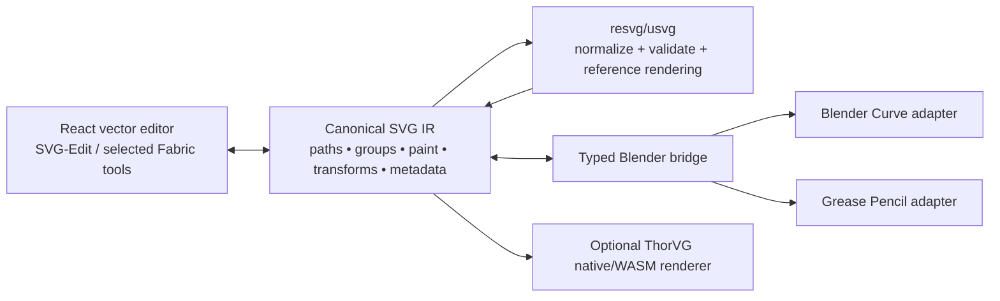
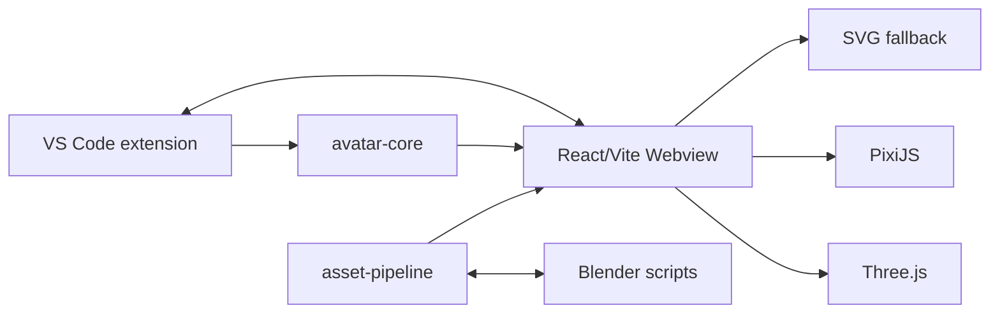
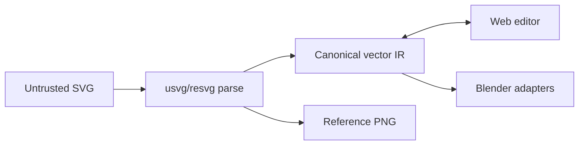
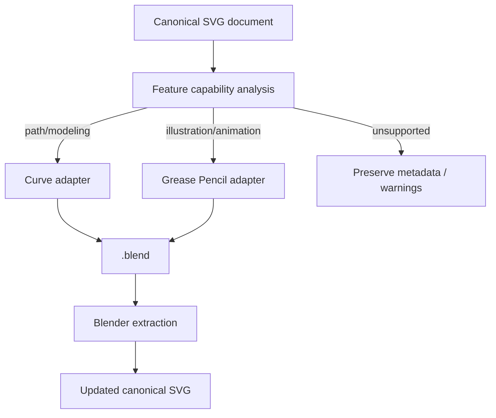
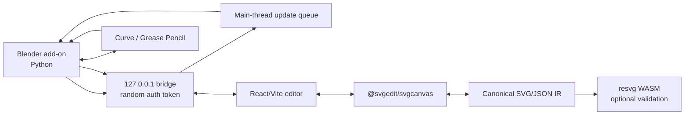
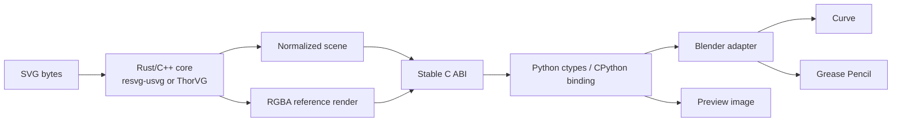
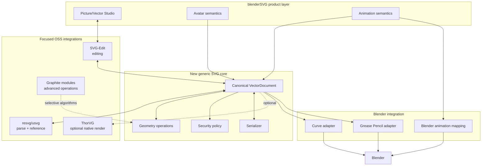

# Deep Research Report: Open-Source SVG Technologies for `uset82/blenderSVG`

## Executive summary

The most important finding is architectural, not algorithmic: **the public `uset82/blenderSVG` repository I audited on September 23, 2026 is not presently structured as a conventional Blender add-on.** Its `main` branch is a TypeScript/pnpm project named **Codex Avatar Studio**, centered on a VS Code/Cursor extension, React Webview, avatar runtimes, a raster-to-SVG asset pipeline, and optional Python scripts that hand SVG assets into and out of Blender. The GitHub repository itself was created on September 23, 2026, reports TypeScript as its primary language, has 0 stars/0 forks at the time of audit, and GitHub cannot identify a standard SPDX license for it. fileciteturn21file0L2-L2

That distinction matters because it changes the highest-value strategy. You do **not** need to build a vector editor or full SVG implementation from scratch inside `bpy`. The repo already has the beginnings of a sensible three-tier architecture:

```text
Web/TypeScript editor & preview
        ↕
canonical SVG / asset pipeline
        ↕
Blender Python adapters
```

The problem is that the SVG layer is still comparatively shallow. Raster tracing is based on ImageTracer/Jimp; validation mainly counts paths/groups and enforces avatar-specific layer names; external SVG runtime assets are rendered as an ``, making their nodes inaccessible for interactive editing; and Blender handoff ultimately delegates SVG understanding to Blender's built-in curve importer or Grease Pencil exporter. fileciteturn10file0L2-L2 fileciteturn12file0L2-L2 fileciteturn13file0L2-L2 fileciteturn14file0L2-L2

That last dependency is particularly limiting. Blender 5.2's official SVG-as-Curves importer still supports **path geometry only**; gradients, fills, strokes, text objects, images, and filters are ignored. Blender's separate Grease Pencil SVG workflow is more capable and now supports exporting selected or scene frames as SVG animation, but it remains a Grease-Pencil-specific representation rather than a general SVG DOM. citeturn17search13turn17search5

### Recommended strategic stack

My strongest recommendation is **integration, not a monolithic fork**:

| Priority | Technology | What it should do for you | Recommendation |
|---|---|---|---|
| **Highest** | [resvg/usvg](https://github.com/linebender/resvg) | Correct parsing/normalization/render oracle | **Integrate** |
| **Highest** | [SVG-Edit / `@svgedit/svgcanvas`](https://github.com/SVG-Edit/svgedit) | Interactive SVG editing in your existing web UI | **Embed/fork editor layer** |
| **High** | [Graphite](https://github.com/GraphiteEditor/Graphite) | Advanced vector/node algorithms and future procedural editing | **Mine/integrate selectively** |
| **High** | [Fabric.js](https://github.com/fabricjs/fabric.js) | Manipulation, controls, object model, SVG I/O | **Alternative/complement to SVG-Edit** |
| **High** | [ThorVG](https://github.com/thorvg/thorvg) | Native/WASM high-performance rendering | **Optional native renderer** |

`resvg/usvg` is the best technical foundation because it is a dedicated Rust SVG implementation usable as Rust, C, and CLI code, carries MIT/Apache-2.0 licensing, has roughly 1,600 SVG-to-PNG regression tests, and deliberately separates static SVG interpretation from browser-specific scripting behavior. It has about 4.1k stars and 347 forks in the current snapshot. citeturn14search0turn14search5

SVG-Edit is almost tailor-made for your current React/Vite direction. The project explicitly separates its UI from `@svgedit/svgcanvas`, says `svgcanvas` can be used to build your own editor, documents embedding the editor into an arbitrary DOM `<div>`, has a React proof of concept, and is MIT-licensed. It currently has about 7.8k stars/1.8k forks and was updated August 5, 2026. citeturn13search0turn13search4turn13search9

Graphite is the strongest long-term source of sophisticated vector/editor architecture: Rust, nondestructive layer compositing, a procedural node graph, vector and raster graphics, MIT/Apache-2.0 dual licensing, roughly 27.3k stars/1.3k forks, and active development through September 2026. I would **not** fork all of Graphite into your project; its value is in reusable algorithms, architecture patterns, and potentially WASM-isolated capabilities. citeturn13search2turn13search7

A realistic target architecture is therefore:



The architectural mistake I would avoid is making Blender's importer the canonical SVG parser. Blender should become a **consumer of your normalized vector scene**, not the authority on what SVG means.

---

## Repository audit and refactor opportunities

### What the repository actually contains

The documented architecture describes a pnpm TypeScript workspace with a VS Code extension host, React Webview, shared avatar contracts, an asset-processing package, a PixiJS runtime, optional Three.js rendering, and Python scripts for Blender. SVG is intentionally the permanent fallback renderer. fileciteturn16file0L2-L2

Conceptually:



That is actually a good foundation for an SVG-heavy product because editing, rendering, asset processing, and Blender conversion are already separated enough to evolve independently. The architecture also deliberately keeps runtime assets local, uses a nonce-based CSP, validates local packages, launches Blender without a shell, and treats sanitized SVG as a fallback around Blender/GLB workflows. fileciteturn16file0L2-L2

The root repository, however, identifies itself elsewhere as `codex-avatar-studio`, version `0.1.0`, `private: true` at the package level and `UNLICENSED`, while repository URLs in the package metadata refer to another `avatar-studio` path. That, combined with the `blenderSVG` GitHub repository name, is a strong indication that **project identity, packaging, and licensing need normalization before a public fork ecosystem is built around it**. fileciteturn21file0L2-L2

### Current SVG capabilities

| Area | Current implementation | Strength | Main limitation |
|---|---|---|---|
| Raster → SVG | Jimp preprocessing + ImageTracerJS | Fully local; configurable threshold/detail/palette/background removal | Tracing yields geometric paths, not semantic authored vector structure |
| SVG optimization | SVGO | Mature optimizer; IDs and group structure intentionally preserved | Optimization is not a semantic SVG engine |
| SVG sanitization | Custom sanitization + SVGO | Strict local-security posture | Regex-based filtering becomes difficult to reason about as SVG support expands |
| Structure validation | `fast-xml-parser` + avatar profiles | Useful warnings for layer naming and complexity | Understands only a tiny subset of SVG semantics |
| Web runtime | Built-in inline SVG or external SVG `` | Very robust fallback behavior | External SVG nodes cannot be manipulated as a live editor DOM |
| Blender SVG import | `bpy.ops.import_curve.svg` | Generates native editable curves | Inherits Blender curve-import limitations |
| Blender SVG export | Grease Pencil export operator | Uses Blender's supported GP SVG path | Only GP objects; not a general Curve/Mesh → SVG system |
| SVG animation | Web/CSS avatar behavior + Blender GP capabilities | Foundation exists | No canonical SVG animation model/round trip |
| Layer conventions | Reference/humanoid/orb/mascot IDs | Valuable for avatar workflows | Domain-specific rules are mixed with general SVG processing |

The tracing pipeline validates input, preprocesses it, passes pixel data to `ImageTracer.imagedataToSVG()`, runs SVG validation, optimizes with SVGO, validates again, and applies safety limits. The default generated-output bounds are one million bytes and 20,000 paths. Its own messages accurately warn that bitmap tracing is most appropriate for references/icons/silhouettes and that animated mascot art should instead be authored as named SVG layers. fileciteturn10file0L2-L2

That is a sensible image-vectorization utility, but it is **not yet a vector graphics engine**.

The optimizer is deliberately conservative about group semantics: `cleanupIds` and `collapseGroups` are disabled. That is a very good choice for an editor/animation system because group IDs can remain meaningful. It also strips active/external constructs including scripts, `foreignObject`, styles, iframe/object/embed content, external images/media and unsafe references. fileciteturn11file0L2-L2

The problem is that sanitization and SVG feature policy are currently intertwined. For example, stripping `<style>` and `<image>` is entirely reasonable for today's restricted avatar security model, but it prevents those constructs from ever becoming supported editor features. A mature implementation should distinguish:

```text
Parse → normalize → policy check → sanitize for target → optimize → serialize
```

rather than treating sanitization itself as the parser.

The current structural validator illustrates the same point. It recognizes groups and paths, extracts IDs, counts tiny paths and unnamed groups, enforces avatar-specific layer profiles, and issues warnings for file/path complexity. It does not constitute validation of SVG transforms, paint servers, gradients, clipping, masks, `<use>`, CSS cascade, text, viewBox calculations, path grammar, or unit semantics. fileciteturn12file0L2-L2

### The web renderer is the largest missed opportunity

Manifest-provided SVGs are currently rendered via:

```tsx

```

while only the built-in orb is authored as inline JSX/SVG. fileciteturn13file0L2-L2

That makes the runtime dependable, but from an editor perspective an `` is an opaque bitmap-like replaced element. Your application cannot naturally select `path#eye-left`, manipulate Bézier nodes, alter a gradient stop, attach per-layer animation, or map a user click back to the underlying SVG node.

The biggest short-term feature leap would come from replacing this path with an editable representation:

```text
raw SVG
   ↓
safe parser
   ↓
canonical scene/document model
   ↓
interactive editor canvas
   ↙                ↘
SVG serialization   Blender serialization
```

### Blender handoff

Your Blender importer currently resets to a clean scene, makes `Avatar`, `Export`, `Guides`, and `Ignore` collections, ensures the SVG curve importer is available, imports the sanitized document as curves, applies basic extrusion/bevel, normalizes scale, and adds an orthographic camera/light. fileciteturn14file0L2-L2

That produces an editable starting point, but the upstream limitation is severe: current Blender documentation says SVG-as-Curves supports **only SVG path geometry** and ignores gradients, fills, strokes, text, images, and filters. citeturn17search13turn17search16

Your exporter similarly explicitly requires Grease Pencil objects and Blender's Grease Pencil SVG export operator; arbitrary meshes, curves, and pictures are not converted to SVG by that script. fileciteturn15file0L2-L2

Modern Blender's Grease Pencil SVG exporter is more interesting than your current wrapper exposes. Blender 5.2/5.3 can export active, selected, or visible GP objects; active, selected, or whole-scene frame ranges; fills; uniform stroke widths; and camera clipping. Selected or scene frames can be exported as SVG animation. citeturn17search1turn17search5

That suggests implementing **two distinct Blender adapters**:

```text
SVG → Curve adapter
best for modeling/extrusion/path geometry

SVG ↔ Grease Pencil adapter
best for illustration/strokes/fills/animation
```

Trying to collapse these into a single Blender representation will lose information unnecessarily.

### Refactor targets

I would introduce this package boundary before adding another major SVG dependency:

```text
packages/
  svg-core/
    parser/
    document/
    geometry/
    paint/
    transforms/
    serializer/
    sanitize/
    tests/

  svg-editor-adapter/
    svgedit/
    fabric/          # optional

  svg-renderer-resvg/
    wasm/
    native/

  blender-svg-contract/
    schema/
    layer-map/
    coordinate-map/

scripts/blender/
  adapters/
    curve.py
    grease_pencil.py
```

The central model should be something like:

```ts
interface VectorDocument {
  viewport: ViewBox;
  root: VectorGroup;
  defs: VectorDefinitions;
}

interface VectorNodeBase {
  id: string;
  transform: Matrix2D;
  opacity: number;
  metadata: Record<string, string>;
}

interface VectorPath extends VectorNodeBase {
  kind: "path";
  geometry: PathGeometry;
  fill?: Paint;
  stroke?: StrokeStyle;
}

interface VectorGroup extends VectorNodeBase {
  kind: "group";
  children: VectorNode[];
}
```

Crucially, your `avatar/...` naming requirements should become a **profile layered on top of this generic IR**, not assumptions inside the generic SVG parser.

---

## Blender and SVG open-source landscape

The Blender-specific ecosystem is surprisingly thin. The highest-value repositories are useful mostly as sources of conversion algorithms and Blender API patterns; none is a modern, full SVG editor worthy of becoming your entire foundation.

### Comparison of Blender-oriented projects

Activity data below reflects the repository state observed during this research on September 23, 2026.

| Project | Purpose and notable features | Language / license | Activity | Maintainability | Integration complexity | Verdict |
|---|---|---|---|---|---|---|
| [Blender `blender-addons`](https://github.com/blender/blender-addons) | Historical official modules including `io_curve_svg` and Freestyle SVG exporter | Python / individual Blender modules GPL-family | 393★, 205 forks; mirror pushed Jun. 17, 2025; archived | **Reference only**: GitHub is an archived read-only mirror | Medium | Study Blender mappings, but follow current Blender APIs rather than forking the archive |
| [Sverchok](https://github.com/nortikin/sverchok) | Large parametric node system; geometry pipelines and SVG/DXF-related workflows | Python / GPL-3.0 | 2,525★, 243 forks; pushed Sep. 13, 2026 | **High** | Very high as whole project; medium for isolated concepts | Valuable architecture/geometry source, poor wholesale fork |
| [Freestyle SVG Exporter](https://github.com/folkertdev/freestyle-svg-exporter) | Freestyle stylized line rendering → SVG | Python / repository API does not declare license | 61★, 19 forks; last push Jan. 30, 2019 | **Low/stale** | Low–medium | Mine line/projection/export ideas; do not base a new subsystem on it |
| [blender-curve-to-svg](https://github.com/aryelgois/blender-curve-to-svg) | Selected Blender 2D curves → SVG; material grouping, transforms, viewBox/precision | Python / MIT | 46★, 8 forks; last push Aug. 3, 2020 | **Low/stale but small** | Low | Best small reference for Curve → SVG serialization |
| Blender current native SVG/GP tooling | Path SVG → curves and SVG ↔ Grease Pencil | C/C++/Python inside Blender / GPL | Actively developed in Blender itself | **Very high** | Low API use; high if copying internals | Prefer calling supported APIs and filling gaps yourself |

The GitHub metadata confirms that the historical Blender add-ons repository is an official read-only mirror, archived, with 393 stars and 205 forks. fileciteturn22file0L2-L2 Blender's current manuals should therefore be treated as the source of truth for current functionality, not the archived add-on mirror. citeturn17search1turn17search13

Sverchok is in a completely different maintenance class: 2,525 stars, 243 forks, GPL-3.0, and a push on September 13, 2026. fileciteturn20file0L2-L2 Its scale makes it unattractive as a dependency merely to gain SVG capabilities, but it is useful research material for Blender-native procedural geometry, nodes, data transformations, and exporters.

`blender-curve-to-svg` is almost the opposite: tiny and stale, but MIT-licensed and narrowly aligned with a missing capability in your codebase. It has 46 stars/8 forks and was last pushed in August 2020. fileciteturn19file0L2-L2 It is a much more reasonable source from which to adapt curve serialization logic than to absorb a large GPL application.

The Freestyle exporter has 61 stars/19 forks but has not been pushed since January 2019. fileciteturn18file0L2-L2 It is useful primarily for understanding 3D-view-dependent stylized-line export, not as the backbone of a modern implementation.

### What Blender itself still does not solve

The distinction between Blender's two SVG routes is fundamental:

| SVG concept | SVG → Curve | SVG ↔ Grease Pencil | Your own SVG core |
|---|---:|---:|---:|
| Bézier/path geometry | Good | Good | Should preserve exactly |
| Filled illustration | Ignored by curve importer | Supported to an extent | Preserve |
| Stroke styling | Ignored by curve importer | Relevant | Preserve |
| Gradients | Ignored by curve importer | Not a general full SVG paint model | Preserve |
| Text | Ignored by curve importer | Not a general SVG text round trip | Preserve or outline |
| Masks/clipping | Not general | Limited representation mapping | Preserve |
| Filters | Ignored | Not general | Preserve even if Blender cannot represent |
| SVG groups/IDs | Not a complete semantic round trip | Blender-layer mapping possible | Preserve exactly |
| Animation | No | Modern GP export can emit animation | Model separately |
| `<use>`/symbols/CSS | Not a canonical round trip | Not canonical | Normalize/preserve |

Blender's current Curve importer explicitly documents the path-only limitation, while the Grease Pencil workflow exposes animation, fills and sampling controls. citeturn17search13turn17search1

The correct design is therefore **loss-aware conversion**. Keep a canonical SVG/IR document and let each Blender adapter produce the subset Blender can edit. Do not overwrite the canonical document merely because Blender cannot express a feature.

---

## Broader vector and canvas ecosystem

This is where the dramatic feature gains are available.

### Strong open-source candidates

| Project | Stack / license | SVG/vector strengths | Modularity / embedding | Collaboration | Suitability |
|---|---|---|---|---|---|
| [resvg/usvg](https://github.com/linebender/resvg) | Rust; MIT or Apache-2.0 | High-correctness static SVG parsing/rendering; extensive regression suite | Rust library, C library, CLI; excellent for native/WASM bridge | None | **Excellent SVG core/reference renderer** |
| [SVG-Edit](https://github.com/SVG-Edit/svgedit) | JavaScript; MIT | Direct SVG editor, shapes, paths, selection/editing, serialization | Explicitly split UI + `@svgedit/svgcanvas` | Not its core | **Excellent web editor embed** |
| [Graphite](https://github.com/GraphiteEditor/Graphite) | Rust; MIT/Apache-2.0 | Nondestructive vector+raster editing, procedural node engine | Large but architecturally modular; web-targeted Rust/WASM concepts | Not primary focus | **Excellent strategic/algorithm source** |
| [Fabric.js](https://github.com/fabricjs/fabric.js) | TypeScript; MIT | Object manipulation, controls, shapes, gradients, patterns, brushes, SVG import/export | `@fabricjs/core`, browser and Node packages | None | **Excellent interaction toolkit** |
| [Paper.js](https://github.com/paperjs/paper.js) | JavaScript; MIT | Path geometry, Bézier operations, scripting, SVG import/export | Core/full browser builds; Node shims | None | **Very good geometry library; maintenance caution** |
| [Penpot](https://github.com/penpot/penpot) | Clojure/ClojureScript; MPL-2.0 | Professional SVG/web-standard design platform | Plugins/API are more attractive than embedding whole stack | **Yes, real-time** | **Excellent reference/API system; poor embedded dependency** |
| [ThorVG](https://github.com/thorvg/thorvg) | C++; MIT | SVG/Lottie renderer, gradients, paths, masks, clips, text, effects | C API, native, headless, WASM, multiple render backends | No | **Excellent native renderer** |
| [LunaSVG](https://github.com/sammycage/lunasvg) | C++; MIT | SVG 1.1/Tiny static renderer/manipulator, CSS/styles, hit testing | Small C++ library | No | **Good lightweight alternative** |
| [Pencil](https://github.com/evolus/pencil) | Electron/JavaScript | Diagram/UI prototyping | Desktop Electron application | No modern collaboration focus | **Low priority / legacy** |

#### resvg/usvg

`resvg` is unusually well matched to this project because it does only one hard thing. It can be used as a Rust library, C library, or CLI, aims for broad static SVG correctness, and maintains approximately 1,600 rendering regression tests. It intentionally excludes animation, scripting and event-driven SVG, which is a feature rather than a defect for your sanitized local asset pipeline. citeturn14search0turn14search5

Its static-only limitation means it should not become your animation model. Its job should be:

```text
SVG input
  ↓
parse / normalize
  ↓
known static scene
  ├──→ canonical IR
  ├──→ regression render
  └──→ compatibility diagnostics
```

For an SVG/Blender application, that separation is ideal.

#### SVG-Edit

SVG-Edit is the quickest path from your present `` preview to a real authoring interface. Its maintainers explicitly describe two main components: the editor UI and underlying `svgcanvas`, with the latter usable to build a custom editor. It supports embedding into a specified DOM element and points to React integration examples. citeturn13search0turn13search9

It also has healthy enough present activity: 7,828 stars, 1,751 forks, MIT license, update on August 5, 2026. citeturn13search4

**I would start with `@svgedit/svgcanvas`, not fork the whole SVG-Edit UI.** Your own Picture Studio and avatar-layer UI should remain the product interface.

#### Graphite

Graphite is the most technologically interesting project surveyed. It combines traditional layer workflows with a procedural node-based graphics engine and is explicitly intended for both vector and raster content. Its source is dual-licensed MIT/Apache-2.0. citeturn13search2

Its September 2026 GitHub snapshot shows roughly 27,280 stars and 1,259 forks with current development. citeturn13search7

Its disadvantage is precisely its ambition. Forking Graphite to become a Blender SVG widget would create an enormous long-term merge burden. Instead, use Graphite to answer questions such as:

- How should nondestructive vector operations be represented?
- How should path effects become nodes?
- How do you separate document state from UI tools?
- Which geometry algorithms make sense to expose through WASM?

Graphite is a **strategic donor**, not your immediate editor dependency.

#### Fabric.js

Fabric has one of the most convenient interactive object models in this space: translation, scaling, rotation, skewing, grouping, shapes, controls, filters, gradients, patterns, brushes and SVG I/O. The current project is typed and modular, with dedicated browser, Node, and shared-core packages. citeturn13search1

Its GitHub organization shows approximately 31,204 stars, 3,624 forks, MIT licensing and an update on May 31, 2026. citeturn13search3

There is, however, a security reason not to allow Fabric to replace your SVG trust boundary. In 2026, Fabric disclosed SVG serialization XSS issues: one high-severity issue affected versions before 7.2.0, and a later gradient color-stop serialization issue affected versions before 7.4.0. citeturn17search14turn17search0

So, if used:

```text
Fabric >= 7.4.0
        ↓
serialize
        ↓
your independent SVG parser/sanitizer
        ↓
trusted project document
```

Never treat `canvas.toSVG()` as sanitization.

#### Paper.js

Paper.js remains one of the best JavaScript path-geometry toolkits: browser/Canvas oriented, SVG import/export, browser and Node builds, and MIT licensing. It has about 15.1k stars and 1.3k forks. citeturn15search1

Its drawback is maintenance velocity. The main `paper.js` repository's organization listing shows its last update on July 23, 2024, even though adjacent Paper.js infrastructure saw 2026 activity. citeturn15search3

I would still consider Paper.js for **isolated geometric operations** if it solves a specific need elegantly, but I would not make it your primary editor architecture in 2026.

#### Penpot

Penpot is the most mature open-source collaborative design platform in this survey. The current repository has 60,291 stars and 4,128 forks, is MPL-2.0 licensed, and was pushed on September 23, 2026. fileciteturn23file0L2-L2

Penpot's broader platform is web-based and built around open web standards, with real-time collaboration, self-hosting, plugins, APIs and webhooks. citeturn16search8

It is nevertheless a poor library dependency for blenderSVG. A Clojure/ClojureScript collaborative application plus server infrastructure is far too large merely to gain SVG editing. Penpot is valuable in three ways:

1. as a design/UX benchmark;
2. as an optional external interoperability/API target;
3. as a source of ideas about collaborative document semantics.

I would not embed Penpot wholesale.

#### ThorVG

ThorVG is the strongest native alternative to resvg when **rendering speed and a C API** matter more than maximum SVG coverage. It is a production-oriented C++ vector engine with software/OpenGL/WebGL/WebGPU backends, headless rendering, SVG and Lottie support, optional C bindings and WebAssembly integrations. citeturn14search1turn14search3

The current organization snapshot reports 1,724 stars, 228 forks, MIT licensing and an update on July 29, 2026. citeturn14search2

The trade-off is specification scope: ThorVG explicitly targets SVG Tiny-style static rendering and does not provide SVG animation, interactivity or multimedia semantics. citeturn14search1

Its WebAssembly-based ThorVG View demonstrates that the same renderer can operate locally in a browser. citeturn14search4 This makes it particularly interesting if you eventually want a **shared native/WASM rendering core**.

#### LunaSVG

LunaSVG is an appealing lightweight C++ fallback: MIT licensed, roughly 1.2k stars/172 forks, with SVG rendering/manipulation, CSS styling and newer hit-testing facilities. It supports a large set of SVG elements but excludes animation, filters and scripts. citeturn15search0turn15search4

I would still choose resvg over it for a correctness/reference engine because resvg's own published compatibility testing reports that LunaSVG does not meet the threshold it uses for its comparative test table. citeturn14search0

### The projects named in your prompt that are not good fork candidates

This distinction is important: **open formats, public SDKs and APIs are not the same thing as an open-source editor.**

| Product | What the research found | Forkability conclusion |
|---|---|---|
| **QuiverAI** | Hosted SVG-generation/vectorization/editing models with API, SDKs, CLI/MCP | **API integration, not core fork** |
| **pen.dev** | Agentic design canvas, custom WebGL pipeline, open `.pen` JSON format, CLI/MCP | **Open format; no official OSS editor source established** |
| **Lunagraph** | Code-oriented design canvas producing React and integrating Claude/Codex/Cursor/MCP | **Treat as proprietary/reference unless source licensing changes** |
| **Linearity Curve** | Commercial vector-design product ecosystem | **UX/interchange benchmark, not OSS foundation** |
| **Pencil Project** | Genuine OSS Electron prototyping tool | **Forkable but technically legacy** |

QuiverAI today exposes hosted Text-to-SVG and Image-to-SVG APIs, MCP/plugins and Node SDK capabilities. Its current site announced Arrow 2 in September 2026 and exposes hosted vector generation/vectorization functionality. citeturn16search2turn16search10

That can be useful as an **optional cloud enhancer**:

```text
Raster / prompt
    ↓
QuiverAI API
    ↓
generated SVG
    ↓
your local sanitizer
    ↓
canonical SVG IR
```

But it should not become the foundation of a local-first editor: the model/service is hosted, creates network/privacy/vendor dependencies, and cannot be forked merely because the integration SDK is public. An official Quiver GitHub provider demonstrates API integration rather than an open-source model/editor engine. citeturn16search14

pen.dev is technologically interesting—its current product advertises thousands of editable layers via a custom WebGL pipeline, SVG pasting, path editing, components, mesh gradients, Figma/HTML import, MCP/CLI and an openly specified JSON `.pen` file format. citeturn16search1turn16search4 But an open document format does not make the implementation itself open source. I did not identify an official OSS editor repository in the primary-source research, so it should be treated as a **protocol/interoperability inspiration**, not a fork target.

Lunagraph similarly presents a design canvas with React-code output and Claude Code/Codex/Cursor/MCP integration, but its public product site does not establish an open-source editor implementation. citeturn16search0

Pencil is genuinely open source, with about 9.9k stars and 791 forks, but its repository documentation still describes its Electron rewrite in terms of Node 5-era development. citeturn15search2 It is far less attractive than SVG-Edit, Graphite, or Fabric for new architecture.

---

## Recommended fork and integration candidates

### resvg/usvg — foundational SVG correctness layer

**Recommendation: integrate, not fork.**

This should be the first external core you add.

Its purpose is not to provide your UI. Its purpose is to stop every other subsystem from inventing its own interpretation of SVG.

Proposed role:



**What you gain:** far stronger transform/style/path handling, a large compatibility test corpus, deterministic reference rendering, C/Rust integration and a clean future route to WASM. `resvg` documents Rust/C/CLI deployment and approximately 1,600 rendering regression tests. citeturn14search0

**Estimated prototype effort:** **Medium, roughly 3–6 engineer-weeks** for a robust cross-platform wrapper, canonical representation and test integration.

**Risks:** Rust/native packaging across Blender-supported platforms; fonts; mapping its normalized representation back into a document model that remains editable; no SVG scripting/animation.

**Integration hook:** create `packages/svg-core` plus an optional native/WASM `svg-resvg` adapter. Do not expose `resvg` types throughout application code.

### SVG-Edit / `@svgedit/svgcanvas` — quickest route to a real vector editor

**Recommendation: embed `svgcanvas`; selectively fork UI behavior only where necessary.**

Your current React Webview makes this unusually cheap. SVG-Edit explicitly supports using the underlying canvas in custom applications and documents DOM embedding. citeturn13search0

Use it for:

- path creation and manipulation;
- anchors/Bézier handles;
- object selection and transform handles;
- grouping/layers;
- fill/stroke editing;
- common primitive creation;
- undo/redo;
- SVG serialization.

Keep your own product layer for:

- avatar layer conventions;
- Blender export controls;
- animation state mapping;
- asset/package security;
- manifest generation.

**Estimated effort:** **Medium, 3–7 engineer-weeks** for a polished first integration.

**Risks:** custom editor state versus your canonical state; editor extensions; CSP rules; eventual divergence from SVG-Edit's UI assumptions.

**Code-level hook:** make `svgcanvas` an adapter:

```ts
interface SvgEditorAdapter {
  load(document: VectorDocument): Promise<void>;
  snapshot(): Promise<VectorDocument>;
  selectById(id: string): void;
  onChange(cb: (change: VectorChange) => void): () => void;
}
```

Then switching to Graphite/Fabric later does not rewrite Blender code.

### Graphite — advanced vector technology donor

**Recommendation: selective integration/reimplementation, not wholesale application fork initially.**

Graphite should be your source for the features that move blenderSVG beyond a simple Illustrator-lite editor:

- nondestructive operations;
- procedural node graphs;
- vector/raster composition;
- future motion graphics;
- advanced path effects;
- graph-based generation.

Its Rust core and permissive MIT/Apache licensing make selective reuse considerably easier than importing GPL editor code. citeturn13search2

**Estimated effort:** **High, 2–4+ engineer-months** for meaningful integration beyond experimentation.

**Risks:** rapidly evolving alpha architecture; very large dependency surface; Rust/WASM boundary complexity; document-model impedance mismatch.

**Suggested path:** first run isolated geometry/node operations as WASM or a sidecar library against your own IR. Only consider a deeper fork after the SVG-Edit-based editor proves the product requirements.

### Fabric.js — interaction/object-model accelerator

**Recommendation: consider as an alternative to SVG-Edit or a complementary canvas utility.**

Fabric is stronger when your conceptual model is **interactive objects on a canvas** rather than the browser SVG DOM itself. Its object controls and transform behavior are excellent for building a custom UX. It is typed/modular and has dedicated browser/core packages. citeturn13search1

**Estimated effort:** **Medium, 4–8 engineer-weeks**.

**Primary risk:** you would now have three models to reconcile—Fabric objects, canonical SVG, and Blender objects. SVG-Edit has less conceptual distance because its editing target is SVG itself.

There is also a non-negotiable security requirement: pin Fabric at **7.4.0 or newer** at minimum given the 2026 SVG serialization advisories, and always run exported content through your own security boundary. citeturn17search0turn17search14

**Verdict:** SVG-Edit is the cleaner first choice for blenderSVG; Fabric is the better choice if you decide the product is really a canvas-design application whose export format happens to be SVG.

### ThorVG — native/WASM renderer for performance and consistency

**Recommendation: optional second-stage renderer.**

ThorVG is the strongest candidate when you want the same high-speed renderer in:

```text
Blender/native     WebAssembly/webview     CLI/headless
       \                  |                   /
        └──────── shared vector renderer ───┘
```

The project provides C bindings and web integrations in addition to its C++ API. citeturn14search1turn14search4

**Estimated effort:** **Medium–High, 4–10 engineer-weeks** for cross-platform native packaging plus Blender bindings.

**Risks:** SVG Tiny-oriented scope; another native dependency; potential overlap with resvg.

**Decision rule:** use **resvg** when correctness, normalization and testing are the priority; add **ThorVG** only when interactive/native rendering performance justifies an additional engine.

### Overall decision matrix

Scores are my engineering assessment for this repository, not upstream project ratings.

| Candidate | SVG correctness | Editor value | Blender fit | License fit | Integration speed | Strategic value | Overall |
|---|---:|---:|---:|---:|---:|---:|---:|
| **resvg/usvg** | 10 | 3 | 9 | 10 | 7 | 10 | **9.2/10** |
| **SVG-Edit/svgcanvas** | 8 | 10 | 7 | 10 | 9 | 9 | **9.0/10** |
| **Graphite** | 8 | 10 | 6 | 10 | 4 | 10 | **8.2/10** |
| **Fabric.js** | 7 | 9 | 7 | 10 | 8 | 8 | **8.1/10** |
| **ThorVG** | 7 | 3 | 10 | 10 | 5 | 9 | **7.8/10** |
| Paper.js | 7 | 7 | 6 | 10 | 8 | 6 | 7.3/10 |
| Penpot | 9 | 10 | 3 | 7 | 2 | 7 | 6.6/10 |
| LunaSVG | 6 | 2 | 9 | 10 | 6 | 6 | 6.5/10 |
| Sverchok | 3 | 3 | 10 | 4 | 3 | 6 | 5.4/10 |
| Pencil | 5 | 6 | 3 | — | 4 | 3 | Low priority |

The practical conclusion is **not** to select only one. The best product is a composition:

> **SVG-Edit for authoring + your own canonical IR + resvg/usvg for correctness + Blender adapters for Curve/Grease Pencil + Graphite-derived advanced operations later.**

---

## Prioritized implementation roadmap

The estimates below are engineering estimates rather than upstream claims. They assume roughly one experienced engineer working primarily on this feature, with design/testing assistance but no major rewrite of the rest of Codex Avatar Studio.

For planning purposes:

- **Low:** roughly 3–10 engineer-days.
- **Medium:** roughly 3–6 engineer-weeks.
- **High:** roughly 2–4+ engineer-months.

### Foundation: create a real SVG domain layer

**Priority: immediate. Estimated effort: Medium, 2–4 weeks.**

Do this before embedding an editor.

Create `packages/svg-core` and move responsibility for SVG document semantics out of `asset-pipeline`.

Deliverables:

```text
SvgDocument
├── viewBox / dimensions / units
├── groups & IDs
├── paths
├── rect/circle/ellipse/polygon/polyline
├── transforms
├── fill/stroke
├── linear/radial gradients
├── clip paths/masks
├── defs/use
└── metadata
```

Keep animation as a separate extension to the model rather than prematurely encoding browser SVG animation semantics.

Refactor:

```text
imageToSvg.ts
    ↓
vectorization only

sanitizeSvg.ts
    ↓
target-specific security policy

validateSvgLayers.ts
    ↓
avatar profile validator

svg-core
    ↓
generic format semantics
```

Add fixture-based tests for SVGs from Inkscape, Blender, SVG-Edit and the resvg regression corpus where licensing permits. Use resvg rendering as a visual oracle. resvg's emphasis on public regression tests is particularly valuable here. citeturn14search0

**Required skills:** TypeScript, SVG/XML, computational geometry basics, test automation.

### Interactive editor MVP

**Priority: next. Estimated effort: Medium, 3–6 weeks.**

Embed `@svgedit/svgcanvas` in the existing React/Vite Webview. SVG-Edit is explicitly designed so its canvas can be consumed separately from its full editor shell. citeturn13search0

MVP scope:

```text
select/move/rotate/scale
path node editing
pen tool
rect/circle/polygon
fill + stroke
linear/radial gradients
groups/layer names
undo/redo
copy/paste
SVG import/export
avatar layer naming assistance
```

Replace external SVG `` rendering in edit mode with a parsed/editor-backed scene. Preserve `` as a safe fallback in non-edit/runtime mode if desirable.

**Definition of done:** edit a layered SVG, rename groups into your avatar profile, save, reload with no semantic loss, and feed the same document into Blender.

### Blender round-trip layer

**Priority: high. Estimated effort: Medium–High, 4–7 weeks.**

Build explicit adapters instead of delegating everything to `bpy.ops.import_curve.svg`.



The feature-capability analyzer should tell users exactly what will degrade:

```text
✓ paths
✓ groups
✓ solid fills
△ strokes approximated
△ gradients baked/fallback
✗ filters not editable in Blender
```

This is more useful than silently allowing Blender to discard gradients, strokes and text, which its Curve importer currently does. citeturn17search13

Add support for both current GP SVG import/export and curve workflows. GP SVG export's current frame/fill/sampling capabilities make it the natural animation-facing route. citeturn17search1

**Required skills:** Blender Python API, Curve/Grease Pencil data, coordinate transforms, SVG geometry.

### Advanced vector operations

**Priority: after round-trip stability. Estimated effort: High, 6–12 weeks.**

Introduce features inspired by Graphite/Paper/Fabric rather than building all at once:

```text
boolean union/subtract/intersect
offset/stroke-to-path
simplify
corner rounding
node smoothing
compound paths
clipping/masking
gradient editor
symbols/instances
nondestructive modifiers
```

Start with algorithms that solve actual avatar/Blender use cases.

A useful nondestructive model might be:

```text
Path
 ↓
Simplify
 ↓
Offset
 ↓
Boolean Combine ← Other Path
 ↓
Transform
 ↓
Blender adapter
```

Graphite's node-based nondestructive approach is the strongest architectural reference in this space. citeturn13search2

### Shared native/WASM rendering

**Priority: conditional. Estimated effort: Medium–High, 4–10 weeks.**

Only add this if browser SVG rendering becomes inconsistent or performance limits appear.

Prototype resvg and ThorVG against a representative benchmark set:

```text
100 paths
1,000 paths
10,000 paths
nested transforms
gradients
masks
clip paths
text
large traced assets
```

Use resvg as correctness baseline; test ThorVG when low-latency previews/native integration matter. ThorVG supports native C bindings, headless operation and web rendering technologies. citeturn14search1turn14search3

### Optional AI vectorization/generation

**Priority: optional, after local editor is solid. Estimated effort: Low, 1–3 weeks for API MVP.**

QuiverAI is the obvious API experiment because it directly exposes SVG generation and vectorization. citeturn16search2

Make it explicitly opt-in:

```text
Local tracing                         Cloud enhanced
ImageTracer                           QuiverAI
     ↓                                    ↓
     └──────── canonical sanitizer ───────┘
                        ↓
                    SVG editor
```

Do not let the hosted output bypass normal validation or become a required runtime dependency.

### Hardening and release

**Priority: mandatory before broad distribution. Estimated effort: Medium, 3–6 weeks.**

Test:

- malicious SVGs;
- path-count/size bombs;
- deeply recursive groups/`<use>`;
- extreme transforms;
- degenerate Bézier paths;
- malformed XML;
- font absence;
- external URL references;
- round-trip loss;
- Blender 4.5 LTS and current 5.x behavior;
- Windows/macOS/Linux packaging;
- visual golden tests.

This matters especially for web-editor integrations. Fabric's two 2026 SVG serialization advisories illustrate why SVG serialization and application trust boundaries cannot be conflated. citeturn17search17

---

## Integration architectures and sample code

### Web vector editor with Blender

There is an important architectural caveat: **a normal Blender Python panel is not a Chromium/React webview**. Your current React environment belongs to the VS Code Webview. For a Blender-native product, the robust cross-platform solution is therefore a **local sidecar editor window/browser** rather than trying to force arbitrary HTML into Blender's UI.

The architecture I would use is:



The sidecar should bind only to `127.0.0.1`, generate an unpredictable per-session token, limit body sizes, serve its own bundled UI, and never call `bpy` from the HTTP worker thread.

An illustrative Blender-side skeleton:

```python
# blender_svg/web_bridge.py
#
# Illustrative architecture: networking occurs off-thread, while every
# Blender API call is dispatched through bpy.app.timers on Blender's
# main thread.

from __future__ import annotations

import json
import queue
import secrets
import threading
from http.server import BaseHTTPRequestHandler, ThreadingHTTPServer

import bpy

MAX_DOCUMENT_BYTES = 2_000_000
_updates: queue.Queue[str] = queue.Queue()
_session_token = secrets.token_urlsafe(32)


def apply_svg_document(svg: str) -> None:
    """Convert canonical SVG through your adapter, not directly in the HTTP thread."""
    # Future API:
    # doc = svg_core.parse_and_validate(svg)
    # blender_curve_adapter.update(doc)
    #
    # The important point is that this function executes on Blender's main thread.
    print(f"Received SVG document: {len(svg)} characters")


def pump_updates() -> float:
    try:
        while True:
            svg = _updates.get_nowait()
            apply_svg_document(svg)
    except queue.Empty:
        pass

    # Ask Blender to invoke us again.
    return 0.10


class Handler(BaseHTTPRequestHandler):
    def do_PUT(self) -> None:
        if self.path != "/api/document":
            self.send_error(404)
            return

        if self.headers.get("X-BlenderSVG-Token") != _session_token:
            self.send_error(403)
            return

        try:
            length = int(self.headers.get("Content-Length", "0"))
        except ValueError:
            self.send_error(400)
            return

        if not 0 < length <= MAX_DOCUMENT_BYTES:
            self.send_error(413)
            return

        try:
            payload = json.loads(self.rfile.read(length))
            svg = payload["svg"]

            if not isinstance(svg, str) or "<svg" not in svg:
                raise ValueError("Expected an SVG document")

            _updates.put(svg)
        except (json.JSONDecodeError, KeyError, ValueError) as exc:
            self.send_error(400, str(exc))
            return

        self.send_response(204)
        self.end_headers()

    def log_message(self, fmt: str, *args: object) -> None:
        # Route through Blender logging in production.
        pass


def start_bridge() -> tuple[int, str]:
    server = ThreadingHTTPServer(("127.0.0.1", 0), Handler)

    thread = threading.Thread(
        target=server.serve_forever,
        name="blender-svg-web-bridge",
        daemon=True,
    )
    thread.start()

    if not bpy.app.timers.is_registered(pump_updates):
        bpy.app.timers.register(pump_updates, persistent=True)

    return server.server_port, _session_token
```

The corresponding editor adapter can remain tiny:

```ts
export interface BlenderBridgeConfig {
  port: number;
  token: string;
}

export async function publishSvg(
  config: BlenderBridgeConfig,
  svg: string,
): Promise<void> {
  const response = await fetch(
    `http://127.0.0.1:${config.port}/api/document`,
    {
      method: "PUT",
      headers: {
        "Content-Type": "application/json",
        "X-BlenderSVG-Token": config.token,
      },
      body: JSON.stringify({ svg }),
    },
  );

  if (!response.ok) {
    throw new Error(
      `Blender SVG bridge failed: ${response.status} ${response.statusText}`,
    );
  }
}

// With SVG-Edit the adapter layer would obtain the document from
// svgcanvas, normalize it through your svg-core package, then publish it.
```

In the **current repo specifically**, you can avoid this sidecar entirely for the VS Code use case: mount SVG-Edit directly in `apps/webview`, then keep Blender as the child-process/export endpoint already envisioned by the architecture. fileciteturn16file0L2-L2

That is the route I would implement first.

### Native SVG core bridged to Blender Python

For the second architecture, do not port a modern SVG renderer into pure Python line by line. Keep a tested native implementation and expose a deliberately tiny ABI.



Design your own stable C interface rather than exposing an upstream library's internal structs directly:

```c
/* blendersvg_core.h */

#ifndef BLENDERSVG_CORE_H
#define BLENDERSVG_CORE_H

#include <stddef.h>
#include <stdint.h>

typedef struct {
    uint8_t *data;
    size_t length;
} blsvg_buffer;

typedef struct {
    uint32_t width;
    uint32_t height;
    uint32_t stride;
    uint8_t *pixels; /* RGBA8 */
} blsvg_bitmap;

/*
 * Produce a normalized, implementation-independent scene description.
 * JSON is not the fastest possible format, but is excellent for a first
 * stable Blender/Python ABI.
 */
int blsvg_normalize(
    const uint8_t *svg,
    size_t svg_length,
    blsvg_buffer *out_scene_json
);

/* Reference rendering for thumbnails / golden comparisons. */
int blsvg_render_rgba(
    const uint8_t *svg,
    size_t svg_length,
    uint32_t width,
    uint32_t height,
    blsvg_bitmap *out_bitmap
);

void blsvg_free_buffer(blsvg_buffer *buffer);
void blsvg_free_bitmap(blsvg_bitmap *bitmap);

#endif
```

The native implementation can use `usvg/resvg`, whose public project explicitly supports use as a Rust library and C library. citeturn14search0 Or a performance-oriented build can substitute ThorVG behind the same application ABI; ThorVG explicitly provides optional C bindings. citeturn14search1

The Blender-facing Python stays isolated from the chosen engine:

```python
from __future__ import annotations

import ctypes
import json
from pathlib import Path


class Buffer(ctypes.Structure):
    _fields_ = [
        ("data", ctypes.POINTER(ctypes.c_uint8)),
        ("length", ctypes.c_size_t),
    ]


class SvgCore:
    def __init__(self, library_path: Path) -> None:
        self.lib = ctypes.CDLL(str(library_path))

        self.lib.blsvg_normalize.argtypes = [
            ctypes.POINTER(ctypes.c_uint8),
            ctypes.c_size_t,
            ctypes.POINTER(Buffer),
        ]
        self.lib.blsvg_normalize.restype = ctypes.c_int

        self.lib.blsvg_free_buffer.argtypes = [ctypes.POINTER(Buffer)]
        self.lib.blsvg_free_buffer.restype = None

    def normalize(self, svg: str) -> dict:
        raw = svg.encode("utf-8")
        source = (ctypes.c_uint8 * len(raw)).from_buffer_copy(raw)
        result = Buffer()

        status = self.lib.blsvg_normalize(
            source,
            len(raw),
            ctypes.byref(result),
        )
        if status != 0:
            raise RuntimeError(f"SVG normalization failed with status {status}")

        try:
            payload = ctypes.string_at(result.data, result.length)
            return json.loads(payload.decode("utf-8"))
        finally:
            self.lib.blsvg_free_buffer(ctypes.byref(result))
```

Then implement a clean Blender adapter:

```python
def scene_to_blender(scene: dict) -> None:
    for node in scene["nodes"]:
        match node["type"]:
            case "path":
                create_or_update_curve(node)
            case "group":
                ensure_collection(node)
            case "unsupported":
                preserve_as_metadata(node)
```

The crucial engineering rule is that **the C/native layer knows SVG, while the Blender layer knows Blender**. Neither should know your React UI.

That gives you replaceability:

```text
resvg today
ThorVG tomorrow
another renderer later

              ↓ same ABI

Blender code unchanged
```

---

## Licensing, legal considerations, and primary sources

### Your own repository needs a licensing decision first

The most urgent licensing issue is not a dependency—it is the repository itself.

The public GitHub repository currently reports a nonstandard/`NOASSERTION` license classification, while the project package/readme material describes the code as `UNLICENSED`/all rights reserved. fileciteturn21file0L2-L2

A GitHub repository being public does **not** by itself grant downstream users permission to copy, modify or redistribute it as open-source software.

Before accepting meaningful upstream code, decide whether blenderSVG/Codex Avatar Studio will be:

- MIT;
- Apache-2.0;
- MPL-2.0;
- GPL-family;
- or proprietary with carefully isolated OSS dependencies.

For the architecture I recommend, **Apache-2.0 or MIT** would provide the easiest compatibility with the strongest candidates, assuming all of your existing code can legally be relicensed that way.

### License map

| Component | License | Practical implication |
|---|---|---|
| Your observed repo | `UNLICENSED` / GitHub `NOASSERTION` | Must resolve before calling project OSS or accepting copied code |
| resvg/usvg | MIT or Apache-2.0 | Excellent fit; retain notices; Apache option includes explicit patent provisions |
| SVG-Edit | MIT | Straightforward embedding/forking with copyright/license notice |
| Graphite | MIT / Apache-2.0 dual license | Excellent permissive reuse path, subject to per-directory exceptions |
| Fabric.js | MIT | Permissive; retain license; security version discipline needed |
| Paper.js | MIT | Permissive |
| ThorVG | MIT | Permissive |
| LunaSVG | MIT | Permissive |
| blender-curve-to-svg | MIT | Easy candidate for adapted serialization code |
| Penpot | MPL-2.0 | File-level copyleft; modifications to covered source files carry MPL obligations when distributed |
| Sverchok | GPL-3.0 | Copying code into a distributed combined work can impose GPL compatibility obligations |
| Blender / official Blender code | GPL-family | Prefer public APIs or independently written adapters unless your licensing strategy is GPL-compatible |
| QuiverAI SDKs | SDK-specific OSS terms; hosted service separate | OSS client code does not grant rights to hosted model/service implementation |
| pen.dev / Lunagraph / Linearity editor implementations | No OSS implementation established in this audit | Do not copy product code/assets absent explicit license |

resvg expressly offers MIT or Apache-2.0 at the user's option. citeturn14search0 Graphite likewise documents permissive MIT/Apache-2.0 licensing. citeturn13search2 SVG-Edit is MIT. citeturn13search0 ThorVG is MIT. citeturn14search3 Penpot's repository is MPL-2.0. fileciteturn23file0L2-L2 Sverchok is GPL-3.0. fileciteturn20file0L2-L2 `blender-curve-to-svg` is MIT. fileciteturn19file0L2-L2

For GPL projects in particular, distinguish **learning from behavior/algorithms and independently implementing an adapter** from copying GPL source. Because your repository is currently unlicensed/proprietary in practical terms, directly incorporating GPL code is a poor choice unless you deliberately adopt a GPL-compatible distribution model.

This is a software-licensing engineering assessment, not legal advice.

### SVG itself introduces content and security licensing concerns

A permissively licensed SVG parser does not make every imported SVG freely redistributable. Fonts, logos, images, characters and other embedded artwork can carry their own copyright or font licenses.

Your import pipeline should therefore preserve provenance:

```json
{
  "source": "user-import",
  "sourceFile": "avatar.svg",
  "license": "unknown",
  "externalResources": [],
  "fonts": ["Example Sans"],
  "modified": true
}
```

SVG also has an unusually broad active-content attack surface: external URL references, scripts, events, `foreignObject`, embedded data and CSS can cross security boundaries. Your existing sanitization is appropriately conservative, but a mature implementation should move from regex-oriented filtering toward structured parsing plus an explicit allowlist. The need for independent sanitization is reinforced by Fabric's 2026 SVG-serialization XSS advisories. fileciteturn11file0L2-L2 citeturn17search0turn17search14

### Recommended dependency policy

Use an explicit `THIRD_PARTY_NOTICES.md` and machine-readable dependency audit.

For every bundled/forked project, record:

```text
name
upstream URL
exact version/commit
SPDX license
files incorporated or modified
copyright notice
local modifications
security advisory status
```

Do the same for test corpora. A project's code license does not automatically cover every test SVG or bundled image under identical terms.

### Primary-source index

**Your project**

- [`uset82/blenderSVG`](https://github.com/uset82/blenderSVG) — audited public repository. fileciteturn21file0L2-L2
- `docs/ARCHITECTURE.md` documents the extension/Webview/runtime/Blender boundaries. fileciteturn16file0L2-L2
- `imageToSvg.ts` contains current ImageTracer/Jimp vectorization. fileciteturn10file0L2-L2
- `optimizeSvg.ts` contains current SVG sanitization/SVGO logic. fileciteturn11file0L2-L2
- `validateSvgLayers.ts` contains layer-profile validation. fileciteturn12file0L2-L2
- `SvgAvatarRenderer.tsx` contains current SVG runtime behavior. fileciteturn13file0L2-L2
- `import_svg_scene.py` contains current Blender handoff. fileciteturn14file0L2-L2
- `export_svg.py` contains current GP SVG export wrapper. fileciteturn15file0L2-L2

**Blender**

- [Blender SVG-as-Curves documentation](https://docs.blender.org/manual/en/latest/files/import_export/svg_curve.html) — current path-only importer limitation. citeturn17search13
- [Blender Grease Pencil SVG documentation](https://docs.blender.org/manual/en/latest/files/import_export/grease_pencil_svg.html) — current GP import/export model. citeturn17search1
- [Official historical `blender-addons` mirror](https://github.com/blender/blender-addons). fileciteturn22file0L2-L2
- [Sverchok](https://github.com/nortikin/sverchok). fileciteturn20file0L2-L2
- [Freestyle SVG Exporter](https://github.com/folkertdev/freestyle-svg-exporter). fileciteturn18file0L2-L2
- [blender-curve-to-svg](https://github.com/aryelgois/blender-curve-to-svg). fileciteturn19file0L2-L2

**SVG engines/editors**

- [resvg/usvg](https://github.com/linebender/resvg) — primary recommendation for parsing/reference rendering. citeturn14search0
- [SVG-Edit](https://github.com/SVG-Edit/svgedit) — primary recommendation for interactive editing. citeturn13search0
- [`@svgedit/svgcanvas` integration guidance](https://github.com/SVG-Edit/svgedit) — documented inside SVG-Edit. citeturn13search0
- [Graphite](https://github.com/GraphiteEditor/Graphite) — procedural/nondestructive editor architecture. citeturn13search2
- [Fabric.js](https://github.com/fabricjs/fabric.js) — interactive Canvas/vector object model. citeturn13search1
- [Paper.js](https://github.com/paperjs/paper.js) — path/vector scripting. citeturn15search1
- [Penpot](https://github.com/penpot/penpot) — collaborative design platform. fileciteturn23file0L2-L2
- [ThorVG](https://github.com/thorvg/thorvg) — native/WASM vector engine. citeturn14search3
- [ThorVG View](https://github.com/thorvg/thorvg.view) — browser/WASM renderer example. citeturn14search4
- [LunaSVG](https://github.com/sammycage/lunasvg) — lightweight C++ SVG implementation. citeturn15search0
- [Pencil](https://github.com/evolus/pencil) — legacy OSS prototyping editor. citeturn15search2

**Commercial/open-format references**

- [QuiverAI](https://quiver.ai/) — hosted SVG generation/vectorization/editing API. citeturn16search2
- [QuiverAI API platform](https://quiver.ai/platform) — production hosted integration layer. citeturn16search11
- [pen.dev](https://www.pen.dev/) — agentic canvas and open `.pen` document format. citeturn16search1
- [Lunagraph](https://www.lunagraph.com/) — React/code-oriented design canvas and agent integrations. citeturn16search0

### Bottom-line architecture decision

The most leverage comes from **not forking a giant editor**. Refactor blenderSVG into a standards-aware SVG platform with swappable adapters:



That architecture directly addresses the current bottlenecks revealed by the repository audit: ImageTracer remains a useful **input tool** rather than being mistaken for the SVG engine; avatar-layer validation becomes a **profile** rather than the vector data model; the opaque `` runtime gains a real **editing path**; resvg gives you a substantially stronger correctness baseline; and Blender stops being the lossy authority for SVG semantics. Those changes would produce a much larger improvement than replacing the existing tracer or adding more special cases around `bpy.ops.import_curve.svg`. fileciteturn10file0L2-L2 fileciteturn12file0L2-L2 fileciteturn13file0L2-L2 citeturn17search13